# Усиление звука во время онлайн-собеседования с проводной USB-гарнитурой (схемы аудио потоков с одной USB-гарнитурой)

## 1. Задачи 

Здесь решаются три независимые задачи:

1\) Усилить звук из Phone Link/Teams, усилить звук микрофона проводной
USB-гарнитуры

2\) Подключить незаметно к собеседованию человека-помощника, который
бы всё видел и слышал и подсказывал в беспроводной наушник. Для
подключения человека-помощника используется DISCORD. Помимо этого
предполагается использование невидимых ассистентов-нейронок таких, как
Shadowhint и Sobes Copilot.

3\) Подавить шум от собеседника в Phone Link/Teams (иногда от
собеседника слышна работа его клавиатуры, мыши, удары по столку),
чтобы упростить работу движку распознавания речи и ИИ-асситенту, т.к.
некоторые движки на лету не умеют фильтровать шум.

Человек-помощник может не только на ухо диктовать ответы, но и
присылать их вам на Телеграм, который вы можете просматривать либо на
отдельном ПК+монитор/планшете, либо на том же мониторе, что шарите для
собеседования – в последнем случае надо шарить интервьюеру не весь
экран, а только браузер, в котором вы кодите/создаёте. Но вернёмся к
теме помощи через наушник.

Эти задачи и определили структуру данного документа:

«[3. Для системы №1](#3-для-системы-1)» - этот раздел содержит описание
способов решения задачи 1

Состав системы:

Phone Link, Teams/Яндекс-Телемост/Zoom, ShadowHint, Sobes Copilot, OBS

(DISCORD не используется)

«[4. Для системы №2](#4-для-системы-2)» - этот раздел содержит описание
способов решения задачи 2, в которых используется DISCORD

Состав системы:

Phone Link, Teams/Яндекс-Телемост/Zoom, DISCORD, ShadowHint, Sobes
Copilot, OBS

«[5. Шумодав Krisp для входящих звуков Phone Link/Teams](#5-шумодав-krisp-для-входящих-звуков-phone-linkteams)» - здесь рассматриваются все доступные варианты
использования Krisp, из которых нужно выбрать подходящий для выбранной
конфигурации из разделов «3. Для системы №1» и «4. Для системы №2».

### Дополнительные условия

Во время собеседования используются невидимые ассистенты-нейронки
такие, как Shadowhint и Sobes Copilot. Отличия этих двух ассистентов в
том, что Shadowhint не имеет возможности выбора устройства для звука
системы/голоса собеседника (только микрофон), а Sobes Copilot имеет.
Поэтому если нужно подать на Shadowhint усиленный звук, например, от
собеседника (чтобы лучше распознавался голос), то придётся усиливать
весь звук системы, других вариантов нет.

#### DISCORD

DISCORD используется для подключения человека-помощника, потому что
DISCORD имеет возможность выбрать в качестве микрофона любое
устройство записи(Recording(Capture) devices только), а в качестве
устройства вывода выбрать любое устройства воспроизведения (Playback
devices только), плюс к этому, у него есть мощные настройки фильтрации
звука с микрофона, в т.ч. при помощи встроенного шумодава Krisp, см.
скриншот ниже:

### Ограничения

Техническая информация, которая очень важна при настройке ПО и
построении аудио графа, т.е. схемы звуковых потоков на базе
Voicemeeter. При первом прочтении (человеком! Не нейронкой!) документа
этот раздел можно пропустить.

#### Phone Link

1\) Приложение MS "Связь с телефоном" (Phone Link) имеет ограничения
по маршрутизации звука:

   - 1.1) В самом Phone Link нет управления аудиоустройствами
   - 1.2) Phone Link игнорирует системные механизмы “per-app output”.

Я столкнулся с тем, что **Phone Link не отображается в микшере
приложений Windows**, а значит:

- нельзя штатно назначить ему отдельное output-устройство,
- невозможно разделить “собеседник” и “system/video” по разным
  виртуальным входам Voicemeeter.

Это типичное поведение для некоторых системных/UWP компонентов (часть
аудиопотоков не экспонируется как отдельное “приложение” в микшере).

   - 1.3) Default Communications Device не работает для Phone Link

Если в mmsys.cpl (см. рис. ниже) выбрать отдельное устройство для
связи по умолчанию и отдельное для воспроизведения/вывода, то Phone
Link “прилипает” к **дефолтному устройству вывода,** т.е. игнорит
устройство для связи по умолчанию.

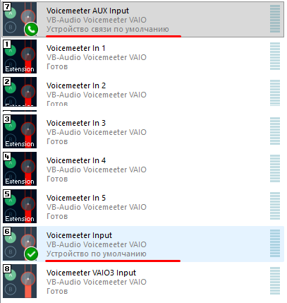

Пункты 1.1, 1.2, 1.3 приводят к тому, что невозможно выделить голос
собеседника в Phone Link без своего голоса из микрофона и направить
его в любое третье приложение, например, ассистент-нейронку. Это
требуется, когда возникает необходимость отдельно его усилить, в
случае, когда HR-сотрудник звонит тебе с ПК-гарнитуры, подключенной к
встроенной звуковой карте (Realtek-чип), что приводит к тихому звуку.

   - 1.4) Phone Link отказывается принимать звук с телефона, если видит
подключенные BT-наушники/гарнитуру к ПК:

Проблему 1.4 можно обойти только использованием внешнего USB-BT
адаптера.

#### ShadowHint

(невидимый ИИ-ассистент)

1\) В самом ShadowHint нет возможности выбора устройства для звука
системы/голоса собеседника, можно только для микрофона. Поэтому если
нужно подать на него усиленный звук, например, от собеседника (чтобы
лучше распознавался голос), то это будет сделать сложно и криво, а в
некоторых случаях невозможно. ShadowHint забирает звук
системы(динамики) при помощи WASAPI loopback с default output
endpoint, т.е. использует дефолтное устройство Воспроизведения,
которое установлено в Винде (mmsys.cpl), а звук микрофона берёт при
запуске приложения из дефолтного устройства записи, но потом можно
выбрать любое устройство, нажав на кнопку с микрофоном (появляется
после старта сессии).

2\) Для ShadowHint важен уровень громкости “master volume” в Винде
(это общий ползунок; вызов по иконке динамика в трее). ShadowHint
«слышит как пользователь», т.е. если будет уровень 5 из 100, то он
ничего не услышит. Поэтому если нужно, чтобы ShadowHint «слышал» и
звук с ноута не шёл, то подключай проводную гарнитуру, у которой есть
собственный/локальный регулятор громкости. После физического
подключения/отключения гарнитуры **нужно перезапускать ассистента
ShadowHint кнопкой Старт/Стоп сессии, чтобы он подхватил новый
источник.**4. Предположительно могут быть проблемы, если подключать
два USB-BT-адаптера или более к USB-хабу (не важно активному или нет).
Идеальная схема – подключение каждого BT-W5 в отдельный физический
порт на материнской плате.

#### Sobes Copilot

(невидимый ИИ-ассистент)

Sobes Copilot имеет возможность выбрать устройство Записи (микрофон)
для получения вашего голоса, а также выбрать устройство для системных
звуков, которое содержит голос собеседника, но только через устройства
воспроизведения, т.к. Sobes Copilot не поддерживает Capture (Recording
devices) и работает ТОЛЬКО через WASAPI loopback (Playback).

#### Шумодав на ПК/ноутбуке

Для шумоподавления звука с микрофона можно использовать либо ПО Krisp,
которое использует только CPU, либо ПО NVIDIA Broadcast, которое
использует GPU, а именно видео карту NVIDIA GeForce RTX 2060 **/**
Quadro RTX 3000 **/** TITAN RTX или выше. У меня на ноутбуке нет видео
карты NVIDIA GeForce, поэтому я использую Krisp.

Krisp построен на нейросетях, это один из лучших шумодавов. Приложение
убирает клацание клавиш, клики мыши и прочие фоновые звуки, оставляя
только ваш голос. У Krisp есть режимы, которые NVIDIA Broadcast не
имеет:

- Voice Detection / Voice AI
- Возможность обучения на твоём голосе

Логика вида: «Оставлять этот голос, остальные — подавлять».

<https://krisp.ai/>

Ломаная версия есть на rutracker.org.

##### Krisp

###### Ограничения канала Krisp Speaker (канал шумоподавления входящего/системного звука)

Здесь мы рассматриваем возможности Krisp для шумоподавления звуков от
Zoom/Teams/Телемост/Phone Link.

1\.  **Krisp Speaker не является “перехватчиком всего системного звука”
    сам по себе.**\
    Krisp обрабатывает только тот поток, который **реально проходит
    через виртуальное устройство воспроизведения “Krisp Speaker”**. Если
    ни одно приложение (или Windows-вывод для приложения) не выводит
    звук в Krisp Speaker, то Krisp нечего обрабатывать — канал Speaker
    фактически простаивает.

2\.  **Статус “not used” в Krisp напротив Speaker означает, что в данный
    момент в “Krisp Speaker” не поступает звук.**\
    Это не ошибка “шумодав выключен”; это индикатор того, что **ни одно
    приложение не выводит звук** в Krisp Speaker (то есть Krisp Speaker
    не выбран как output ни в Teams, ни в другом приложении, ни на
    уровне системного вывода для конкретного приложения).

3\.  **“Speaker device” (выпадающий список устройств в секции Speaker
    внутри Krisp) — это НЕ источник звука, а целевое устройство вывода
    “после обработки”.**\
    Логика канала Speaker в Krisp такая:
    - источник обработки: поток, который приложение отправляет в **Krisp
      Speaker** (виртуальное устройство воспроизведения);
    - затем Krisp применяет шумоподавление;
    - после этого Krisp отправляет очищенный сигнал на выбранное в Krisp
      **Speaker device** (как правило, физические наушники/колонки).\
      Поэтому выбор в Krisp “USB Headset” в секции Speaker не означает,
      что Krisp “берёт звук с USB Headset” для подавления; это означает,
      что Krisp будет **выводить** туда уже обработанный результат.

4\.  **Krisp Speaker — устройство воспроизведения (Playback), а не
    устройство записи (Recording).**\
    Из-за этого Krisp Speaker **нельзя “подать на вход”** в те
    программы/цепочки, которые принимают только устройства захвата
    (Recording/Capture). Например:
    - входы Voicemeeter (Stereo Input 1/2/3/…) принимают только
      устройства записи;
    - Krisp Microphone — это устройство записи (поэтому его можно
      выбрать на вход Voicemeeter);
    - Krisp Speaker — это устройство воспроизведения (поэтому его нельзя
      выбрать как Hardware Input/Stereo Input в Voicemeeter “напрямую”
      по аналогии с Krisp Microphone).

5\.  **Нельзя получить “post-Krisp” (звук после шумодава) через обычный
    loopback Default Playback, если Default Playback = Voicemeeter Input
    (или другой “до-Krisp” узел).**\
    Если софт берёт “remote/system” только через WASAPI loopback **с
    Default Playback**, то он получает именно то, что воспроизводится в
    устройстве “по умолчанию”.\
    При типичной схеме, где Default Playback = **Voicemeeter Input**,
    loopback снимает **pre-Krisp** поток (звук до обработки Krisp).\
    Даже гипотетическая попытка сделать Default Playback = Krisp Speaker
    (если бы это было возможно) всё равно даёт не гарантированный
    “post-Krisp”, потому что Krisp Speaker по своей роли — это точка
    входа (куда подаётся звук на обработку), а “после” выдаётся уже на
    Speaker device, выбранный в Krisp.

6\.  **ShadowHint (и любой софт с аналогичным ограничением) не сможет
    получить “post-Krisp” remote/system, если он жёстко привязан к
    loopback Default Playback.**\
    Если remote/system в ShadowHint берётся исключительно через loopback
    “устройства воспроизведения по умолчанию”, и при этом Default
    Playback нельзя/не планируется менять (например, он должен
    оставаться Voicemeeter Input для стабильности остальной схемы),
    тогда ShadowHint неизбежно получает **звук до Krisp**, а
    “post-Krisp” туда отдать нельзя без изменения самого принципа
    захвата (умение выбрать другое устройство/другой источник remote,
    чего нет).

7\.  **Krisp обычно не позволяет (или делает нестабильной) работу в
    связке “виртуальное устройство ↔ виртуальное устройство”.**\
    Krisp проектировался так, чтобы:
    - приложение выводило звук в **Krisp Speaker**;
    - а Krisp выводил обработанный звук на **физическое устройство**
      (наушники/колонки).\
      На практике многие конфигурации “виртуальный выход Krisp →
      виртуальный кабель/виртуальный микшер” могут:
    - не отображаться в списке в Krisp как допустимое “Speaker device”;
    - работать нестабильно;
    - давать артефакты/эхо/конфликты;
    - или вообще блокироваться логикой Krisp (т.к. Krisp рекомендует
      выбирать физические устройства).\
      Поэтому схемы, где Krisp должен “вывести после себя” в виртуальный
      девайс (например, кабель, который потом заберёт Voicemeeter),
      находятся в зоне повышенного риска и зависят от версии Krisp,
      драйверов и конкретного набора виртуальных устройств.

8\.  **Krisp не предназначен для режима “сделать Krisp Speaker системным
    устройством воспроизведения по умолчанию”.**\
    По умолчанию Krisp ограничивает/откатывает такие попытки, потому что
    при фильтрации речи системные звуки могут восприниматься как шум и
    вырезаться, а также потому что Krisp ожидает включение по приложению
    (в приложении выбирается Krisp Speaker), а не глобально на всю
    систему.\
    Практический симптом этого ограничения: попытка назначить Krisp
    Speaker как Default Playback в Windows может визуально сработать на
    мгновение, но затем настройка “сбрасывается” обратно на предыдущее
    устройство.

9\.  **Исключение из предыдущего пункта: корпоративный режим
    “device-based teams”.**\
    Под “device-based teams” имеется в виду корпоративный/админский
    режим управления Krisp (лицензирование/политики на уровне
    команды/устройства), при котором администратор может разрешить или
    принудительно задать использование Krisp на уровне устройства и (в
    некоторых сценариях/версиях) включать возможность делать Krisp
    speaker системным дефолтом.\
    Если пользователь не находится в таком режиме, то поведение “галочка
    на Default Playback для Krisp Speaker слетает” считается штатным.

10\. **Если Default Playback = Voicemeeter Input, это не означает, что на
    USB-гарнитуре автоматически появится “уже отфильтрованный Krisp’ом”
    звук.**\
    USB Headset получит “post-Krisp” только тогда, когда звук проходит
    по цепочке:\
    **Приложение/система → Krisp Speaker → (Krisp обработал) → USB
    Headset (Speaker device в Krisp)**.\
    Если же Voicemeeter выводит звук на USB Headset напрямую (A1)
    параллельно, то USB Headset будет получать **pre-Krisp** (обход
    Krisp) или “двойной” звук (если одновременно слушать и до, и после).

11\. **“Правильная” (предусмотренная разработчиком) схема работы Krisp
    Speaker — по приложениям.**\
    Нормальный сценарий Krisp:
- в коммуникационном приложении (Teams/Zoom/etc.) в настройках выбрать
  Speaker = **Krisp Speaker**;
- а в Krisp выбрать физическое устройство, куда выводить результат (USB
  Headset и т.п.);
- для приложений без собственных настроек аудио использовать назначение
  устройства вывода на уровне Windows, чтобы направить именно это
  приложение в Krisp Speaker, а не менять системный дефолт глобально. В
  Windows 11: “Микшер громкости” / “App volume and device preferences” ,
  или: Система → Звук → Громкость. Но по опыту скажу, что если в
  приложении нет возможности выбрать устройство воспроизведения, то и в
  микшере громкости это приложение будет отсутствовать.

---
###### Krisp 1.40.7 забывает после перезапуска, что настройка Voice Cancellation уже была сделана

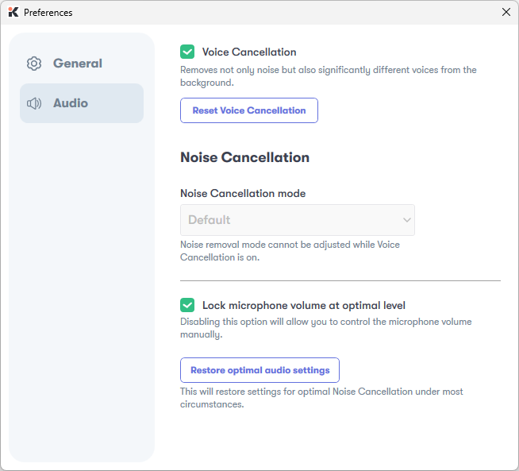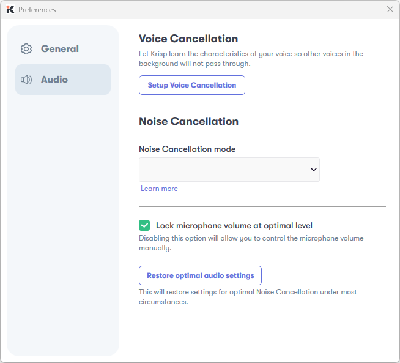

Эта проблема влияет только на качество шумоподавления чужих голосов в
комнате, и никак не влияет на шумоподавление общего шума, звуков
клавиатуры и мыши. На практике разница с активной галочкой Voice
Cancellation и без в версии 1.40.7 есть, но она нестабильная, т.е.
иногда чужой голос в трех метрах (громкий) глушит полностью, а иногда
пропускает. Причем глушить чужой голос полностью умеет только, когда я
сам молчу в этот момент, в противном случае оба голоса будет услышано
одинаково громко.

На **Krisp 1.40.7 для Windows** после прохождения мастера **Voice
Cancellation** проблема проявляется так:

- настройка **Voice Cancellation** выполняется успешно;
- после **перезапуска Krisp** приложение **забывает, что настройка Voice
  Cancellation уже была сделана**;
- интерфейс снова предлагает пройти **Setup Voice Cancellation**;
- при этом файл записи голоса vc_recording.wav остаётся на диске;
- в локальной базе Krisp сохраняются признаки успешной настройки:
  - PNCFeatureState = Active
  - PNCCategory = 1
- после перезапуска Krisp эти значения **не сбрасываются**.

Дополнительно по наблюдениям:

- при запуске **Voicemeeter**, который забирает звук с **Krisp
  Microphone**, в UI Krisp появляется индикатор **HD**;
- это показывает, что аудиообработка и модель Krisp активируются при
  появлении аудиосессии;
- однако сам факт появления **HD** не доказывает, что используется
  именно обученный **Voice Cancellation**, потому что базовое
  шумоподавление может работать и без обучения на голос.

Итоговая картина:\
**после перезапуска Krisp интерфейс ведёт себя так, как будто
настройка Voice Cancellation не была выполнена, хотя локальные
признаки успешной настройки сохраняются.**

Что удалось найти в интернете

**Прямо про точный симптом** — “настройка Voice Cancellation была
выполнена, но после перезапуска UI снова предлагает Setup” — **не
удалось найти публичную Reddit/форумную ветку, которая индексируется
поиском**. Но удалось найти **официальные подтверждения от Krisp**,
что со **старым wizard-based Voice Cancellation** у пользователей были
проблемы, и что Krisp позже **полностью заменил эту функцию** на новую
без долгого setup. Это подтверждается их собственными релиз-нотами.

Что удалось найти:

Krisp выпустил старый **Voice Cancellation** в **Windows 1.30.7**. В
их описании этой функции прямо показан старый мастер настройки: запись
образца, анализ, определение pitch category. Там же Krisp указывает,
что у технологии были **“minor limitations”**, включая случаи, когда
фоновые голоса той же “pitch category” могли частично проходить.

Дальше самое важное: в релизе **Win 1.33.2** Krisp официально написал:
**“Some of you might have had issues with setting up the Voice
Cancellation. We have now improved the setup process.”** Это означает,
что проблемы с настройкой Voice Cancellation действительно были, и
Krisp это прямо признал.

Позже, в **Win 1.42.1**, Krisp выпустил **Background Voice
Cancellation**, который, по их словам, **“comes to replace the
existing Voice Cancellation”** и **“No lengthy setups are needed”**.
Это сильный индикатор того, что старая схема с отдельным setup-wizard
была проблемной, и от неё решили отказаться.

Ещё один важный момент: в текущей документации Krisp по **Voice
Isolation** сказано, что если устройство **не совместимо** или **не
распознано автоматически**, это отдельно отражается в UI, а для
некоторых устройств доступна **Manual activation**; при использовании
нераспознанных устройств Krisp предупреждает о возможной деградации
качества голоса или шумоподавления. Это не является прямым
доказательством именно данного бага, но хорошо согласуется с
ситуацией, когда устройство определяется обобщённо как **“USBC
Headset”**, а старый UI ведёт себя нестабильно.

Почему в интернете не видно кучи публичных жалоб в поиске

Krisp, по всей видимости, обрабатывает такие случаи в основном через
**саппорт и сбор логов**, а не через публичные форумные обсуждения. У
них есть отдельные официальные инструкции по **“Report a problem”**,
по ручному сбору логов из %LOCALAPPDATA%\Krisp, а также по сбору
**Event Viewer** логов Windows. Это может объяснять, почему
индексируемых публичных обсуждений немного, даже если сама проблема
реально встречалась.

Из этого можно сделать такой вывод:

**Наиболее правдоподобная версия** — наблюдается не уникальная
локальная поломка, а баг или десинхрон **старого Voice Cancellation**
из ветки до **1.42.1**, где Krisp ещё использовал старый setup-wizard.
Это косвенно подтверждается тем, что:

- Krisp сам признал проблемы с setup уже в **1.33.2**.
- в **1.42.1** старая функция была заменена новой, без длинного setup.
- современные voice-функции Krisp завязаны также на распознавание и
  совместимость устройств, а используемое устройство определяется в
  общем виде как USB-гарнитура.

## 2. Состав документа

### Схемы

В документе приводятся схемы (Hardware wirings, Audio graphs), созданные
при помощи PlaintUML-кода, их все можно найти в папке репозитория `Audio graphs, HW wirings/Схемы аудио потоков с одной USB-headset/`.

### Конфигурации

В данном документе рассмотрены следующие конфигурации (привожу их коды в
порядке следования в документе):

- 3.1. (Teams ONLY; no Discord, no Phone Link; HW: no audio interface, USB-headset)
  - 🟢 *разновидность:* (Teams ONLY; no Discord, no Phone Link, Default Playback = VM AUX Input; HW: no audio interface, USB-headset)
- 🟢 3.2. (Teams or Phone Link; no Discord; HW: no audio interface, USB-headset)
- 4.1. (Teams ONLY, Discord, no Phone Link; HW: no audio interface, USB-headset)
  - 🔵 *разновидность:* (Teams ONLY; Discord, no Phone Link, Default Playback = VM AUX Input; HW: no audio interface, USB-headset)
- 🔵 4.2. (Teams or Phone Link, Discord; HW: no audio interface, USB-headset)

Коды конфигураций нужны для того, чтобы можно было анализировать данный
документ при помощи нейронки.

Конфигурации одного цвета отличаются между собой только одной настройкой
Windows Default Playback = “Voicemeeter AUX Input” или = “Voicemeeter
Input” – это ни на что не влияет (просто разные названия виртуальных
устройств), т.е. схемы абсолютно одинаковые.

Конфигурация, которой я пользуюсь на постоянной основе и для звонков
через Phone Link и для проведения собесов по Teams/Телемост, с
применением ИИ-ассистентов Shadowhint и Sobes Copilot:

(Teams or Phone Link; no Discord; HW no audio interface, USB-headset)

Если бы у Shadowhint была возможность выбора устройства
Playback(воспроизведения) и не нужно было пользоваться приложением Phone
Link (звонки с телефона через ПК), то я бы использовал конфигурацию

(Teams ONLY; no Discord, no Phone Link; HW: no audio interface,
USB-headset).

### Батники (\*.bat) для переключения звуковых профилей и XML-конфиги для Voicemeeter

В документе приводятся ссылки на батники и XML (в разделе «Автоматизация
настроек»), их все можно скачать из облака из следующих папок:

`bats for calls/Схемы аудио потоков с одной USB-headset/`

`Voicemeeter confings for calls/Схемы аудио потоков с одной USB-headset/`

## 3. Для системы №1

Состав системы:

Phone Link, Teams/Яндекс-Телемост/Zoom, ShadowHint, Sobes Copilot, OBS,
Krisp только для микрофона.

(DISCORD не используется; Krisp только для микрофона! )

### 3.1. Способ: Teams only -> усиленный изолированный звук для Sobes Copilot; Shadowhint не используется.

Код конфигурации: (Teams ONLY; no Discord, no Phone Link; HW: no audio
interface, USB-headset)

Особенность: усиленный изолированный звук собеседника из Teams
передаётся для Sobes Copilot, при этом Shadowhint и Phone Link не
поддерживаются (им невозможно передать изолированный звук собеседника
без звуков системы). Возможность передачи звука системы+собеседника из
Teams в Shadowhint и Phone Link в этом разделе тоже рассмотрена, как
отдельная конфигурация, которая реализуется в пару кликов мыши.

Требуемое ПО: [Voicemeeter
Potato](https://shop.vb-audio.com/en/win-apps/21-voicemeeter8.html) или
[Voicemeeter
Banana](https://shop.vb-audio.com/en/win-apps/10-voicemeeter-banana.html)
(каждая стоит 10 евро разовый платёж, или через месяц начнет надоедать
всплывающим окном с просьбой задонатить, во время которого перестают
работать виртуальные кабели)

#### Оборудование

Список устройств: USB-проводная гарнитура

##### Схема подключения устройств (Hardware wiring):

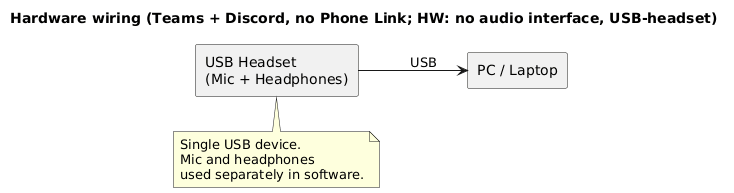

#### Конфигурирование

Что нужно настраивать: Voicemeeter Potato, Windows, Krisp и конечные
приложения (Teams, Sobes Copilot, OBS).

Основные настройки производятся в Voicemeeter Potato.

##### Схема аудио (Audio graph):

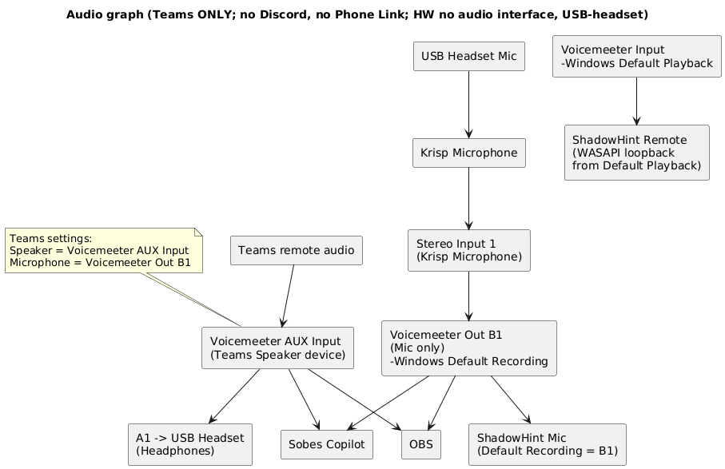

В этой конфигурации главное – Sobes Copilot и OBS получают усиленный
голос/звук собеседника из Teams (изолированный звук от системных
звуков!), а Shadowhint не сможет его получить, т.к. у него в настройках
нет возможности выбрать устройство для голоса собеседника (в данной
схеме изолированный канал звука из Teams (**Voicemeeter AUX Input) не
является дефолтным)**. Shadowhint присутствует на аудио графе только,
чтобы показать, что при его запуске он будет брать звук из Voicemeeter
Input, на который ничего полезного не приходит.

Отправку звука в Shadowhint и Phone Link можно решить легко – в
mmsys.cpl выставить дефолтным устройством Воспроизведения **Voicemeeter
AUX Input** вместо **Voicemeeter Input**, но нужно иметь в виду, что
теперь в дефолтное устройство (Voicemeeter AUX Input) попадают все звуки
системы, а не только звуки собеседника из Teams. Поэтому нужно
позаботиться о том, чтобы не запускать приложения, которые издают лишние
звуки, а в самой Винде отключить все системные звуки. Отдельно в этой
документации я не буду рисовать для этого схемы и приводить настройки в
силу малых отличий. Но на всякий случай приведу отдельный код новой
конфигурации: (Teams ONLY; no Discord, no Phone Link, Default Playback =
VM AUX Input; HW: no audio interface, USB-headset) – данная конфигурация
становится похожей на конфигурацию из следующего раздела 3.2 (Teams or
Phone Link; no Discord; HW: no audio interface, USB-headset), где Phone
Link, Shadowhint, Sobes Copilot и OBS получают усиленный звук
системы+собеседника из Teams, с единственным отличием, что в последней
конфигурации дефолтным Playback является Voicemeeter Input, а не
Voicemeeter AUX Input.

##### Настройки:

###### Цель

Используется **ТОЛЬКО Microsoft Teams**.\
**Discord и Phone Link не поддерживаются**.

Нужно:

- усилить **голос собеседника Teams**
- усилить **твой микрофон USB-гарнитуры**
- раздать:
  - **mic-only** и **усиленный Teams remote-only** → **Sobes Copilot** и
    **OBS**
- **в наушниках USB-гарнитуры слышать ТОЛЬКО собеседника**
  - **без своего микрофона**
- **Default Playback = Voicemeeter Input**

---
###### WINDOWS (mmsys.cpl)

Playback

- **Default device**: **Voicemeeter Input**
- **Default communication device**: **Voicemeeter Input**

Recording

- **Default device**: **Voicemeeter Out B1**
- **Default communication device**: **Voicemeeter Out B1**

---
###### KRISP

- **Microphone** **Input**: USB Headset
- **Cancel Noise and Room Echo** = ON
- **Speaker Cancel Noise = OFF**

**Microphone** **Output (нельзя изменить)**: **Krisp Microphone** (это
устройство отображается в mmsys.cpl\Запись)

Krisp используется **только как обработчик микрофона**.

**Krisp Microphone используется только внутри Voicemeeter** как источник
Stereo Input 1.\
Ни одно приложение напрямую его не использует.

---
###### VOICEMEETER POTATO

Hardware Out

- **A1** = **WDM: USB Headset (Headphones)**

Это **единственный путь** вывода звука в наушники.

Stereo Input 1 — микрофон

- **Device**: **Krisp Microphone**
- Routing:
  - **B1 = ON**
  - **A1 = OFF**
  - **B2 / B3 = OFF**
- Усиление микрофона:
  - Gain / Compressor / EQ — по необходимости

👉 микрофон **никуда не мониторится**, только в capture.

Voicemeeter AUX — звук собеседника Teams

- **Teams Speaker** = **Voicemeeter AUX Input**
- Routing:
  - **A1 = ON** ← мониторинг в наушники
- **B1 / B3 = OFF**
- Усиление:
  - **зелёный AUX fader**

👉 именно здесь происходит усиление собеседника.

Назначение шин

- **B1** — Mic only (усиленный)
- **B3** — ❌ не используется

###### TEAMS

- **Speaker (Output)**: **Voicemeeter AUX Input**
- **Microphone (Input)**: **Voicemeeter Out B1**

---
###### Sobes Copilot

- Mic = **Voicemeeter Out B1**
- Remote = **Voicemeeter AUX Input** (получает усиленный голос
  собеседника Teams, см. рис. ниже)

---
###### OBS

- **Mic track**: **Voicemeeter Out B1**
- **Remote track**: **Voicemeeter AUX Input**

### 3.2. Способ: Teams or Phone Link -> усиленный звук для Shadowhint.

Код конфигурации: (Teams or Phone Link, no Discord; HW: no audio
interface, USB-headset)

Альтернативный код:
(audio_calls_Potato_Samsung_AKG_B1-Krisp_B2-raw_Gain_and_Virtual_Input)

Требуемое ПО: [Voicemeeter
Potato](https://shop.vb-audio.com/en/win-apps/21-voicemeeter8.html) или
[Voicemeeter
Banana](https://shop.vb-audio.com/en/win-apps/10-voicemeeter-banana.html)
(каждая стоит 10 евро разовый платёж, или через месяц начнет надоедать
всплывающим окном с просьбой задонатить, во время которого перестают
работать виртуальные кабели)

#### Оборудование

Список устройств: USB-проводная гарнитура

##### Схема подключения устройств (Hardware wiring):

- Схема такая же, как в разделе 3.1.

#### Конфигурирование

Что нужно настраивать: Voicemeeter Potato, Windows, Krisp и конечные
приложения (Teams, Sobes Copilot, OBS).

Основные настройки производятся в Voicemeeter Potato.

##### Схема аудио (Audio graph):

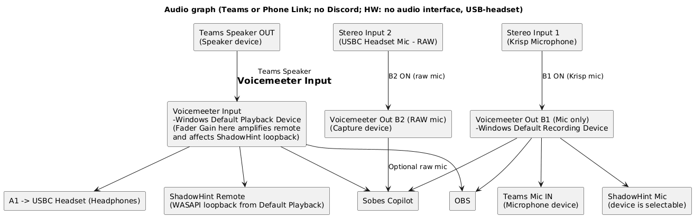

В этой конфигурации главное – Shadowhint, Sobes Copilot и OBS получают
усиленный звук системы+собеседника из Teams/Phone Link. Но нужно иметь в
виду, что в дефолтное устройство воспроизведения(Playback = Voicemeeter
Input) попадают все звуки системы, а не только звуки собеседника из
Teams/Phone Link. Поэтому нужно позаботиться о том, чтобы не запускать
приложения, которые издают лишние звуки, а в самой Винде отключить все
системные звуки.

Voicemeeter Out B2 – сюда подаётся сырой микрофон, который можно усилить
и далее подать в Sobes Copilot. Для чего? Например, чтобы сравнить как
работает встроенный шумодав у Sobes Copilot с шумодавом Krisp.

##### Настройки:

###### Цель

Нужно:

- усилить **ТОЛЬКО голос собеседника Teams**
- усилить **микрофон USB-гарнитуры**
- раздать:
  - **mic-only** и **remote-only** → в **Sobes Copilot** и **OBS**
- **ShadowHint**:
  - получает **микрофон** через выбранное устройство записи
  - получает **звук собеседника / системы** через **WASAPI loopback** с
    **Windows Default Playback**
- **свой голос в наушниках не слышать**
- **AUX НЕ используется**

###### ОБЩАЯ ЛОГИКА АУДИО

- **Teams**:
  - Speaker → Voicemeeter Input
  - Microphone → Voicemeeter Out B1
- **Усиление собеседника** происходит **на Virtual Input “Voicemeeter
  Input”** (красный fader)
- Именно поэтому:
  - ShadowHint слышит Teams
  - изменение fader’а **Voicemeeter Input** напрямую влияет на
    ShadowHint\
    (что ты и подтвердил экспериментом)

---
###### WINDOWS (mmsys.cpl)

Воспроизведение

- **Default Playback Device** = Voicemeeter Input

Запись

- **Default Recording Device** = Voicemeeter Out B1

---
###### KRISP

- **Microphone** **Input**: USB Headset
- **Cancel Noise and Room Echo** = ON
- **Speaker Cancel Noise = OFF**

**Microphone** **Output (нельзя изменить)**: **Krisp Microphone** (это
устройство отображается в mmsys.cpl\Запись)

Krisp используется **только как обработчик микрофона**.

**Krisp Microphone используется только внутри Voicemeeter** как источник
Stereo Input 1.\
Ни одно приложение напрямую его не использует.

###### TEAMS

- **Speaker** = Voicemeeter Input
- **Microphone** = Voicemeeter Out B1

(это важно: микрофон **не** идёт в Teams напрямую)

---
###### VOICEMEETER POTATO

Stereo Input 1 — *Krisp Microphone*

(USB-гарнитура → Krisp → Voicemeeter)

Включено:

- **B1** — mic-only
- **B3** — mic + remote (если нужен общий микс где-то, а вообще согласно
  текущей конфигурации B3=OFF)

Выключено:

- **A1 / A2 / A3 / A4 / A5**\
  (чтобы **не слышать себя**)

Fader Gain:

- по необходимости (усиление микрофона)

Stereo Input 2 — *USB Headset mic (raw)*

( используется как отдельный raw-канал на случай если нужно усилить звук
raw-микрофона для ассистента-нейронки. Если в этом нет необходимости, то
Stereo Input 2 вообще не настраиваем)

Включено:

- **B2** — raw mic

Virtual Input — **Voicemeeter Input**

(сюда приходит **звук Teams**)

- **Это ключевая точка усиления собеседника**
- Fader Gain (красный):
  - ↑ — ShadowHint слышит громче
  - ↓ — ShadowHint перестаёт слышать

Включено:

- **A1** → USB-гарнитура (слушаешь ТОЛЬКО собеседника)
- **B3** → mic + remote (если нужен общий микс, а вообще согласно
  текущей конфигурации B3=OFF)

Hardware Out (Настройки наушников)

- USB-гарнитура подключена как **A1**
- В A1 приходит **только Virtual Input (Teams)**
- Микрофон **НЕ** подаётся в A1

---
###### Sobes Copilot

- Mic = **Voicemeeter Out B1**
- Remote = **Voicemeeter Input** (получает усиленный голос собеседника
  Teams, см. рис. ниже)

Либо Remote = “**По умолчанию”** (с тем же результатом):

---
###### OBS

- Mic track = Voicemeeter Out B1
- Remote/System track = Voicemeeter Input

---
###### SHADOWHINT

- **Microphone device** = Voicemeeter Out B1
- **Remote/System**:
  - автоматически через **WASAPI loopback**
  - берётся с **Windows Default Playback = Voicemeeter Input**

##### Автоматизация настроек

`bats for calls/Схемы аудио потоков с одной USB-headset/`

(Teams or Phone Link; no Discord; HW no audio interface, USB-headset).bat

Для возврата в базу используется единый для всех «audio_normal.bat» .

`Voicemeeter confings for calls/Схемы аудио потоков с одной USB-headset/`

VoicemeeterPotato (Teams or Phone Link; no Discord; HW no audio
interface, USB-headset).xml

## 4. Для системы №2

Состав системы:

Phone Link, Teams/Яндекс-Телемост/Zoom, DISCORD, ShadowHint, Sobes
Copilot, OBS, Krisp только для микрофона.

Krisp только для микрофона!

Назначение DISCORD – незаметно подключить человека-помощника к
собеседованию, чтобы он всё видел, слышал и высылал ответы в Телеграм.

В DISCORD отправляется (на Input Device) звук системы+собеседник и
микрофон, а с выводом(Output Device) есть два варианта:

1\) выбрать в DISCORD в качестве Output device USB-проводную гарнитуру –
в этом случае вы будете одновременно слышать и что говорят в Teams и что
подсказывает человек через DISCORD.

2\) выбрать в DISCORD любое отключенное в mmsys.cpl устройство
Воспроизведения, например, встроенные динамики ноутбука, если не хотите
слышать помощника из DISCORD

### 4.1. Способ: Teams only -> усиленный изолированный звук для Sobes Copilot и DISCORD; Shadowhint не используется.

Код конфигурации: (Teams ONLY, Discord, no Phone Link; HW: no audio
interface, USB-headset)

Особенность: усиленный изолированный звук собеседника из Teams
передаётся для Sobes Copilot и DISCORD, при этом Shadowhint и Phone Link
не поддерживаются (им невозможно передать изолированный звук собеседника
без звуков системы). Возможность передачи звука системы+собеседника из
Teams в Shadowhint и Phone Link в этом разделе тоже рассмотрена, как
отдельная конфигурация, которая реализуется в пару кликов мыши.

Требуемое ПО: [Voicemeeter
Potato](https://shop.vb-audio.com/en/win-apps/21-voicemeeter8.html)
(стоит 10 евро разовый платёж, или через месяц начнет надоедать
всплывающим окном с просьбой задонатить, во время которого перестают
работать виртуальные кабели)

#### Оборудование

Список устройств: USB-проводная гарнитура

##### Схема подключения устройств (Hardware wiring):

- Схема такая же, как в разделе 3.1.

#### Конфигурирование

Что нужно настраивать: Voicemeeter Potato, Windows, Krisp и конечные
приложения (Discord, Sobes Copilot, OBS).

Основные настройки производятся в Voicemeeter Potato.

##### Схема аудио (Audio graph):

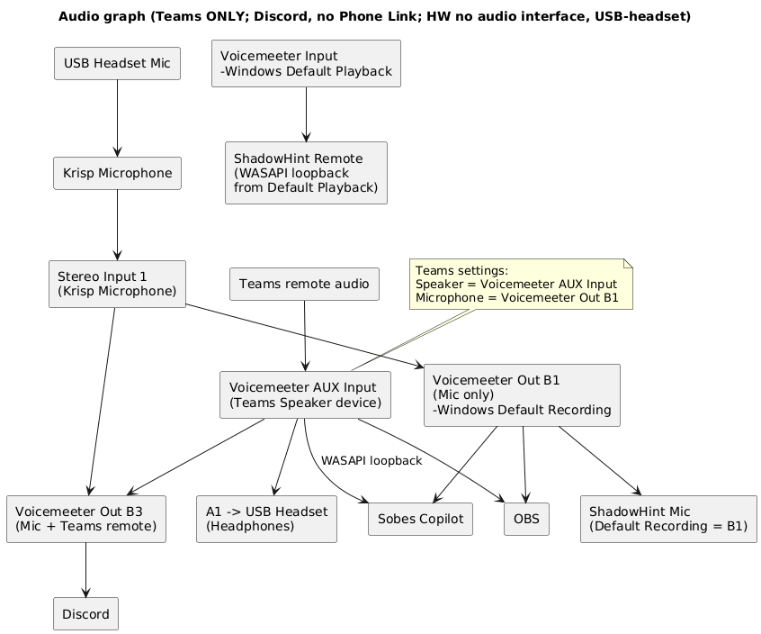

В этой конфигурации главное – Sobes Copilot, DISCORD и OBS получают
усиленный голос/звук собеседника из Teams (изолированный звук от
системных звуков!), а Shadowhint не сможет его получить, т.к. у него в
настройках нет возможности выбрать устройство для голоса собеседника (в
данной схеме изолированный канал звука из Teams (**Voicemeeter AUX
Input) не является дефолтным)**. Shadowhint присутствует на аудио графе
только, чтобы показать, что при его запуске он будет брать звук из
Voicemeeter Input, на который ничего полезного не приходит.

Отправку звука в Shadowhint и Phone Link можно решить легко – в
mmsys.cpl выставить дефолтным устройством Воспроизведения **Voicemeeter
AUX Input** вместо **Voicemeeter Input**, но нужно иметь в виду, что
теперь в дефолтное устройство (Voicemeeter AUX Input) попадают все звуки
системы, а не только звуки собеседника из Teams. Поэтому нужно
позаботиться о том, чтобы не запускать приложения, которые издают лишние
звуки, а в самой Винде отключить все системные звуки. Отдельно в этой
документации я не буду рисовать для этого схемы и приводить настройки в
силу малых отличий. Но на всякий случай приведу отдельный код новой
конфигурации: (Teams ONLY; Discord, no Phone Link, Default Playback = VM
AUX Input; HW: no audio interface, USB-headset) – данная конфигурация
становится похожей на конфигурацию из следующего раздела 4.2 (Teams or
Phone Link; Discord; HW: no audio interface, USB-headset), где Phone
Link, Shadowhint, Sobes Copilot, DISCORD и OBS получают усиленный звук
системы+собеседника из Teams, с единственным отличием, что в последней
конфигурации дефолтным Playback является Voicemeeter Input, а не
Voicemeeter AUX Input.

##### Настройки:

###### Цель

Используется **только Teams** (как источник remote).

Нужно:

- **усилить ТОЛЬКО голос собеседника Teams**
- **усилить микрофон**
- раздать **усиленный remote-звук Teams (изолированный от системных
  звуков)** в:
  - **Discord**
  - **Sobes Copilot**
  - **OBS**
- **ShadowHint НЕ используется** и **ничего не получает**
- в наушниках USB-гарнитуры:
  - слышен **ТОЛЬКО собеседник Teams**
  - **свой голос не слышен**

###### ОБЩАЯ ЛОГИКА

- Teams **НЕ идёт в Default Playback**
- Teams выводится **строго в Voicemeeter AUX Input**
- Усиление remote происходит **на фейдере AUX**
- Усиленный remote уходит:
  - в **B2** → Discord / Sobes / OBS
  - в **A1** → USB-гарнитура (прослушивание)
- Микрофон:
  - идёт через **Krisp**
  - **НЕ подмешивается** в A1
  - **НЕ участвует** в этой конфигурации (кроме как для Teams mic)

---
###### Windows (mmsys.cpl)

Playback

- **Default device**: **Voicemeeter Input**
- **Default communication device**: **Voicemeeter Input**

Recording

- **Default device**: **Voicemeeter Out B1**
- **Default communication device**: **Voicemeeter Out B1**

---
###### KRISP

- **Microphone** **Input**: USB Headset
- **Cancel Noise and Room Echo** = ON
- **Speaker Cancel Noise = OFF**

**Microphone** **Output (нельзя изменить)**: **Krisp Microphone** (это
устройство отображается в mmsys.cpl\Запись)

Krisp используется **только как обработчик микрофона**.

**Krisp Microphone используется только внутри Voicemeeter** как источник
Stereo Input 1.\
Ни одно приложение напрямую его не использует.

---
###### Teams

- **Speaker** → Voicemeeter AUX Input
- **Microphone** → Voicemeeter Out B1

---
###### Discord

- **Input Device** → Voicemeeter Out B3
- **Output Device** → USBC Headset, или любое отключенное устройство
  Воспроизведения из списка mmsys.cpl, например, встроенные динамики
  ноутбука, если не хотите слышать помощника из DISCORD

---
###### Sobes Copilot

- Mic = **Voicemeeter Out B1**
- Remote = **Voicemeeter AUX Input** (получает усиленный голос
  собеседника Teams, см. рис. ниже)

---
###### OBS

- **Mic / Aux 1** → Voicemeeter Out B1
- Remote track = **Voicemeeter AUX Input**

---
###### Voicemeeter Potato

Stereo Input 1 — Krisp Microphone

- B1 ✅
- B3 ✅
- Gain — по необходимости
- **A1** → ❌\
  👉 микрофон **никуда не маршрутизируется**, кроме Teams напрямую

Voicemeeter AUX Input

(Сюда приходит **ТОЛЬКО Teams remote)**

- **A1** → ✅ (слушаешь Teams в наушниках)
- **B3** → ✅ (Mic + Remote)
- Fader Gain AUX → **используется для усиления голоса собеседника
  везде**

BUS ROUTING

**B1 — Mic only**

- Источник: Stereo Input 1
- Используют:
  - Sobes Copilot (Mic)
  - OBS (Mic)
  - ShadowHint (Mic)

**B3 — Mic + Teams remote**

- Использует: Discord (Input)

Hardware Out (Настройки наушников)

- USB-гарнитура подключена как **A1**
- В A1 приходит **только Voicemeeter AUX Input (Teams)**
- Микрофон **НЕ** подаётся в A1

### 4.2. Способ: Teams or Phone Link -> усиленный звук для Shadowhint и DISCORD.

Код конфигурации: (Teams or Phone Link, Discord; HW: no audio interface,
USB-headset)

Требуемое ПО: [Voicemeeter
Potato](https://shop.vb-audio.com/en/win-apps/21-voicemeeter8.html)
(стоит 10 евро разовый платёж, или через месяц начнет надоедать
всплывающим окном с просьбой задонатить, во время которого перестают
работать виртуальные кабели)

#### Оборудование

Список устройств: USB-проводная гарнитура

##### Схема подключения устройств (Hardware wiring):

- Схема такая же, как в разделе 3.1.

#### Конфигурирование

Что нужно настраивать: Voicemeeter Potato, Windows, Krisp и конечные
приложения (Discord, Sobes Copilot, OBS).

Основные настройки производятся в Voicemeeter Potato.

##### Схема аудио (Audio graph):

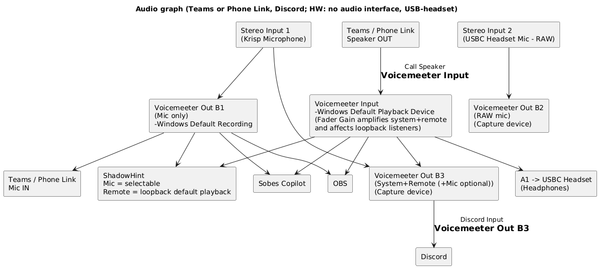

В этой конфигурации главное – Shadowhint, Sobes Copilot, DISCORD и OBS
получают усиленный звук системы+собеседника из Teams/Phone Link. Но
нужно иметь в виду, что в дефолтное устройство воспроизведения(Playback
= Voicemeeter Input) попадают все звуки системы, а не только звуки
собеседника из Teams/Phone Link. Поэтому нужно позаботиться о том, чтобы
не запускать приложения, которые издают лишние звуки, а в самой Винде
отключить все системные звуки.

Voicemeeter Out B2 – сюда подаётся сырой микрофон, который можно усилить
и далее подать в Sobes Copilot. Для чего? Например, чтобы сравнить как
работает встроенный шумодав у Sobes Copilot с шумодавом Krisp.

##### Настройки:

###### Цель

- **Teams / Phone Link Speaker = Voicemeeter Input**
- **Windows Default Playback = Voicemeeter Input**
- Усиление remote+system делается **на fader’е Voicemeeter Input**
- Все приложения, которым нужен усиленный remote+system, берут его:
  - либо через **WASAPI loopback с Voicemeeter Input**
    (Sobes/OBS/ShadowHint remote)
  - либо через **Voicemeeter Out B3** (для Discord, т.к. ему нужен
    capture-вход)

---
###### Windows (mmsys.cpl)

**Playback**

- Default Playback Device = **Voicemeeter Input**

**Recording**

- Default Recording Device = **Voicemeeter Out B1**

---
###### KRISP

- **Microphone** **Input**: USB Headset
- **Cancel Noise and Room Echo** = ON
- **Speaker Cancel Noise = OFF**

**Microphone** **Output (нельзя изменить)**: **Krisp Microphone** (это
устройство отображается в mmsys.cpl\Запись)

Krisp используется **только как обработчик микрофона**.

**Krisp Microphone используется только внутри Voicemeeter** как источник
Stereo Input 1.\
Ни одно приложение напрямую его не использует.

---
###### Voicemeeter Potato

Stereo Input 1 = Krisp Microphone

- **B1 = ON** (mic-only)
- **B3 = ON** (чтобы микрофон мог попасть в Discord-микс при
  необходимости)
- **A1 = OFF** (чтобы не слышать свой голос)

Stereo Input 2 = USBC Headset Mic (RAW)

(опционально - используется как отдельный raw-канал на случай если нужно
усилить звук raw-микрофона для ассистента-нейронки. Если в этом нет
необходимости, то Stereo Input 2 вообще не настраиваем)

- **B2 = ON** (raw mic, если нужно)
- **A1 = OFF**

Voicemeeter Input (Virtual Inputs → “Voicemeeter Input”)

- **A1 = ON** (чтобы слышать собеседника в гарнитуре)
- **B3 = ON** (**ВАЖНО**: чтобы system+remote попали в Discord Input)
- Fader “Voicemeeter Input” = **усиление remote+system** (и именно его
  слышит ShadowHint через loopback)

A1 Hardware Out

- **USBC Headset (Headphones)**

---
###### Teams или Phone Link (любой один)

- **Speaker = Voicemeeter Input**
- **Microphone = Voicemeeter Out B1**

---
###### ShadowHint

- **Mic device = Voicemeeter Out B1**
- **Remote/desktop**: автоматически через WASAPI loopback **Default
  Playback**\
  (а default playback у нас **Voicemeeter Input**, значит ShadowHint
  получает усиленный remote+system)

---
###### Sobes Copilot

- Mic = **Voicemeeter Out B1**
- Remote = **Voicemeeter Input** (получает усиленный голос собеседника
  Teams, см. рис. ниже)

Либо Remote = “**По умолчанию”** (с тем же результатом):

---
###### OBS

- **Mic track = Voicemeeter Out B1**
- **Desktop audio = Voicemeeter Input (WASAPI)**\
  (получает усиленный remote+system)

---
###### Discord

(мы добавляем Discord именно как получателя микса)

- **Input device = Voicemeeter Out B3**
  - В B3 у тебя попадает:
    - remote+system (из Voicemeeter Input, потому что B3 там включен)
    - mic (если включен B3 на Stereo Input 1)
- **Output device** = USBC Headset, или любое отключенное устройство
  Воспроизведения из списка mmsys.cpl, например, встроенные динамики
  ноутбука, если не хотите слышать помощника из DISCORD

## 5. Шумодав Krisp для входящих звуков Phone Link/Teams

### Вариант 1. Phone Link-совместимый (post-Krisp для OBS и Sobes Copilot; ShadowHint остаётся pre-Krisp)

Этот вариант оставляет **Windows Default Playback Device = Voicemeeter
Input**, поэтому **Phone Link** остаётся работоспособным. Шумоподавление
Krisp накладывается внутри тракта Voicemeeter, а в OBS и Sobes Copilot
подаётся уже **post-Krisp** через отдельный виртуальный выход
Voicemeeter. ShadowHint при этом остаётся **pre-Krisp**, потому что он
loopback’ает Default Playback (= Voicemeeter Input).

Требуемое ПО:

1\) [Voicemeeter
Potato](https://shop.vb-audio.com/en/win-apps/21-voicemeeter8.html) (10
евро разовый платёж, или через месяц начнет надоедать всплывающим окном
с просьбой задонатить, во время которого перестают работать виртуальные
кабели)

2\) VB-Cable A+B (можно купить за 5\$ (донат):
<https://shop.vb-audio.com/en/win-apps/12-vb-cable-ab.html?SubmitCurrency=1&id_currency=1#/30-donation_s-p1_i_m_a_fan>)

**Тракт:**\
System / Teams / Phone Link → **Voicemeeter Input (Default Playback)** →
**Voicemeeter Hardware Out A2 = Krisp Speaker** → **Krisp Noise Cancel**
→ **VB-Cable** → **Voicemeeter Stereo Input 3** → **Voicemeeter Out B3**
→ OBS / Sobes Copilot

#### ***Настройки*:**

##### **Windows**

- Default Playback Device: **Voicemeeter Input** (без изменений)

##### **Voicemeeter**

- Hardware Out:
  - **A1 = USB Headset (Headphones)**
  - **A2 = Krisp Speaker**
- Полоса **Voicemeeter Input (VAIO)**:
  - **A2 = ON**
  - **A1 = OFF**
  - **B3 = OFF**
- **Stereo Input 3**:
  - Device: **CABLE-A Output**
  - **A1 = ON**
  - **B3 = ON**
  - **A2 = OFF**
- Усиление post-Krisp выполняется фейдером **Stereo Input 3 (CABLE-A
  Output)**.

##### **Krisp (Speaker)**

- Speaker device: **CABLE-A Input**
- Cancel Noise: **ON**

##### **OBS**

- Remote/System (Desktop Audio через loopback): **Voicemeeter Out B3**
  (как устройство, содержащее post-Krisp поток)

##### **Sobes Copilot**

- Remote/System: **Voicemeeter Out B3**

### Вариант 2. Простой “как задумал Krisp” (только Teams/Zoom/Телемост; Phone Link не фильтруется; усиления в Voicemeeter нет)

Этот вариант использует Krisp по “классической” схеме: коммуникационное
приложение выводит звук в **Krisp Speaker**, а Krisp выводит уже
очищенный звук непосредственно на **USB Headset**. Voicemeeter в этой
схеме не является узлом “после Krisp”, поэтому “пост-усиления” в
Voicemeeter нет.\
Также в этой схеме **Phone Link не получится отфильтровать**, потому что
он ориентируется на системный Default Playback и не поддерживает per-app
output.

**Тракт:**\
Teams / Zoom / Телемост → **Krisp Speaker** → **Krisp Noise Cancel** →
**USB Headset (Headphones)** → OBS / Sobes Copilot (loopback с USB
Headset)

#### **Настройки:**

##### **Teams / Zoom / Яндекс Телемост**

- Playback device: **Krisp Speaker**

##### **Krisp (Speaker)**

- Speaker device: **USB Headset (Headphones)**
- Cancel Noise: **ON**

##### **OBS**

- Remote/System: **USB Headset (Headphones)** (loopback по выбранному
  playback устройству)

##### **Sobes Copilot**

- Remote/System: **USB Headset (Headphones)** (loopback по выбранному
  playback устройству)

### Вариант 3. ShadowHint-совместимый post-Krisp (ShadowHint + OBS + Sobes Copilot; только Teams/Zoom/Телемост, Phone Link исключён)

Это единственный вариант, где ShadowHint получает **post-Krisp**, потому
что его loopback привязан к Default Playback.

#### Что получится

- ShadowHint Remote/System = **после шумодава Krisp**
- OBS Desktop Audio / Sobes Copilot Remote/System = **после шумодава
  Krisp**
- Усиление post-Krisp — **в Voicemeeter** (фейдером входа кабеля)

#### Главная жёсткая оговорка (в этом варианте)

В Default Playback не должен попадать нефильтрованный “левый” звук.
Поэтому нужно **не запускать лишние приложения** и **отключить системные
звуки**.\
И отдельно фиксируем по Phone Link: он не поддерживает per-app output и
“прилипает” к Default Playback — поэтому **в варианте 3 Phone Link не
используется вообще** (иначе он будет загрязнять Default Playback
нефильтрованным потоком).

#### Настройки

##### Windows (mmsys.cpl)

**Playback**

- Default device: **CABLE-A Input**
- Default communication device: можно оставить как Default device (или
  как было у тебя)

**Recording**

- Default device: **Voicemeeter Out B1**

Важно: после этого “по умолчанию” звук будет уходить в кабель, и ты
можешь перестать слышать звук, пока не настроишь мониторинг через
Voicemeeter (ниже).

##### Windows микшер громкости (Win11 → Система → Звук → Громкость)

Назначить **Устройство вывода (Output device) = Krisp Speaker**
**только** для:

- **Teams**
- **Zoom**
- **Яндекс Телемост**

Альтернативный путь: установить **Output device** можно внутри самого
приложения.

Остальные приложения **не трогать и не запускать**, а **системные звуки
выключить**, чтобы в Default Playback (= CABLE-A Input) не попадал
нефильтрованный мусор.

Отдельно: **Phone Link в этом варианте не используем**, потому что он не
поддерживает per-app output и “прилипает” к Default Playback — из-за
этого его нельзя гарантированно прогнать через Krisp Speaker и он будет
загрязнять Default Playback нефильтрованным звуком.

##### Krisp (Speaker)

- Cancel Noise: **ON**
- Speaker device: **CABLE-A Input**

##### Voicemeeter Potato (чтобы слышать звук и управлять уровнем post-Krisp)

**Hardware Out**

- **A1 = USB Headset (Headphones)**

**Stereo Input 3**

- Device: **CABLE-A Output**
- Routing на этой полосе:
  - **A1 = ON** (слушать в наушники)
  - (опционально) **B3 = ON** (если хочешь ещё и отдельный “post-Krisp”
    capture-выход Voicemeeter)
  - **A2/A3… = OFF**

**Громкость post-Krisp**

- регулируется фейдером **Stereo Input 3 (CABLE-A Output)**.

##### ShadowHint

Remote/System берётся loopback’ом с **Default Playback**.\
Default Playback теперь = **CABLE-A Input**, а там лежит **post-Krisp**
→ ShadowHint получает **фильтрованный** звук.

##### OBS

Desktop Audio:

- **По умолчанию** (так как Default Playback = CABLE-A Input), или явно
  **CABLE-A Input** (если выбираешь устройство вручную).

##### Sobes Copilot

Remote/System:

- **По умолчанию** или явно **CABLE-A Input**.

Mic — как и раньше:

- **Voicemeeter Out B1**

### Плюсы и минусы (3 варианта)

| **Вариант** | **Плюсы** | **Минусы** |
|----|----|----|
| **1. Phone Link-совместимый (post-Krisp для OBS/Copilot)** | Phone Link работает через Default Playback. OBS и Sobes Copilot получают **post-Krisp** через **Voicemeeter Out B3**. Можно усилить post-Krisp в Voicemeeter (фейдер Stereo Input 3). | ShadowHint остаётся **pre-Krisp**, потому что loopback Default Playback (= Voicemeeter Input). |
| **2. Простой “классический Krisp” (Teams/Zoom/Телемост)** | Минимум роутинга: app → Krisp Speaker → USB Headset. OBS и Copilot могут брать remote через loopback USB-гарнитуры. | Phone Link не фильтруется. Усиления “после Krisp” в Voicemeeter нет. ShadowHint post-Krisp не строится этой схемой. |
| **3. ShadowHint-совместимый post-Krisp (только Teams/Zoom/Телемост)** | ShadowHint получает **post-Krisp**, потому что Default Playback = CABLE-A Input. OBS и Copilot тоже получают post-Krisp через Default/CABLE-A. Есть усиление post-Krisp в Voicemeeter (фейдер Stereo Input 3). | Требует дисциплины: выключить системные звуки и не запускать лишнее, иначе Default Playback загрязняется. Phone Link исключён. |

## 6. Проблемы, с которыми столкнулся

### Гарнитура. Микрофон молчит

**Проблема** – звук с микрофона USB-гарнитуры не идет на ПК.

**Решение** - нужно проверить:

Win+R → mmsys.cpl → Свойства: Микрофон → Уровни \\ кнопка динамика
должна быть отжата (это mute микрофона) и уровень 100%

### Гарнитура. Динамики молчат

**Проблема** – нет звука в динамиках проводной гарнитуры, подключенной к
ПК.

Однажды увидел такое (mmsys.cpl):

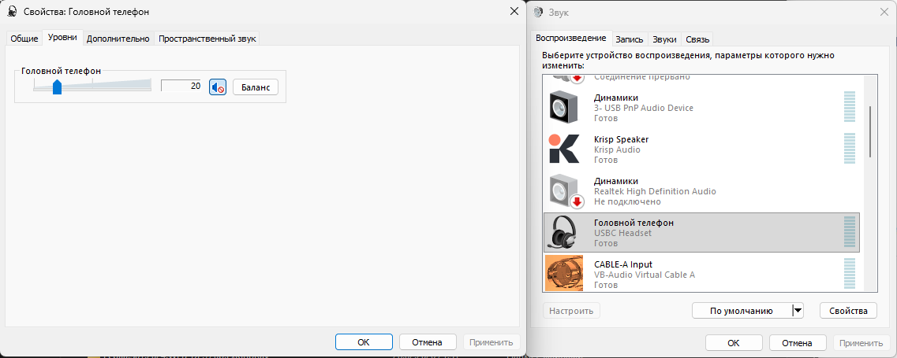

**Решение** - нужно проверить:

Win+R → mmsys.cpl → Свойства: Гарнитура → Уровни \\ кнопка динамика
должна быть отжата (это mute микрофона) и уровень 100%.

### “Сползание громкости” микрофона

**Проблема** –ползунок громкости микрофона сам сползает со 100%.

Чтобы Windows/Phone Link не трогали уровень:

1\.  mmsys.cpl → вкладка **Связь**

2\.  Выбери **“Действие не требуется / Ничего не делать”**

3\.  ОК

По умолчанию стояло 80%.

Но это не помогает, если например в Teams включена автоматическая
корректировка чувствительности микрофона:

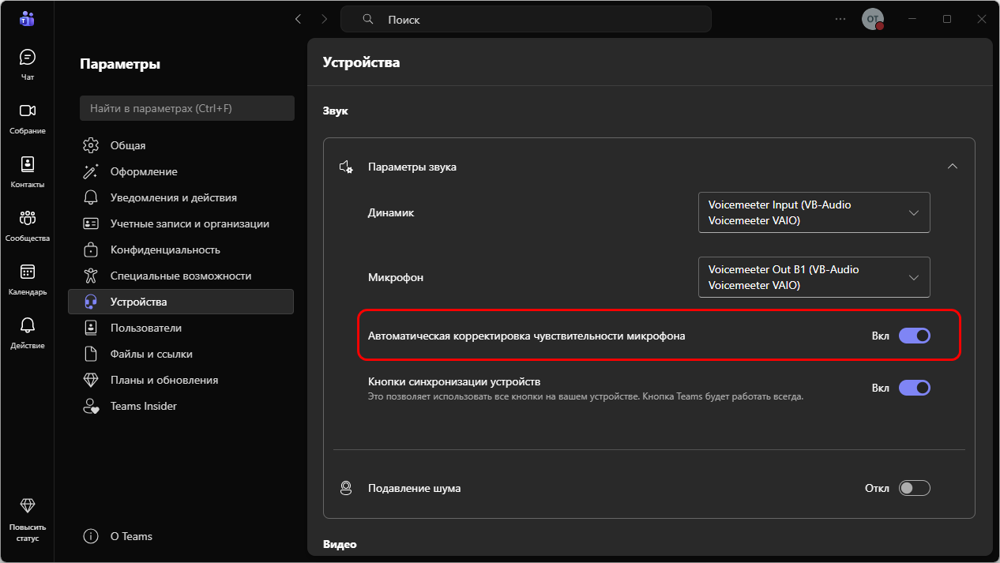

Такая же настройка есть в Discord.

Однажды во время созвона по Телемосту меня стали плохо слышать, я
обнаружил, что уровень Krisp Microphone стоял на уровне 0%, а микрофона
Voicemeeter Out B1 (выставлен дефолтным устройством записи в Windows у
меня) на уровне 6%. Вероятно, это могло произойти по причине того, что
перед этим созвоном я экспериментировал с уровнями громкости в
компрессоре Voicemeeter Potato на тракте микрофона (Stereo Input 1) –
вплоть до треска динамиков гарнитуры, в результате чего одно из
приложений могло среагировать на это и убавить уровень звука дефолтного
микрофона (Voicemeeter Out B1), и таким приложением было либо Teams либо
Discord, одно из которых было запущено в этот момент. Поэтому я написал
ps1-скрипт, который детектирует приложение, изменившее уровень
громкости, и возвращает этот уровень на 100%:

`bats for calls/Детектор источника изменения громкости микрофонов и динамиков/`

- в этой папке помимо скрипта для микрофона есть ещё скрипт для
динамиков, который устраняет проблему описанную в параграфе выше
([Гарнитура. Динамики молчат](звонки-через-пк.md#гарнитура-динамики-молчат)).

Ниже пример работы ChangeMicVolumeDetector.ps1:

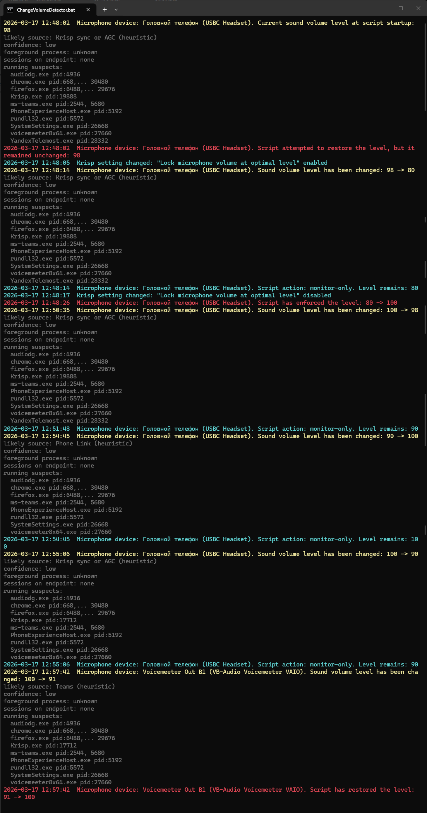

- такое количество событий в реальности не происходит, это я сделал
специально для показа возможностей скрипта. В реальности за день работы
можно увидеть только как Krisp меняет уровень физического микрофона с
диапазоне 90-98% при условии установленной галочки "Lock microphone
volume at optimal level". Все остальные события редки, и у меня
случались 1-2 раза в месяц. В идеале данный скрипт нужно запускать перед
началом работы (созвоны, собеседования), но также его можно запустить,
когда вы обнаружили проблему со звуком уже во время созвона – скрипт всё
поправит. Нужно только скрипт доработать под ваши устройства Записи и
Воспроизведения, которые вы используете с своей работе. Используйте
универсальный скрипт из папки «Детектор источника изменения громкости
микрофонов и динамиков».
