# Восстановление уровня громкости и шумодав


В этой инструкции решаются следующие проблемы:

**Проблема 1**: звук от микрофона гарнитуры на ПК занижен на 30-50%, при
этом уровень громкости микрофона в свойствах устройства выставлен на
100%. Проблема касается гарнитуры, подключенной к ПК – ваш собственный
голос звучит тише собеседника на видео/аудио-записи созвона («Связь с
телефоном», Teams, Телемост, Discord и т.п.). При этом уровень вашего
голоса звучит ещё тише при использовании ПО «Связь с телефоном», а
именно в динамике телефона собеседника по сравнению с любым приложением
видео-конференций (Teams, Телемост, Discord) - если в Винде
воспользоваться встроенным тестом микрофона (записать , затем
воспроизвести), то громкость записанного голоса будет отличная, но
передаваться в телефон собеседнику через ПО «Связь с телефоном» этот
голос будет с заниженным уровнем громкости.

**Проблема 2**: тихий звук от собеседника, приходящий из ПО «Связь с
телефоном»(Phone Link). Эта проблема второстепенная, т.к. в большинстве
случаев для её решения можно обойтись локальным регулятором громкости на
проводной гарнитуре.

**Проблема 3**: звуки от нажатия клавиатуры попадают в микрофон
проводной гарнитуры. Проблема рассматривается к разделе «[Шумодав от
Krisp](#4-шумодав-от-krisp)».

Решение этих проблем одинаково работает, как для ПО «Связь с телефоном»,
так и для любого другого ПО, например, Яндекс Телемост, поскольку любое
ПО использует аудио устройства , заданные в ОС как дефолтные. Если
приложение позволяет выбирать устройства вручную — переключи его на «По
умолчанию».

## 1. Voicemeeter

Решение - установить утилиту Voicemeeter
(https://vb-audio.com/Voicemeeter/ - бесплатная) и поднять уровень
громкости на 3.8 дБ (можете подобрать любой). В этой инструкции
используется Voicemeeter 1.X.X.X, т.е. обычная(минимальная) версия.

Вид voicemeeter_x64.exe сразу после установки (см. рис. 1):

<figure>
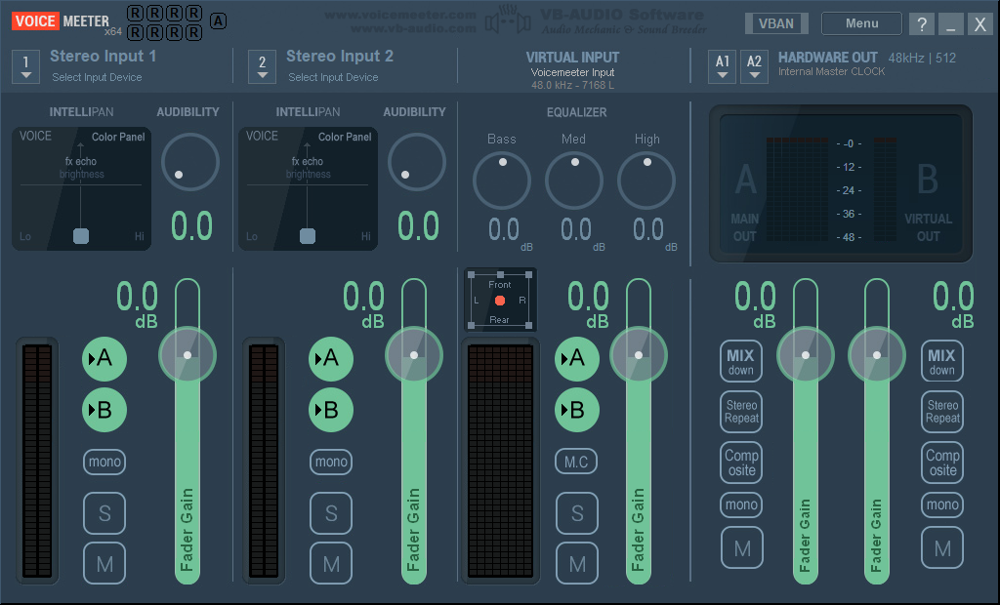
<figcaption><p>Рисунок</p></figcaption>
</figure>

Fader Gain позволяет увеличить максимум на 12dB. Если нужно больше, то
надо установить Voicemeeter Banana или Potato (Voicemeeter Standard надо
удалить перед этим) – такое редко, но может понадобиться, например, при
подключении USB-гарнитуры со слабым усилением микрофона, подключенной к
Realtek-чипу на материнской плате ПК/ноута – в этом случае звук может
быть очень тихим. В Potato есть подменю "Compressor Details", в которое
можно попасть ПКМ по кружку с надписью "Comp.":

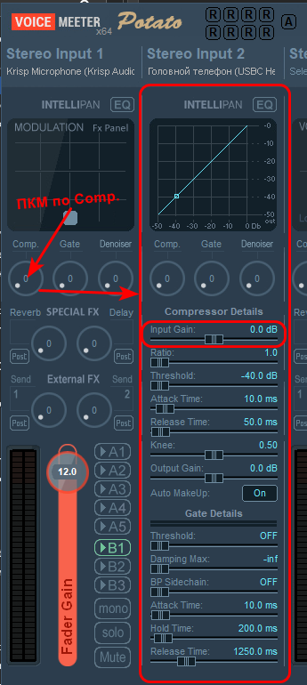

Input Gain – дополнительный коэф-т усиления помимо Fader Gain.

### 1.1. Начало тракта “микрофон гарнитуры → Voicemeeter → собеседник”

Выбираем устройство начала тракта – микрофон гарнитуры. Нажимаем на
кнопку «1» слева от “Stereo Input 1” и выбираем (ЛКМ) нужный микрофон,
после нажатия ЛКМ справа появится треугольник (рис. 2):

<figure>
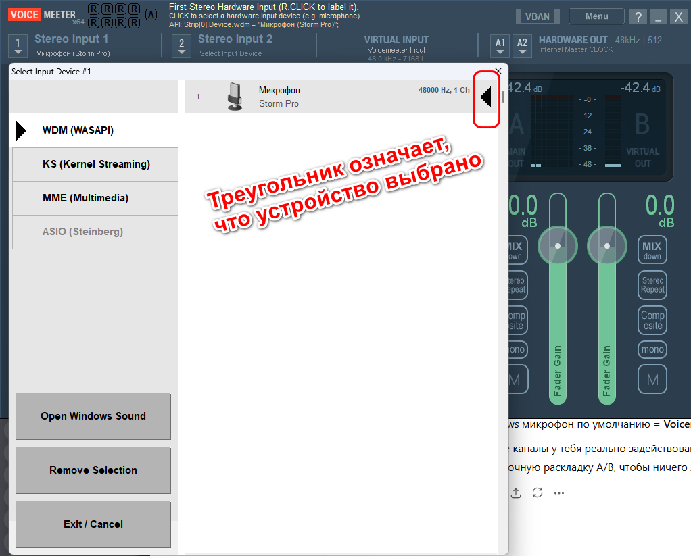
<figcaption><p>Рисунок</p></figcaption>
</figure>

### 1.2. Конец тракта “микрофон гарнитуры → Voicemeeter → собеседник”

**Тракт микрофона**: Storm Pro Mic → Voicemeeter Strip 1 → Bus B1 →
Voicemeeter Out B1 (Capture default) → Phone Link → телефон →
собеседник.

Для включения направления «Voicemeeter Strip 1 → Bus B1 → Voicemeeter
Out B1 (Capture default)», а значит и всего тракта, **нужно чтобы была
нажата кнопка Bus B1** (рис. 3).

**Конец тракта микрофона** =\
**Bus B1 / Voicemeeter Out B1**, потому что именно оттуда Phone Link
берёт “микрофон звонка” (Voicemeeter Out B1 установим дефолтным, см.
[раздел
1.7](#17-настройки-записи-в-windows-для-тракта-микрофон-гарнитуры-voicemeeter-связь-с-телефоном),
а Phone Link берёт только дефолтный микрофон Windows).

Strip 1 – это название используется в xml-файле настроек и соответствует
«Stereo Input 1» в интерфейсе Voicemeeter.

Bus B1 – это название используется в xml-файле настроек и соответствует
кнопке «B» в столбце «Stereo Input 1», см. рис. 3.

#### OBS Studio

Если планируете записывать экран при помощи OBS , то имейте в виду, что
OBS иногда может не слышать микрофонный звук с устройства “**Voicemeeter
Out B1”** – выбрать позволяет, но звук он оттуда не берёт. Поэтому либо
нужно выбирать физический микрофон, либо любой другой виртуальный
(Krisp, Voicemeeter Out B2, B3). Чтобы использовать Voicemeeter Out B2
нужен Voicemeeter Banana или Potato. Но лично у меня проблем с **Out
B1** не было.

Архитектура Voicemeeter Potato:

<table style="width:50%;">
<colgroup>
<col style="width: 7%" />
<col style="width: 18%" />
<col style="width: 24%" />
</colgroup>
<thead>
<tr>
<th style="text-align: center;"><strong>Канал</strong></th>
<th><blockquote>
<p><strong>Назначение</strong></p>
</blockquote></th>
<th><blockquote>
<p><strong>Поведение в OBS</strong></p>
</blockquote></th>
</tr>
</thead>
<tbody>
<tr>
<td><strong>B1</strong></td>
<td><blockquote>
<p>Main Virtual Mic</p>
</blockquote></td>
<td><blockquote>
<p>🧨 конфликтный</p>
</blockquote></td>
</tr>
<tr>
<td><strong>B2</strong></td>
<td><blockquote>
<p>AUX Virtual Mic</p>
</blockquote></td>
<td><blockquote>
<p>✅ самый стабильный</p>
</blockquote></td>
</tr>
<tr>
<td><strong>B3</strong></td>
<td><blockquote>
<p>Additional</p>
</blockquote></td>
<td><blockquote>
<p>норм, но реже нужен</p>
</blockquote></td>
</tr>
</tbody>
</table>

### 1.3. Защита от loopback

Отключаем голосовую петлю:

1\) чтобы не слышать собственный голос в гарнитуре на ПК – отключаем
Stereo Input 1 (Mic Storm Pro) – это кнопка A на рис. 3. Зелёная =
включено/маршрут активен, серая = выключено.

2\) отключаем VIRTUAL INPUT (Voicemeeter Input / VAIO) кнопка B на рис.
3, чтобы системный звук и звук приложений не попадал в микрофонный канал
B1. Иначе собеседник на другом конце GSM услышит всё, что играет на ПК ,
в т.ч. он услышит свой голос в динамике своего телефона. Ну и в
принципе, VIRTUAL INPUT не используется для [прямого тракта от
собеседника в динамики
гарнитуры](#вариант-1-прямой-тракт-прослушивания-от-собеседника-в-динамики-гарнитуры),
который подходит для 90% случаев.

### 1.4. Прочие кнопки A и B

1\) отключаем VIRTUAL INPUT (Voicemeeter Input / VAIO) кнопка A на рис.
3 в случае, когда VIRTUAL INPUT не используется, а он у нас не
используется для [прямого тракта от собеседника в динамики
гарнитуры](#вариант-1-прямой-тракт-прослушивания-от-собеседника-в-динамики-гарнитуры),
который подходит для 90% случаев.

2\) Stereo Input 2 кнопки A и B отключаем просто потому, что он не
используется (рис. 3).

<figure>
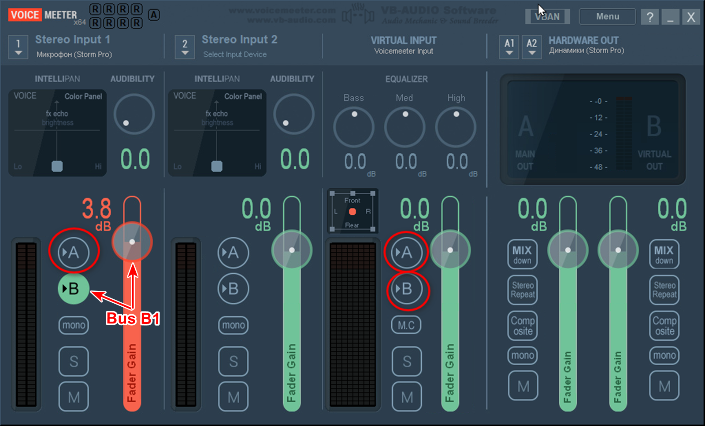
<figcaption><p>Рисунок . «Минимальная схема»</p></figcaption>
</figure>

### 1.5. Усиление громкости

Регулируем усиление микрофона на полосе Stereo Input 1, который уходит в
шину B1. Ползунок поднимает уровень, слышимый собеседником, см. красный
ползунок на рис. 3 – уровень звука увеличен на 3.8дБ.

### 1.6. Сохраните настройки

Menu\Save Settings

Пример имени файла: Voicemeeter_calls_mode_Storm_Pro_headset.xml

### 1.7. Настройки записи в Windows для тракта микрофон гарнитуры → Voicemeeter → «Связь с Телефоном»

В Windows-настройках звука выбрать виртуальный канал (см. рис. 4):

- Win+R → mmsys.cpl → Запись

- **Voicemeeter Out B1** → ПКМ→\
  **Использовать по умолчанию** и\
  **Использовать устройство связи по умолчанию**.

<figure>
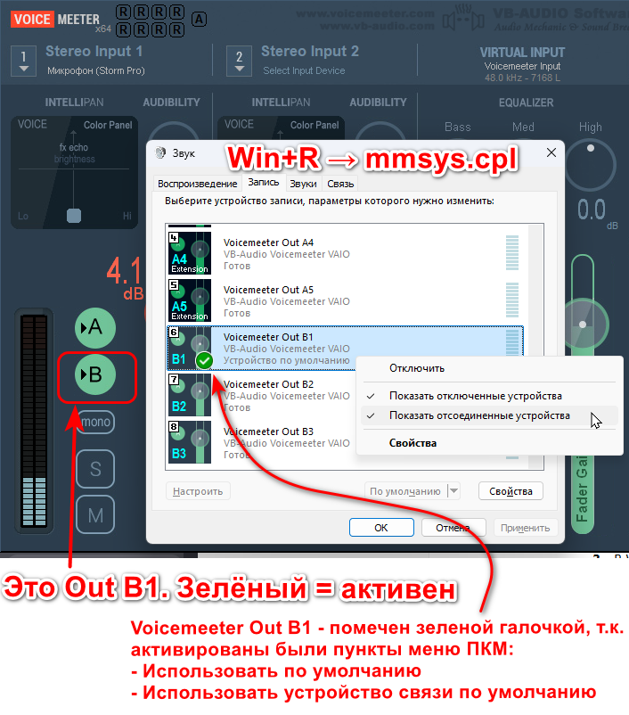
<figcaption><blockquote>
<p>Рисунок</p>
</blockquote></figcaption>
</figure>

В свойствах Voicemeeter Out B1 → Дополнительно:

- Формат: **48 kHz**

- ❌ «Разрешить приложениям использовать устройство в монопольном
  режиме» — ВЫКЛ

- ❌ «Предоставить приоритет приложениям монопольного режима» — ВЫКЛ

В свойствах Voicemeeter Out B1 →Уровни**:** **100%**

### 1.8. Настройки воспроизведения в Windows для тракта собеседник → ПК

#### Вариант 1. Прямой тракт прослушивания от собеседника в динамики гарнитуры

Прямой тракт означает, что звук идет напрямую с телефона в динамики
гарнитуры или ПК минуя Voicemeeter. Подойдёт для 90% случаев.

**Тракт:**

Собеседник → телефон → Phone Link → Windows аудиомикшер → Storm Pro
(Render endpoint)

- Win+R → mmsys.cpl → Воспроизведение (рис. 5)

- **Динамики Storm Pro** → ПКМ→\
  **Использовать по умолчанию** и\
  **Использовать устройство связи по умолчанию**.

В свойствах Динамики Storm Pro → Дополнительно (рис. 5):

- Формат: **48 kHz**

- ❌ «Разрешить приложениям использовать устройство в монопольном
  режиме» — ВЫКЛ

- ❌ «Предоставить приоритет приложениям монопольного режима» — ВЫКЛ

В свойствах Динамики Storm Pro →Уровни**:** **100%**

<figure>
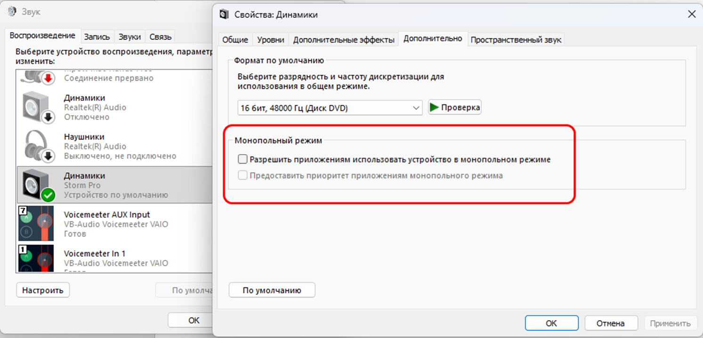
<figcaption><blockquote>
<p>Рисунок</p>
</blockquote></figcaption>
</figure>

#### Вариант 2. Собеседник → Voicemeeter → динамики гарнитуры

Нужен, если требуется обработать звук от собеседника, например, когда он
очень тихий. Такое происходит в случае, когда вам звонят по VoIP через
гарнитуру, подключенную к Windows-ПК, где не позаботились об усилении
выходного тракта. В этом случае звук нужно подать на Voicemeeter Input
(VB-Audio Voicemeeter VAIO). Если усиливать собеседника не нужно, то
используйте Вариант 1. В большинстве случаев можно обойтись локальным
регулятором громкости на проводной гарнитуре.

**Тракт:**

Собеседник → телефон → Phone Link → Voicemeeter (VAIO / Virtual Input) →
Storm Pro (Render endpoint)

Win+R → mmsys.cpl → Воспроизведение

- **Voicemeeter Input (VB-Audio Voicemeeter VAIO)**→ ПКМ→\
  **Использовать по умолчанию** и\
  **Использовать устройство связи по умолчанию**.

В свойствах Voicemeeter Input → Дополнительно:

- Формат: **48 kHz**

- ❌ «Разрешить приложениям использовать устройство в монопольном
  режиме» — ВЫКЛ

- ❌ «Предоставить приоритет приложениям монопольного режима» — ВЫКЛ

В свойствах Voicemeeter Input →Уровни**:** **100%**

**Внимание!** Помимо голоса и звуков от собеседника в гарнитуру попадают
все системные звуки и звуки приложений, поскольку устройство
**Voicemeeter Input** выбрано в качестве дефолтного для воспроизведения
. Способа отделения звуков системы от звуков собеседника нет по причине
ограничений приложения Phone Link, о которых было сказано в разделе
Ограничения инструкции «Звонки с телефона через ПК». Поэтому при выборе
варианта 2 не используете приложения, которые могут издавать звуки и
которые вам не нужны во время созвона по Phone Link, не открывайте в
браузере сайты, где может появиться звук - для случая, когда дефолтное
устройство воспроизведения (Voicemeeter Input) используется для
распознавания голоса ассситентом(нейронкой).

##### Вариант 2. Настройки тракта “Собеседник → Voicemeeter → динамики гарнитуры” в Voicemeeter

1\. Включить кнопку A на VIRTUAL INPUT (Voicemeeter Input / VAIO), см.
рис. 3. Кнопка B там остаётся OFF.

2\. Выбираем устройство для вывода – динамики гарнитуры:

<figure>
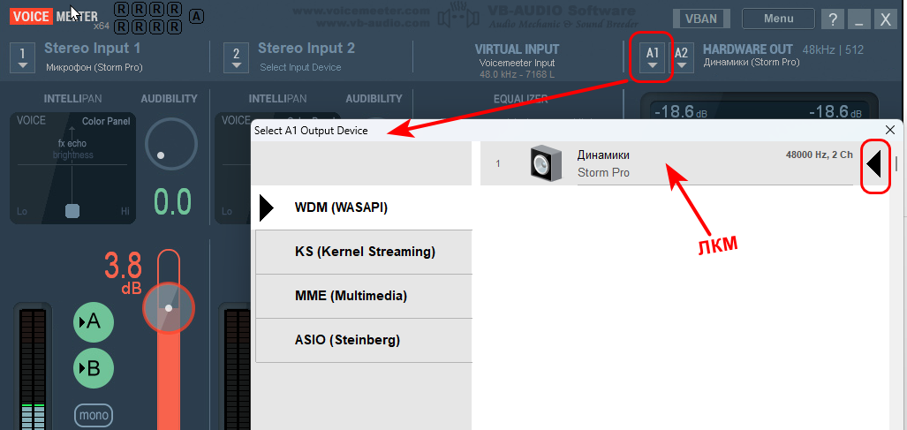
<figcaption><p>Рисунок</p></figcaption>
</figure>

### 1.9. Настройки Windows mmsys.cpl → Связь

Выбери **“Действие не требуется / Ничего не делать”**

<figure>
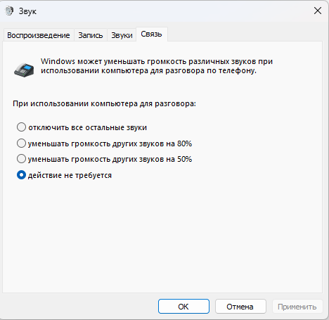
<figcaption><p>Рисунок</p></figcaption>
</figure>

### 2.0. Система > Звук

Вместо mmsys.cpl рис.4 и 5 есть способ 2:

Win+I → Система → Звук , см. ниже рис. 8 (для Windows 11). Но лично
мне удобнее показалось работать с mmsys.cpl.

<figure>
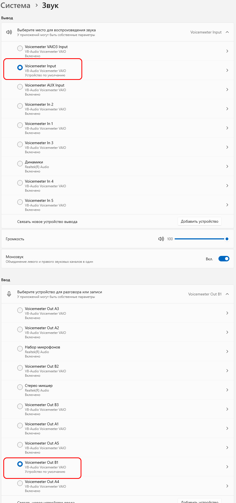
<figcaption><p>Рисунок . Win+I → Система → Звук</p></figcaption>
</figure>

## 2. Проникновение звуков в “Связь с телефоном”

### 2.1 Минимальная схема

Схема на рис. 3 в [разделе 1.4](#14-прочие-кнопки-a-и-b) (назовём её
“минимальная”) идеальна для звонков.\
Приложения не могут протечь к собеседнику, потому что:

- в шину B уходит только микрофон,

- системный звук вообще никуда не маршрутизируется.

**Единственный момент, который стоит помнить**

- на Virtual Input **не трогай B никогда** (рис. 9). Как для [варианта
  1](#вариант-1-прямой-тракт-прослушивания-от-собеседника-в-динамики-гарнитуры),
  так и для [варианта
  2](#вариант-2-собеседник-voicemeeter-динамики-гарнитуры).

<figure>
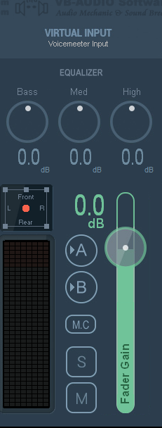
<figcaption><blockquote>
<p>Рисунок</p>
</blockquote></figcaption>
</figure>

### 2.2. Сценарии утечки (реальные)

(ознакомительный раздел, необязательно к прочтению)

Базовая истина

Собеседник слышит **только то, что попадает в B-шину**, потому что на
телефоне микрофон = **Voicemeeter Out B1 (Capture)**.

Значит “утечка приложений” возможна **только если звук приложения
каким-то путём попал в B1**.

#### 1) Ты включил **B** на полосе, куда приходит системный звук

Обычно это **VIRTUAL INPUT (Voicemeeter Input / VAIO / VAIO3 / AUX)**.

- Было правильно: **A ON, B OFF**

- Стало опасно: **B ON**\
  → всё, что играет на ПК (браузер, плеер, уведомления), уйдёт
  собеседнику.

Типичный случай: случайно нажал кнопку B или загрузил другой пресет.

В обычном Voicemeeter GUI виден один Virtual Input (VAIO). В Windows
могут отображаться ещё VAIO3/AUX как отдельные virtual endpoints — это
нормально. Важно лишь, чтобы в GUI на всех системных/виртуальных входах
B был OFF

#### 2) Приложение играет не в VAIO, а в другой виртуальный вход, где B включён

Например:

- Vivaldi перескочил на **Voicemeeter AUX Input**

- или Windows/приложение выбрало **VAIO3 Input**\
  а там у тебя вдруг **B ON**.

→ утечка даже если на “основном” Virtual Input B выключен.

#### 3) В Windows дефолтный микрофон внезапно стал **не B1, а Stereo Mix / “что слышу”**

Если Voicemeeter отрубился/не запущен, или bat не вернул профиль,
Windows может:

- переключить Default Mic на **Стерео микшер (Realtek)**\
  или на другой loopback-микрофон.

Тогда собеседник услышит всё системное аудио **в обход
Voicemeeter-логики**.

#### 4) Включена “прослушка микрофона” + B включён на Virtual Input

Цепочка:

1\.  На микрофоне Windows стоит галка **“Прослушивать с данного
    устройства”**

2\.  Прослушивание идёт в **Voicemeeter Input**

3\.  На Virtual Input включён **B**

→ твой микрофон превращается в системный звук, уходит обратно в B1\
→ собеседник слышит эхо/себя/ПК.

#### 5) Ты отправляешь приложение напрямую в B-виртуалку

Редко, но возможно:

- обычно только если вручную выбрать в настройках приложения устройством
  вывода **Voicemeeter Out B1 (Render)**\
  или **Voicemeeter VAIO3 Output / B2/B3**.

→ тогда оно сразу попадает в B-шину.

## 3. Автоматизация

**Задача** – автоматизировать переключение звуковых профилей в Windows
по скрипту. **Цель** – быстро переключаться в режим звонков из обычного
режима и обратно.

**Что автоматизируем:**\
— профили устройств вывода (динамики/наушники);\
— профили устройств ввода (микрофон);\
— состояние “Стерео микшера”;\
— системные звуки Windows.

**Что не автоматизируем:**\
— звуки приложений (браузер, мессенджеры и т.п.). При «[минимальной
схеме](#21-минимальная-схема)» они **не могут попасть к собеседнику**,
потому что в шину **B1 уходит только микрофон**, а
системные/приложенческие звуки в B-шины не маршрутизируются (B на всех
входных полосах OFF).\
Если звук приложений мешает лично вам — проще закрыть лишнее или вручную
приглушить в микшере громкости Windows.

**Как автоматизируем:** при помощи bat-файлов.

**Какие тракты автоматизируем**:\
— “микрофон гарнитуры → Voicemeeter → собеседник” (усиливаем звук от
микрофона нашей гарнитуры)\
—«[Вариант 1. Прямой тракт прослушивания от собеседника в динамики
гарнитуры](#вариант-1-прямой-тракт-прослушивания-от-собеседника-в-динамики-гарнитуры)».

—«[Вариант 2. Собеседник → Voicemeeter → динамики
гарнитуры](#вариант-2-собеседник-voicemeeter-динамики-гарнитуры)»
(усиливаем звук от собеседника).

### 3.1. SoundVolumeView

Для управления аудио профилями в Windows скачайте бесплатную тулзу
SoundVolumeView:

<https://www.nirsoft.net/utils/sound_volume_view.html>

Положите SoundVolumeView.exe в любое место:

C:\SoundVolumeView\\

### 3.2. Настройка SoundVolumeView

Что сделать, чтобы отключенные в mmsys.cpl устройства отображались в
SoundVolumeView

В SoundVolumeView:

1\.  **Options → Show Disabled Devices** (Показать отключённые
    устройства)

2\.  **Options → Show Disconnected Devices** (Показать отсоединённые
    устройства)

### 3.3. Находим свои аудио устройства в SoundVolumeView

Найдите все аудио устройства, которые вы используете на ноуте/ПК в
обычном режиме (встроенные динамики, встроенный микрофон) и устройства,
которые были выставлены по умолчанию утилитой Voicemeeter.

**Задача** – взять правильные имена.

#### Какие имена ищем?

Которые фигурируют в аудио профилях Windows, а именно:

1\) Динамики и микрофон, которые выставлены по умолчанию в обычной
работе ноутбука (без звонков). Чаще всего это встроенные динамики и
микрофон

2\) Стерео микшер

3\) динамики гарнитуры (микрофон гарнитуры не ищем, т.к. мы уже
прописали в настройках Voicemeeter, поэтому в CMD-файле он не будет
фигурировать)

4\) для [Варианта
1](#вариант-1-прямой-тракт-прослушивания-от-собеседника-в-динамики-гарнитуры)
– только название устройства “Voicemeeter Out B1”, которое участвует в
конфигурации Voicemeeter, а для [Варианта
2](#вариант-2-собеседник-voicemeeter-динамики-гарнитуры) – ещё и
“Voicemeeter Input”.

Системные звуки искать не надо, т.к. [будем отключать через
реестр](#системные-звуки), а не при помощи SoundVolumeView.

Их можно посмотреть двумя способами:

1\) Win+R → mmsys.cpl

2\) Win+I → Система → Звук [(см. рис. 8 в разделе “Система >
Звук”)](#20-система-звук)

#### Как ищем?

Ищите по первому столбцу Name:

<figure>
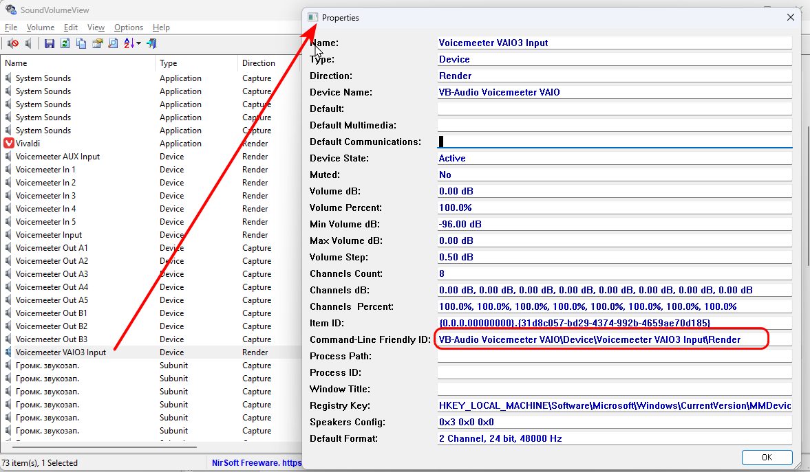
<figcaption><p>Рисунок</p></figcaption>
</figure>

Дополнительный ориентир на всякий случай:

Нас интересуют только устройства – **Device** в столбце **Type**. Далее
смотрим столбец **Direction**: **Render** – это выводное устройство, а
**Capture** – входное.

#### Какой ключ взять?

Ключ – это либо имя, либо путь, либо ID устройства/приложения.

В большинстве случаев рабочим будет “Command-Line Friendly ID” (CLFID).
Вместо “Command-Line Friendly ID” **можно использовать имя Name, при
условии, что оно уникальное.**

**ВАЖНО!** Для capture-устройств (микрофонов) и render-устройств
(динамиков) SoundVolumeView часто “путается” по Name/Friendly ID, а
**Item ID (GUID) — самый надёжный ключ для устройств**. Например, в моём
случае SoundVolumeView не смог найти "Набор микрофонов" (Realtek(R)
Audio) ни по Name ни по Friendly ID, а только Item ID.

Стерео микшер (Stereo Mix) лучше включать по “Command-Line Friendly ID”
(CLFID), а не по Item ID. Потому что Stereo Mix — это
**виртуальный/драйверный loopback-endpoint**, в отличии от динамиков и
микрофона (“железные” endpoints Realtek).

##### Почему /Enable по Item ID иногда не срабатывает для Stereo Mix

Есть две типовые причины:

1\.  **Item ID меняется, когда устройство Disabled или драйвер
    перезагрузился.**\
    Для Stereo Mix это происходит гораздо чаще, чем для спикеров/мика.\
    В итоге SVV получает “старый” GUID → команда валидная, но endpoint
    уже другой → эффекта нет.

2\.  **Когда устройство Hidden/Disabled, SVV иногда не может “поднять”
    его по GUID,**\
    потому что Windows PolicyConfig не активирует скрытые
    loopback-источники по ID,\
    а активирует их по “endpoint path” (CLFID) / имени драйвера.

Поэтому по GUID ты иногда бьёшь в “мертвую запись”, а по CLFID — в
живую.

##### Item ID и Friendly ID меняются при каждом выключении/включении

Такое происходит, когда устройство не является встроенным в материнскую
плату, и подключается к ПК по кабелю, например, телевизор или проводная
USB-гарнитура. Единственный выход – автоматически определять Friendly ID
при помощи ps1-скрипта. Пример скрипта:
«audio_normal_BRIX_Haier55TV.ps1» и батник для его запуска –
«audio_normal_BRIX_Haier55TV.bat», лежат тут:

`bats for calls/Схемы аудио потоков с одной USB-headset/`

##### Item ID

Некоторые Item ID содержат такие символы и их комбинации, которые
являются служебными для CMD:

 | — пайп (cmd пытается разрезать команду на две)

 %b — попытка подставить переменную окружения %b%

Правило замены для всех таких ID в .bat:

1\.  **Все % → %%**

2\.  **Все | → ^|**

3\.  Держим всё в кавычках при /SetDefault.

Вот пример Item ID:

{0.0.0.00000000}.{f4fbe252-29ed-414d-bcf6-c460dff5eed5}|#%b{A9EF3FD9-4240-455E-A4D5-F2B3301887B2}|1%b#

И вот как его нужно представить для CMD:

"{0.0.0.00000000}.{f4fbe252-29ed-414d-bcf6-c460dff5eed5}^|#%%b{A9EF3FD9-4240-455E-A4D5-F2B3301887B2}**^|**1**%**%b#"

Но мне ниразу не приходилось заморачиваться с такими Item ID. И если вы
с таким столкнётесь, то переходите к написанию ps1-скрипта вместо
батника, чтобы избежать мороки с заменами символов.

##### Системные звуки

Системные звуки – звуки **системных событий Windows**, они не связаны со
звуками приложений/браузера.

Искать их не надо в через SoundVolumeView.exe /Mute **надежнее их
отключать через реестр командой** :

```bat
reg add "HKCU\AppEvents\Schemes" /ve /t REG_SZ /d ".None" /f >nul
```

Это команда выключения **схемы звуков (AppEvents Schemes)**.

Включение:

```bat
reg add "HKCU\AppEvents\Schemes" /ve /t REG_SZ /d ".Default" /f >nul
```

###### Почему так?

(раздел ознакомительный, можно не читать)

System Sounds — это не один вечный объект. Windows создаёт/закрывает
аудио-сессии динамически:

- после перезапуска explorer.exe,

- после обновления аудиодрайверов,

- после смены устройства вывода,

- иногда просто после сна/пробуждения,

- после запуска/закрытия Voicemeeter.

В итоге **старый Item ID может “умереть”**, а появится новый. Именно
поэтому в списке SoundVolumeView куча дублей и все с уникальными ID. На
следующем рисунке (рис. 11) живой объект выделен синим баром, я его
вычислил по Volume Percent = 82.0%, т.к. именно такое значение я
выставил в микшере громкости Винды (см. рис. 12).

<figure>
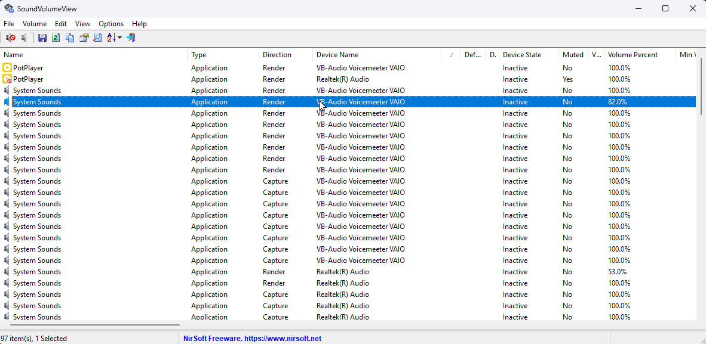
<figcaption><p>Рисунок</p></figcaption>
</figure>

<figure>
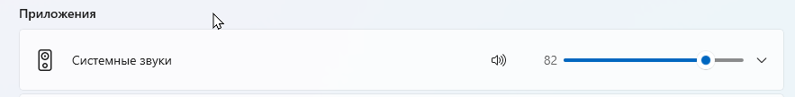
<figcaption><p>Рисунок</p></figcaption>
</figure>

Поэтому надежнее управлять через схему звуков (AppEvents Schemes). Но
тут есть один небольшой недостаток - возникает эффект:

- схема .None → **события не играют**

- но микшер громкости Винды может показывать “Mute” по старому состоянию
  сессии\
  (или наоборот).

Но этот косметический эффект нам ничем не мешает пока мы на созвоне. А
после созвона мы обратно включим схему таким же образом через реестр и
всё будет в базовом состоянии. В любом случае , для общей информации,
сообщаю, что «выровнять» состояние микшера и схемы звуков можно кнопкой
«Сброс», которая на той же странице в микшере громкости, что и
«Системные звуки»:

<figure>

<figcaption><p>Рисунок</p></figcaption>
</figure>

### 3.4. Пишем bat-ник для включения обычного режима

Обычный режим – звук через встроенные динамики и микрофон ноутбука.

Для моей системы:

<figure>
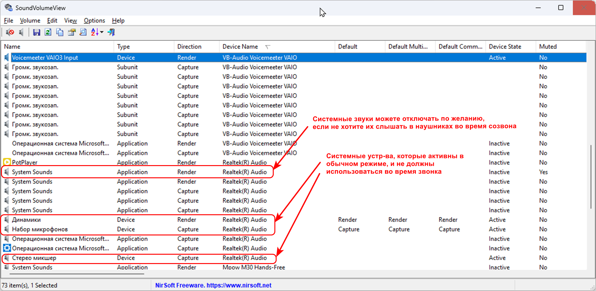
<figcaption><p>Рисунок</p></figcaption>
</figure>

Следующий файл запускаем для активации обычного режима:

#### audio_normal.bat (обычный режим)

```bat
@echo off
cd /d C:\SoundVolumeView

REM Встроенные динамики ноута: Realtek(R) Audio\Device\Динамики\Render
set "SPK_NAME={0.0.0.00000000}.{f4fbe252-29ed-414d-bcf6-c460dff5eed5}"

REM Встроенный микрофон ноута: Realtek(R) Audio\Device\Набор микрофонов\Capture
set "MIC_NAME={0.0.1.00000000}.{14673e6c-d339-4a90-bc3a-d9d1cb3303be}"

set MIXER_NAME="Realtek(R) Audio\Device\Стерео микшер\Capture"

REM Обычный вывод/ввод. На случай если устройства были отключены вручную — включаем их
SoundVolumeView.exe /Enable "%SPK_NAME%"
SoundVolumeView.exe /Enable "%MIC_NAME%"
timeout /t 1 >nul

REM Выбираем по умолчанию обычный вывод/ввод
SoundVolumeView.exe /SetDefault "%SPK_NAME%" all
SoundVolumeView.exe /SetDefault "%MIC_NAME%" all

REM Включаем системные звуки
reg add "HKCU\AppEvents\Schemes" /ve /t REG_SZ /d ".Default" /f >nul

REM Stereo Mix включаем
SoundVolumeView.exe /Enable "%MIXER_NAME%"

echo Normal audio profile applied.
```

Примечания:

1\) Здесь мы снова включаем “Стерео микшер”. На практике он нужен лишь
для сценариев записи “что слышите” (например, захват системного звука),
поэтому если вы этим не пользуетесь, можно оставить его выключенным
постоянно.

2\) В качестве ключа для Стерео микшера используем CLFID/Name, а для
‘железных’ девайсов — Item ID.

3\) SPK_NAME – сокращение от SPEAKER NAME.

4\) Сюда можно добавить завершение работы Voicemeeter:

```bat
REM Завершение с /F нужно для случая, когда в настройках стоит галочка "System Tray"
taskkill /IM voicemeeter_x64.exe /F
```

- Эту строку надо добавлять в конце перед echo - лучше убивать
  Voicemeeter после возврата дефолтов на Realtek, чтобы не было окна
  тишины.

### 3.5. Пишем bat-ник для Варианта 1

Вариант 1 – усиливаем звук от микрофона гарнитуры, и используем [прямой
тракт прослушивания от собеседника в динамики
гарнитуры](#вариант-1-прямой-тракт-прослушивания-от-собеседника-в-динамики-гарнитуры).

#### audio_calls.bat (звонки + Voicemeeter)

```bat
@echo off
REM Гарнитура Storm Pro: Storm Pro\Device\Динамики\
REM Усиливаем только звук от микрофона своей гарнитуры
REM Батник написан для Voicemeeter 1.X.X.X, т.е. для обычной версии

cd /d C:\SoundVolumeView
set MIXER_NAME="Realtek(R) Audio\Device\Стерео микшер\Capture"

REM Динамики гарнитуры: Storm Pro\Device\Динамики\Render
set "SPK_NAME_Headset={0.0.0.00000000}.{28091505-8d38-4b96-b30c-1ffb3ba9f892}"

REM Stereo Mix выключаем
SoundVolumeView.exe /Disable "%MIXER_NAME%"

REM заглушаем системные звуки
reg add "HKCU\AppEvents\Schemes" /ve /t REG_SZ /d ".None" /f >nul

REM Звонковый вывод. На случай если устройство было отключено вручную — включаем его
SoundVolumeView.exe /Enable "%SPK_NAME_Headset%"

REM Звонковый вывод - динамики гарнитуры
SoundVolumeView.exe /SetDefault "%SPK_NAME_Headset%" all

REM Звонковый ввод: микрофон из Voicemeeter (B1)
SoundVolumeView.exe /SetDefault "VB-Audio Voicemeeter VAIO\Device\Voicemeeter Out B1\Capture" all

echo Calls + Voicemeeter audio profile applied. Gain: Storm Pro output.
```

Сюда можно добавить запуск Voicemeeter:

```bat
start "" "C:\Program Files (x86)\VB\Voicemeeter\voicemeeter_x64.exe"
timeout /t 1 >nul
```

- Старт Voicemeeter можно ставить либо сразу после переключения
дефолтов при помощи SoundVolumeView, либо в начале — оба варианта
рабочие. Если Voicemeeter ругается на несовпадение, ставь запуск
**после** SetDefault

### 3.6. Пишем bat-ник с автозапуском Voicemeeter и профилем для Варианта 1

Задача – автоматизировать загрузку настроек в Voicemeeter для cmd-файла
audio_calls.bat.

Положите XML-файл настроек в папку "C:\Program Files (x86)\VB\\.

Добавляем в конце audio_calls.bat перед echo:

```bat
REM важно: Voicemeeter должен быть полностью закрыт, чтобы загрузить в него XML-файл при следующем запуске
REM Проверка: запущен ли процесс
tasklist /FI "IMAGENAME eq voicemeeter_x64.exe" 2>NUL | find /I "voicemeeter_x64.exe" >NUL
if %errorlevel%==0 (
    echo Voicemeeter is running - terminating it...
    taskkill /IM voicemeeter_x64.exe /F
    timeout /t 1 /nobreak >nul
)

REM Запускаем Voicemeeter с XML-профилем
REM важно: Voicemeeter должен быть полностью закрыт, иначе XML-файл не загрузится
start "" "C:\Program Files (x86)\VB\Voicemeeter\voicemeeter_x64.exe" -L"C:\Program Files (x86)\VB\Voicemeeter_calls_mode_Storm_Pro_headset.xml"
timeout /t 1 >nul
```

Полная версия батника:

#### audio_calls_Storm_Pro.bat (звонки через Strorm Pro + Voicemeeter)

```bat
@echo off
REM Гарнитура Storm Pro: Storm Pro\Device\Динамики\
REM Усиливаем только звук от микрофона своей гарнитуры
REM Батник написан для Voicemeeter 1.X.X.X, т.е. для обычной версии

cd /d C:\SoundVolumeView
set MIXER_NAME="Realtek(R) Audio\Device\Стерео микшер\Capture"

REM Динамики гарнитуры Storm Pro: Storm Pro\Device\Динамики\Render
set "SPK_NAME_Headset={0.0.0.00000000}.{28091505-8d38-4b96-b30c-1ffb3ba9f892}"

REM Микрофон гарнитуры Storm Pro: Storm Pro\Device\Микрофон\Capture
set "MIC_NAME_Headset={0.0.1.00000000}.{xxxxxxxx-xxxx-xxxx-xxxx-xxxxxxxxxxxx}"

REM Stereo Mix выключаем
SoundVolumeView.exe /Disable "%MIXER_NAME%"

REM заглушаем системные звуки
reg add "HKCU\AppEvents\Schemes" /ve /t REG_SZ /d ".None" /f >nul

REM Звонковый вывод. На случай если устройство было отключено вручную — включаем его
SoundVolumeView.exe /Enable "%SPK_NAME_Headset%"

REM Звонковый вывод - динамики гарнитуры
SoundVolumeView.exe /SetDefault "%SPK_NAME_Headset%" all

REM Звонковый ввод: микрофон из Voicemeeter (B1)
SoundVolumeView.exe /SetDefault "VB-Audio Voicemeeter VAIO\Device\Voicemeeter Out B1\Capture" all

REM Выставляем громкость микрофонов на максимум:
SoundVolumeView.exe /SetVolume "Voicemeeter Out B1" 100
SoundVolumeView.exe /SetVolume "%MIC_NAME_Headset%" 100

REM важно: Voicemeeter должен быть полностью закрыт, чтобы загрузить в него XML-файл при следующем запуске
REM Проверка: запущен ли процесс
tasklist /FI "IMAGENAME eq voicemeeter_x64.exe" 2>NUL | find /I "voicemeeter_x64.exe" >NUL
if %errorlevel%==0 (
    echo Voicemeeter is running - terminating it...
    taskkill /IM voicemeeter_x64.exe /F
    timeout /t 1 /nobreak >nul
)

REM Запускаем Voicemeeter с XML-профилем
REM важно: Voicemeeter должен быть полностью закрыт, иначе XML-файл не загрузится
start "" "C:\Program Files (x86)\VB\Voicemeeter\voicemeeter_x64.exe" -L"C:\Program Files (x86)\VB\Voicemeeter_calls_mode_Storm_Pro_headset.xml"
timeout /t 1 >nul

echo Calls + Voicemeeter Storm_Pro audio profile applied. Gain: Storm Pro output.
```

### 3.7. Пишем bat-ник с автозапуском Voicemeeter и профилем для Варианта 2

Вариант 2 – усиливаем не только звук от микрофона гарнитуры, но и звук
от собеседника ([Собеседник → Voicemeeter → динамики
гарнитуры](#вариант-2-собеседник-voicemeeter-динамики-гарнитуры)).

#### audio_calls_Samsung_AKG_with_Virtual_Input.bat (звонки через Samsung AKG + Voicemeeter)

```bat
@echo off
REM Гарнитура Samsung EO-IC100BWEGRU: USBC Headset\Device\Головной телефон\
REM Усиливаем звук от собеседника и усиливаем звук от микрофона своей гарнитуры
REM Батник написан для Voicemeeter 1.X.X.X, т.е. для обычной версии

cd /d C:\SoundVolumeView
set MIXER_NAME="Realtek(R) Audio\Device\Стерео микшер\Capture"

REM Микрофон гарнитуры Samsung EO-IC100BWEGRU: USBC Headset\Device\Головной телефон\Capture
set "MIC_NAME_Headset={0.0.1.00000000}.{3136ddda-2336-43ab-ac93-8451214ccb99}"

REM Stereo Mix выключаем
SoundVolumeView.exe /Disable "%MIXER_NAME%"

REM заглушаем системные звуки
reg add "HKCU\AppEvents\Schemes" /ve /t REG_SZ /d ".None" /f >nul

REM Звонковый вывод: системный звук в Voicemeeter
SoundVolumeView.exe /SetDefault "VB-Audio Voicemeeter VAIO\Device\Voicemeeter Input\Render" all

REM Звонковый ввод: микрофон из Voicemeeter (B1)
SoundVolumeView.exe /SetDefault "VB-Audio Voicemeeter VAIO\Device\Voicemeeter Out B1\Capture" all

REM Выставляем громкость микрофонов на максимум:
SoundVolumeView.exe /SetVolume "Voicemeeter Out B1" 100
SoundVolumeView.exe /SetVolume "%MIC_NAME_Headset%" 100

REM важно: Voicemeeter должен быть полностью закрыт, чтобы загрузить в него XML-файл при следующем запуске
REM Проверка: запущен ли процесс
tasklist /FI "IMAGENAME eq voicemeeter_x64.exe" 2>NUL | find /I "voicemeeter_x64.exe" >NUL
if %errorlevel%==0 (
    echo Voicemeeter is running - terminating it...
    taskkill /IM voicemeeter_x64.exe /F
    timeout /t 1 /nobreak >nul
)

REM Запускаем Voicemeeter с XML-профилем
REM важно: Voicemeeter должен быть полностью закрыт, иначе XML-файл не загрузится
start "" "C:\Program Files (x86)\VB\Voicemeeter\voicemeeter_x64.exe" -L"C:\Program Files (x86)\VB\Voicemeeter_calls_mode_Samsung_AKG_headset_with_Virtual_Input.xml"
timeout /t 1 >nul

echo Calls + Voicemeeter Samsung_AKG audio profile applied. Gain: 1) sound from the cellphone interlocutor, 2) Samsung AKG output.
```

## 4. Шумодав от Krisp

Krisp построен на нейросетях, это один из лучших шумодавов. Приложение
убирает клацание клавиш, клики мыши и прочие фоновые звуки, оставляя
только ваш голос.

<https://krisp.ai/>

Ломаная версия есть на rutracker.org.

### 4.1. Схема (что куда идёт)

Физический микрофон гарнитуры → Krisp (шумодав) → “Krisp Microphone” →
Voicemeeter Hardware Input 1 → B1 → Windows Default Microphone → Phone
Link.

Звук на ПК/ноуте, который ты слышишь от собеседника, оставляем без
изменений:

Windows Default Playback → динамики/наушники гарнитуры, или развёрнуто:

Собеседник → телефон → Phone Link → Windows аудиомикшер (Default
Playback) → гарнитура (Render endpoint)

### 4.2. Настройка Krisp

Настройка Krisp не зависит от того используется Voicemeeter или нет.

<figure>

<figcaption><p>Рисунок</p></figcaption>
</figure>

**Microphone (важная часть)**

1\.  **Input device (вход Krisp):**\
    выбери **микрофон USB-гарнитуры** (в данном примере – это USBC
    Headset / «Головной телефон (Samsung AKG)», артикул: Samsung
    EO-IC100BWEGRU).\
    Это тот источник, который Krisp будет чистить. Настройка
    запоминается – и как только произойдёт повторное физическое
    подключение гарнитуры в ноутбук Krisp обнаруживает её и подхватывает
    в качестве Input device.

2\.  **Cancel Noise and Room Echo:** **ON**\
    Режим — **Auto** (не Aggressive).

3\.  **Lock microphone volume at optimal level:** **ON**\
    Krisp держит ровный уровень до Voicemeeter, а усиливаем мы уже
    после. Фактически это означает, что Krisp сам выставляет и
    удерживает уровень физического микрофона на “оптимальном” значении
    (часто около 90%, см. рис. 17), блокируя ручную регулировку ползунка
    в Windows (mmsys.cpl). Конкретный процент может зависеть от
    микрофона и версии Krisp.

4\.  **Voice Cancellation (обучение голоса):**

    - **НЕ настраивай**, если тебе надо убрать только клавиатуру.

    - Включай/обучай **только если рядом бывают чужие голоса/ТВ**, и
      Krisp их пропускает.

**Speaker (необязательно)**

В наушниках нам не нужно чистить входящий звук поэтому —\
**Speaker = not used**, шумодав на Speaker оставляем OFF.

<figure>
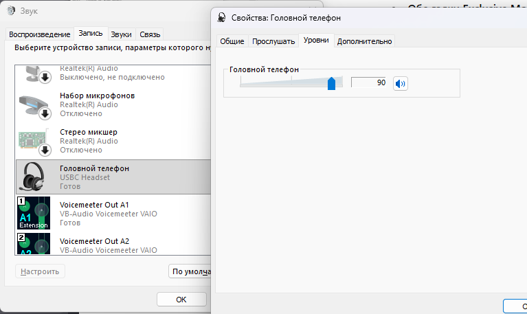
<figcaption><p>Рисунок</p></figcaption>
</figure>

### 4.3. Настройка Voicemeeter

Используем «[минимальную схему](#21-минимальная-схема)», меняем только
Stereo Input 1 на “Krisp Microphone”:

<figure>
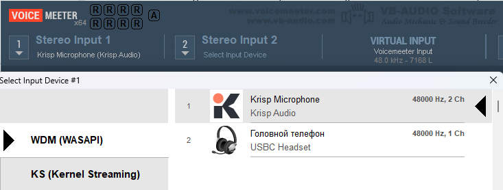
<figcaption><p>Рисунок</p></figcaption>
</figure>

### 4.4. Настройка Windows (mmsys.cpl)

#### Запись (Recording)

**Voicemeeter Out B1** — без изменения, см. раздел “[1.7. Настройки
записи в Windows для тракта микрофон гарнитуры → Voicemeeter → «Связь с
Телефоном»](#17-настройки-записи-в-windows-для-тракта-микрофон-гарнитуры-voicemeeter-связь-с-телефоном)”.

**Krisp Microphone** (это виртуальный микрофон)

- Дефолтом **не делаем**.

- В Properties:

  - Уровни 100%

  - 48 kHz


- Exclusive Mode OFF («Разрешить приложениям использовать устройство в
  монопольном режиме» — ВЫКЛ )

#### Воспроизведение (Playback)

- Дефолтный вывод — **динамики/наушники USB-гарнитуры** (USBC Headset).

- Properties → Advanced:


- **48 kHz**

- **Обе галки Exclusive Mode = OFF** .


#### Связь (Communications)

- **Do nothing / Ничего не предпринимать**\
  Иначе Windows будет сама приглушать звук при звонках.

### 4.5. Пишем bat-ник с автозапуском

Берём **audio_calls_Storm_Pro.bat** и перед запуском Voicemeeter
вставляем запуск Krisp.exe:

```bat
REM ============================================================
REM Запускаем Krisp (если не запущен)
REM ------------------------------------------------------------
tasklist /FI "IMAGENAME eq Krisp.exe" 2>NUL | find /I "Krisp.exe" >NUL
if errorlevel 1 (
    if exist "C:\Program Files\Krisp\Krisp.exe" (
        start "" "C:\Program Files\Krisp\Krisp.exe"
        timeout /t 4 >nul
    ) else (
        echo [WARN] Krisp exe not found
    )
)
REM ============================================================
```

Тут таймер стоит на 4 сек – да, так медленно запускается Krisp.

А после запуска Voicemeeter укажите имя нужного XML-профиля, например
"Voicemeeter_calls_mode_Strom_Pro_headset_with_Krisp.xml".

Полный пример: **audio_calls_Samsung_AKG_with_Krisp.bat** в папке

`bats for calls/Схемы аудио потоков с одной USB-headset/`

### 4.6. Пишем bat-ник для завершения Krisp

Берём **audio_normal.bat** и в самом конце перед echo вставить
завершение процесса Krisp.exe:

```bat
REM ============================================================
REM Надежно останавливаем Krisp
REM ------------------------------------------------------------
taskkill /IM Krisp.exe /F /T >nul 2>&1
REM ============================================================
```

Такая заморочка связана с тем, что Krisp не всегда убивается простой
командой «taskkill /IM Krisp.exe» и требуется её повторный запуск.
