# Звонки с телефона через ПК

## Задача: 

разговор по телефону нужно в прямом эфире передавать на ПК/ноут в
таком качестве, чтобы выполнить 3 условия:

1\) нейронка смогла распознавать речь.

2\) собеседник должен слышать нас так же хорошо, как при общении по
обычному телефону.

3\) собеседник слышит тебя и не слышит лишних звуков из ПК.

Условие 2 касается тракта **телефон → ПК → нейронка**, условие 3 -
**тракта гарнитура+ПК → телефон**.

Четвёртое, по значимости условие, которое в идеале нужно учитывать -
время задержки сигнала при прохождении по тракту **телефон → ПК →
нейронка**. Но мы его в этой задаче не учитываем, задержка ни на что
не влияет. Эта задержка стремится к нулю по сравнению со временем
реакции ассистента-нейронки.

## Ограничения: 

Техническая информация, которая очень важна при настройке ПО и
построении аудио графа, т.е. схемы звуковых потоков на базе Voicemeeter.
При первом прочтении (человеком! Не нейронкой!) документа этот раздел
можно пропустить.

### Общие

1\) Главное ограничение, с которым боремся - многие производители
Андроид-смартфонов блокируют передачу/сохранение/запись аудио потока во
время звонка. Например, Samsung.

Есть кастомные прошивки и отдельные производители телефонов, где таких
проблем нет и вариантов решить задачу масса, но я такие варианты тут не
рассматриваю.

2\) Используем ноутбук, а не ПК суть главного отличия которых в том, что
у ноутбука, как правило, нет Line-in-входа, который, теоретически, даёт
больше вариантов обойти ограничения.

### Windows

Есть реальные проблемы использования двух BT-гарнитур в Windows. Для
получения подробной информации отправь промт в нейронку: «поищи в
интернете реальные случаи проблем одновременного использования двух
BT-гарнитур в Windows 10/11. В первую очередь интересуют случаи когда
каждая BT гарнитура работает со своим приложением - например одна
выбрана в DISCORD, вторая в Teams/Яндекс-Телемост/Zoom».

### Шумодав на ПК/ноутбуке

Для шумоподавления звука с микрофона можно использовать либо ПО Krisp,
которое использует только CPU, либо ПО NVIDIA Broadcast, которое
использует GPU, а именно видео карту NVIDIA GeForce RTX 2060 **/**
Quadro RTX 3000 **/** TITAN RTX или выше. У меня на ноутбуке нет видео
карты NVIDIA GeForce, поэтому я использую Krisp.

Krisp построен на нейросетях, это один из лучших шумодавов. Приложение
убирает клацание клавиш, клики мыши и прочие фоновые звуки, оставляя
только ваш голос. У Krisp есть режимы, которые NVIDIA Broadcast не
имеет:

- Voice Detection / Voice AI
- Возможность обучения на твоём голосе

Логика вида: «Оставлять этот голос, остальные — подавлять».

<https://krisp.ai/>

Ломаная версия есть на rutracker.org.

### Phone Link

1\) Приложение MS "Связь с телефоном" (Phone Link) имеет ограничения по
маршрутизации звука:

   - 1.1) В самом Phone Link нет управления аудиоустройствами
   - 1.2) Phone Link игнорирует системные механизмы “per-app output”.

Я столкнулся с тем, что **Phone Link не отображается в микшере
приложений Windows**, а значит:

- нельзя штатно назначить ему отдельное output-устройство,
- невозможно разделить “собеседник” и “system/video” по разным
  виртуальным входам Voicemeeter.

Это типичное поведение для некоторых системных/UWP компонентов (часть
аудиопотоков не экспонируется как отдельное “приложение” в микшере).

   - 1.3) Default Communications Device не работает для Phone Link

Если в mmsys.cpl (см. рис. ниже) выбрать отдельное устройство для
связи по умолчанию и отдельное для воспроизведения/вывода, то Phone
Link “прилипает” к **дефолтному устройству вывода,** т.е. игнорит
устройство для связи по умолчанию.

Пункты 1.1, 1.2, 1.3 приводят к тому, что невозможно выделить голос
собеседника в Phone Link без своего голоса из микрофона и направить
его в любое третье приложение, например, ассистент-нейронку. Это
требуется, когда возникает необходимость отдельно его усилить, в
случае, когда HR-сотрудник звонит тебе с ПК-гарнитуры, подключенной к
встроенной звуковой карте (Realtek-чип), что приводит к тихому звуку.

   - 1.4) Phone Link отказывается принимать звук с телефона, если видит
подключенные BT-наушники/гарнитуру к ПК:

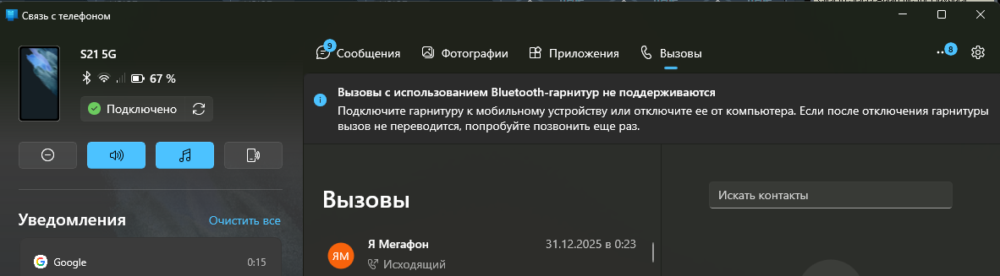

Проблему 1.4 можно обойти только использованием внешнего USB-BT
адаптера (см. раздел «1.2. Способ Приложение MS “Связь с Windows” +
BT-гарнитура в ПК»)

### ShadowHint

(невидимый ИИ-ассистент)

1\) В самом ShadowHint нет возможности выбора устройства для звука
системы/голоса собеседника, можно только для микрофона. Поэтому если
нужно подать на него усиленный звук, например, от собеседника (чтобы
лучше распознавался голос), то это будет сделать сложно и криво, а в
некоторых случаях невозможно. ShadowHint забирает звук системы(динамики)
при помощи WASAPI loopback с default output endpoint, т.е. использует
дефолтное устройство Воспроизведения, которое установлено в Винде
(mmsys.cpl), а звук микрофона берёт при запуске приложения из дефолтного
устройства записи, но потом можно выбрать любое устройство, нажав на
кнопку с микрофоном (появляется после старта сессии).

2\) Для ShadowHint важен уровень громкости “master volume” в Винде (это
общий ползунок; вызов по иконке динамика в трее). ShadowHint «слышит как
пользователь», т.е. если будет уровень 5 из 100, то он ничего не
услышит. Поэтому если нужно, чтобы ShadowHint «слышал» и звук с ноута не
шёл, то подключай проводную гарнитуру, у которой есть
собственный/локальный регулятор громкости. После физического
подключения/отключения гарнитуры **нужно перезапускать ассистента
ShadowHint кнопкой Старт/Стоп сессии, чтобы он подхватил новый
источник.**

### Sobes Copilot

(невидимый ИИ-ассистент)

Sobes Copilot имеет возможность выбрать устройство Записи (микрофон) для
получения вашего голоса, а также выбрать устройство для системных
звуков, которое содержит голос собеседника, но только через устройства
воспроизведения, т.к. Sobes Copilot не поддерживает Capture (Recording
devices) и работает ТОЛЬКО через WASAPI loopback (Playback).

## 1. Состав системы №1:

1\) Смартфон Android с оригинальной прошивкой, без поддержки аналогового
сигнала на выходе (нет jack 3.5, а есть цифровой Type-C);

2\) Windows 10/11

3\) ноутбук без Line-in-входа (стандарт для ноутбуков), есть только разъём
для гарнитуры - TRRS-джек (4 контакта).

### Решение для системы №1

Мне известно всего 2 рабочих способа для системы №1 – 1.1 и 1.2.

### 1.1. Способ: Приложение MS “Связь с Windows” + проводная гарнитура в ПК.

**Требования к Windows**: минимум Windows 10 версии 1903 (May 2019
Update), лучше 2004+ / 20H1 и новее. На этих версиях приложение "Связь с
телефоном" предустановлено. На более старых сборках приложение "Связь с
телефоном" либо не ставится, либо работает криво.

**Требования к Android:** Приложение "Связь с Windows" на моем Samsung
S21 было предустановлено. Его можно скачать с Google Play Market.

**Схема**: приложение "Связь с телефоном" (ПК)+ "Связь с Windows"
(Android) + проводная гарнитура к ПК. Данная схема работает так:
сопряжение телефона и Windows идет через Bluetooth и через MS-аккаунт
(без него не даст ничего сделать), передача голоса может идти по одному
из трех каналов: BT, локальный Wi-FI, интернет. У меня был случай, когда
всё передавалось через интернет, т.к. по BT не происходило подключение
телефона с ноутом (работает только сопряжение), причина - BT-микросхема
на ноуте косячная. Ну во всяком случае, я сделал такой вывод потому, что
BT не работал, а звонок передавался на ноут, причем на Винде и Андроиде
был включен ВПН.

#### 1) Подготовка телефона — “Связь с Windows”

1\.  **Убедись, что стоит приложение “Связь с Windows / Link to
    Windows”**\
    На Samsung оно обычно встроено. Если нет — ставится из Google Play.

2\.  Открой **Настройки телефона → Доп. функции / Подключения → Связь с
    Windows**\
    (название может чуть отличаться, но суть — Link to Windows).

3\.  **Включи “Связь с Windows”**.

4\.  В приложении Link to Windows дай разрешения:

    - Контакты
    - Телефон/звонки
    - Микрофон
    - Уведомления
    - Фоновая работа (желательно)

------------------------------------------------------------------------

#### 2) Подготовка ПК (Windows ) — “Связь с телефоном / Phone Link”

1\.  Открой **“Связь с телефоном”** на ПК.

2\.  В мастере добавления выбери **Android** → “Подключить телефон”.
    Windows попросит войти в MS-аккаунт – без него не работает.

3\.  Следуй связке через QR-код:

    - на ПК появляется QR
    - сканируешь телефоном в Link to Windows
    - подтверждаешь привязку

На скриншоте ниже – телефон добавлен и подключен:

<figure>
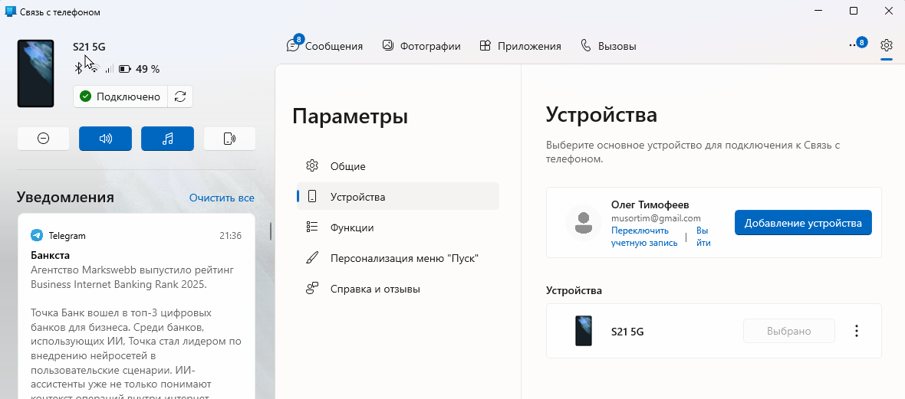
<figcaption>
Рисунок
</figcaption>
</figure>

4\.  В Phone Link на ПК выбери вкладку **“Вызовы”**.

------------------------------------------------------------------------

#### 3) Bluetooth-связь для звонков

Аудио звонка *может* идти по BT Hands-Free, по локальному Wi-Fi или
через интернет (если BT-аудио/Hands-Free не поднялся). Поэтому одна
Wi-Fi сеть не обязательна — главное, чтобы Phone Link и Link to Windows
были онлайн. На следующих скриншотах полный список BT-служб, который
доступен для моего Samsung S21 5G:

<figure>
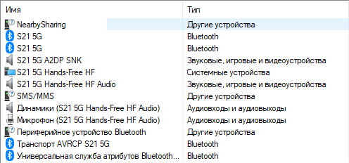
<figcaption>
Рисунок 2
</figcaption>
</figure>

Рисунок Полный список из окна "Свойства S21 5G"

- эта информация просто для справки. Далее по сути.

1\.  На ПК: **Параметры → Bluetooth и устройства → Устройства**\
    Убедись, что телефон **сопряжён**.

2\.  На телефоне в Bluetooth-параметрах убедись, что для ПК включено
    **“Вызовы”(**“**Звонки”)**.

<figure>
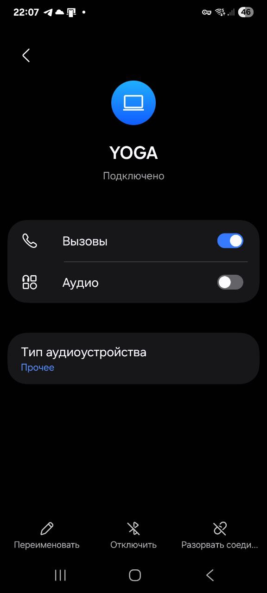
<figcaption><blockquote>

Рисунок Нормальная ситуация

</blockquote></figcaption>
</figure>

На скриншоте выше YOGA – имя моего ноутбука, к которому подключился
телефон по BT. У меня, лично долгое время BT не соединялся, ничего не
помогало, поэтому попытка активировать переключателем “Вызовы”(Звонки)
приводила к ошибке. Но ноут всё-равно подхватывал звонок и всё
работало как надо согласно поставленной задаче.

------------------------------------------------------------------------

#### 4) Настройка устройств звука в Windows

##### 4.1 Вывод (куда слышишь собеседника)

**Путь 1 (через Параметры):**

1\.  **Пуск → Параметры** (или **Win+I**)

2\.  **Система → Звук**

3\.  Вверху блок **“Вывод”**

4\.  **“Выберите место для воспроизведения звука”**\
    → кликаешь нужное устройство (наушники/гарнитура).

<figure>
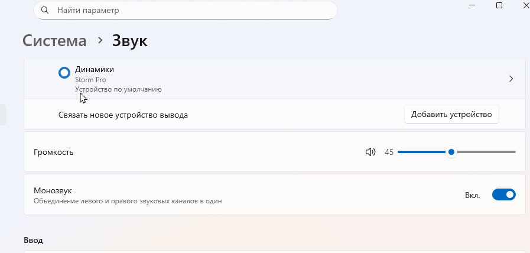
<figcaption><blockquote>

Рисунок

</blockquote></figcaption>
</figure>

Storm Pro – Это название моей проводной гарнитуры.

**Быстрый путь:**

- Нажми на значок громкости в трее → стрелка **“>”** рядом с
  устройством → выбери нужный вывод. Или ещё быстрее: Win+CTRL+V

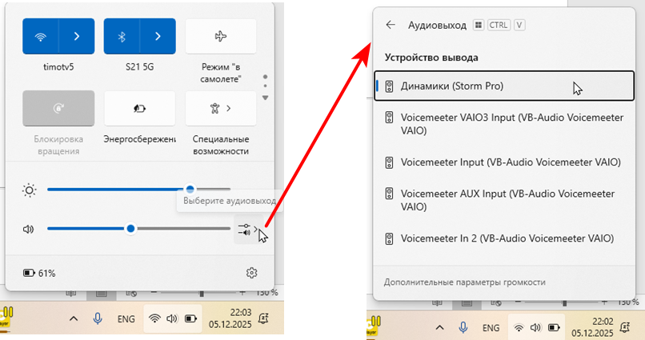

Рисунок

Storm Pro – Это название моей проводной гарнитуры.

##### 4.2 Ввод (в какой микрофон говоришь)

1\.  **Параметры → Система → Звук → Ввод**

2\.  Выбери **“Микрофон (Headset)”** как основной.

------------------------------------------------------------------------

#### 5) Устройство связи по умолчанию

Phone Link берёт микрофон **именно как “устройство связи по
умолчанию”**.

1\.  mmsys.cpl → вкладка **Запись**

2\.  ПКМ по **Микрофон Headset**:

    - **Использовать по умолчанию**
    - **Использовать устройство связи по умолчанию**

#### 6)Отключение лишних звуков

##### 6.1. Проникновение звуков в “Связь с телефоном”

Когда приложения могут “протечь” собеседнику (утилита Voicemeeter не
установлена) - только в трёх случаях:

1\.  **поставил “Стерео микшер” как микрофон по умолчанию**.\
    Тогда в звонок улетит всё, что слышит ПК.

<figure>
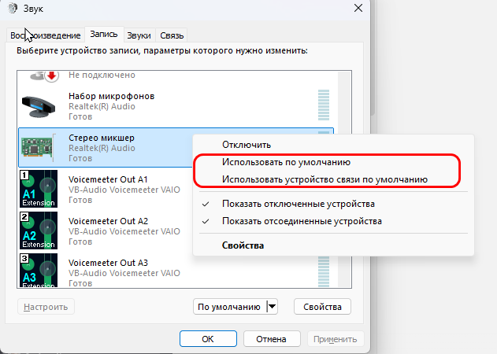
<figcaption><blockquote>

Рисунок . Так нельзя делать !

</blockquote></figcaption>
</figure>

2\.  **Включено “Прослушивать с данного устройства” на микрофоне** и оно
    заведено в Stereo Mix/loopback. Если интересно как это сделать,
    спроси у нейронки – много букоф.

3\.  Если сменить «устройство связи по умолчанию» на loopback-микрофон
    после переподключения/обновления драйвера, т.е. микрофон сделать
    устройством связи по умолчанию.

**Вывод:** в звонок могут улететь звуки приложений и системы только если
самому вручную сделать настройки. Поэтому беспокоиться не стоит.

Но если не хотите, чтобы лишние звуки не попадали в наушники даже в
случае если один из трех пунктов выше случился, то можно подстарховаться
и сделать несколько шагов.

##### 6.2. Системные звуки 

ставим на muted (Win+I → Система → Звук → Громкость):

<figure>
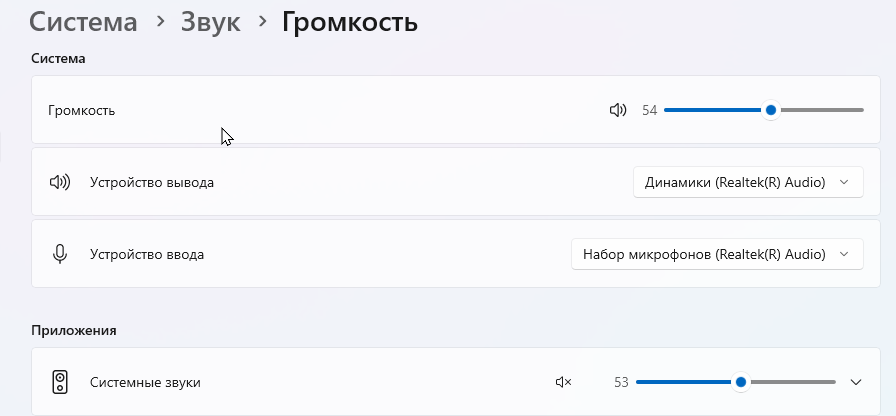
<figcaption>
Рисунок
</figcaption>
</figure>

Второй вариант попасть сюда - ПКМ по динамику в трее:

<figure>
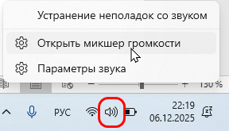
<figcaption>
Рисунок
</figcaption>
</figure>

##### 6.3. Приложения с уведомлениями.

У тех приложений, которые планируете использовать во время звонка,
отключите уведомления или просто поставьте их на mute (там же):

<figure>

<figcaption>
Рисунок
</figcaption>
</figure>

#### 7) Использование

Примите звонок на телефоне, на котором запущено приложение “Связь с
Windows”. На ноуте приложение “Связь с телефоном” должно автоматически
подхватить звонок и начать выводить звук в гарнитуру, но если этого не
случается, то нужно открыть вкладку “Вызовы” и нажать кнопку “Передача
на компьютер”.

<figure>
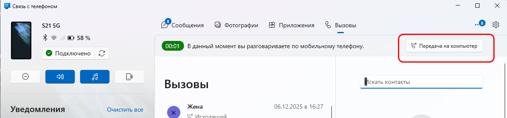
<figcaption>
Рисунок
</figcaption>
</figure>

### 1.2. Способ Приложение MS “Связь с Windows” + BT-гарнитура в ПК

Способ не проверял, но на 90% уверен, что он рабочий.

**Схема**: связь с ПК по воздуху, как в 1.1: приложение "Связь с
телефоном"(Phone Link; ПК)+ "Связь с Windows" (Windows Link; Android) ,
а BT-гарнитуру к ноутбуку через USB-BT адаптер Creative BT-W5. Причем в
настройках BT-W5 нужно выключить режим **HFP / Voice Chat** (т.е.
работаем в режиме A2DP-only), чтобы Phone Link позволил принять звонок
на ПК. Т.е. BT-гарнитура работает только как внешний динамик и Windows
видит только USB-аудиовыход Creative BT-W5. Поэтому нужен ещё проводной
USB-микрофон, любой.

Список устройств (минимальный): BT-W5, TWS, USB-микрофон

Список устройств (профессиональный): аудиоинтерфейс, BT-W5, TWS,
XLR-микрофон

#### Микрофон

Если используете нейронку-ассистент, то нужен почти любой не самый
дешёвый микрофон (от 30\$). Причём 30\$ это для случая идеальной тишины
во всех комнатах квартиры, у соседей и за окном - например, петличный
конденсаторный микрофон круговой диаграммы направленности BOYA BY-M3.
Отличный звук, ловит без необходимости усиления на расстоянии 1-2 м. К
этому микрофону нужен небольшой кронштейн, по типу «[Крепление для
микрофона бочонок на гибком кронштейне и металл
прищепке](https://www.ozon.ru/product/kreplenie-dlya-mikrofona-bochonok-na-gibkom-kronshteyne-i-metall-prishchepke-2701970310/)»(10\$),см.
фото ниже:

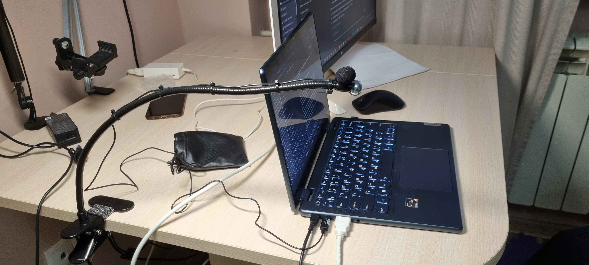

В остальных случаях, когда комната не подготовлена (нет звукоизоляции),
и слышны голоса домочадцев, детей(!) и соседей, то и конденсаторный
микрофон круговой диаграммы тоже их отлично слышит, нужен будет
направленный микрофон, который немного приглушит их голоса (чужие голоса
можно добить шумодавом Krisp). В этом случае есть два пути:

1\) направленный микрофон с USB- выходом (т.е. со встроенным ADC).
Пример дорогого конденсаторного - ATR2500X USB (100\$); Пример дорогого
динамического - ATR2100x (100\$) или AT2040USB (200\$). Плюс пантограф,
например, Fifine BM88 (40\$). Вполне вероятно, что для наших задач
подойдут китайские реплики микрофонов (подделки), у них цена в 2-2.5
раза ниже.

2\) XLR+микрофон и усилитель - за полный комплект (XLR-микрофон,
пантограф, звуковая карта, аудио кабель) нужно будет выложить от 240\$.

Я, как дилетант, сделал вывод, что **подойдёт любой XLR-микрофон от 40\$
(без учёта пантографа) и любой USB (или XLR+USB) от 55\$(без учёта
пантографа), главные условия**:

- Кардиодный/гиперардиодный
- Возможность крепления к пантографу, т.е. чтобы микрофон был не на
  настольной подставке, которая принимает на себя вибрации стола. Это
  важно, не столько по причине шумов (шумодав Krisp это всё 100%
  отфильтрует), скорее это важно для того, чтобы можно использовать
  вместе с ноутбуком – чтобы микрофон не мешался под руками, не
  пересекался с проводами, которые выходят из ноутбука, и чтобы можно
  было микрофон вывести за сектор обзора видеокамеры.

##### Важные замечания:

- Даже гиперкардиоида не “заглушит” голоса за стеной, если они слышны в
  комнате (через дверь/проёмы/отражения). Она *сильнее режет* бок/тыл,
  но магии нет.
- Для максимального отсечения домашнего фона обычно дают лучший эффект:
  динамический + близкая дистанция (10–15 см) + грамотная ориентация
  (нулём диаграммы в сторону двери или откуда идут ненужные голоса) +
  компрессор/expander/gate.\
  При 40 см почти всегда придётся усиливать — и фон тоже поднимется.

#### Ограничения

Предположительно могут быть проблемы, если подключать Creative BT-W5
более 1 шт к USB-хабу (не важно активному или нет). Идеальная схема –
подключение каждого BT-W5 в отдельный физический порт на материнской
плате.

#### Итоговая архитектура

В данной архитектуре не участвуют такие приложения, как DISCORD,
ShadowHint , Sobes Copilot. Если они вам нужны, то настройки Voicemeeter
будут отличаться, подробнее см. раздел «**3.1B. Способ: без аудио карты,
один USB-BT-адаптер**» в инструкции «**[Незаметный человек-помощник на онлайн-собеседовании, TWS-наушники](человек-помощник-tws.md)**».

- **BT-W5** → наушники **для Phone Link**
- **Микрофон для Phone Link** → **USB-C Headset** (или другой USB-mic)

❗ На BT-W5 **HFP / Voice Chat выключен** (A2DP-only).

#### Как это видит Windows

В системе будет **независимый USB-аудиовыход**:

- Creative BT-W5

Windows **не видит Bluetooth-гарнитуры**, **нет Hands-Free**, поэтому:

- ✅ Phone Link не ругается
- ✅ Discord работает стабильно
- ✅ Voicemeeter рулит маршрутизацией

#### Оборудование

Список устройств: BT-W5 1шт, TWS 1 шт, USB-микрофон

##### Схема подключения устройств (Hardware wiring):

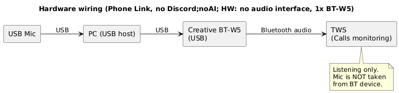

#### Конфигурирование

Что нужно настраивать: Voicemeeter Potato, Windows, Krisp и конечные
приложения (OBS).

Основные настройки производятся в Voicemeeter Potato.

##### Схема аудио (Audio graph):

Код конфигурации: (Phone Link, no Discord;no AI; HW: no audio interface,
1x BT-W5)

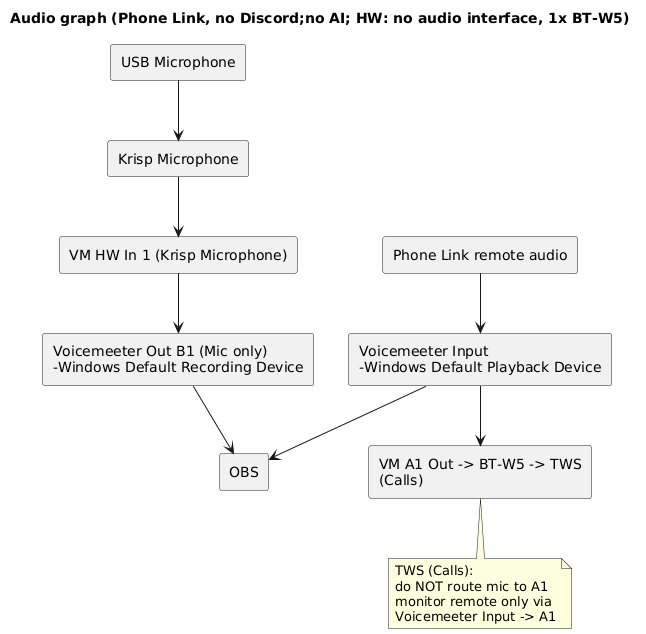

В этой конфигурации главное:

1\) OBS и TWS-наушники получают усиленный звук системы+собеседника из
Phone Link. Но нужно иметь в виду, что в дефолтное устройство
воспроизведения(Playback = Voicemeeter Input) попадают все звуки
системы, а не только звуки собеседника из Phone Link. Поэтому нужно
позаботиться о том, чтобы не запускать приложения, которые издают лишние
звуки, а в самой Винде отключить все системные звуки.

##### Настройки:

###### Цель

- Используется только **Phone Link и OBS**.
- Нужно:
  - усилить **микрофон** (через Krisp → Voicemeeter);
  - усилить **звук собеседника из Phone Link**;
  - раздать:
    - **mic-only → OBS (микрофон)**;
    - **remote/system-only → OBS (remote)**;
  - в **TWS (через BT-W5 )** слышать собеседника из Phone Link;
- Частота: **48 кГц**

---
###### WINDOWS

Воспроизведение

- Default device: **Voicemeeter Input**
- Default communication device: **Voicemeeter Input**

Запись

- Default device: **Voicemeeter Out B1**
- Default communication device: **Voicemeeter Out B1**

Формат устройств: 48 000 Hz / 24-bit (где доступно).

---
###### KRISP

- **Microphone** **Input**: USB Headset
- **Cancel Noise and Room Echo** = ON
- **Speaker Cancel Noise = OFF**

**Microphone** **Output (нельзя изменить)**: **Krisp Microphone** (это
устройство отображается в mmsys.cpl\Запись)

Krisp используется **только как обработчик микрофона**.

**Krisp Microphone используется только внутри Voicemeeter** как источник
Stereo Input 1.\
Ни одно приложение напрямую его не использует.

---
###### Voicemeeter Potato

- Stereo Input 1 = Krisp Microphone
  - B1 ON (mic-only)
  - B2/B3 OFF
  - A1/A2/A3 OFF
- Voicemeeter Input (Teams remote)
  - A1 ON (мониторинг TWS )
  - **усиление звука из Phone Link делать зелёным fader’ом** Voicemeeter
    Input

Наушники

- A1 -> BT-W5 -> TWS (Teams)

ШИНЫ

- **B1** — Mic only\
  (и это Windows Default Recording Device)

---
###### Phone Link

- Input: **Windows Default Recording Device (Voicemeeter Out B1)**
- Output: **Windows Default Playback Device (Voicemeeter Input)**

---
###### OBS

Добавить два источника *Audio Input Capture*:

- Mic track: **Voicemeeter Out B1**
- Remote track: **Default Playback (Voicemeeter Input)**

### 1.3. Способ НЕРАБОЧИЙ: Приложение MS “Связь с Windows” + гарнитура в телефон.

**Схема**: связь с ПК по воздуху ,как в 1.1: приложение "Связь с
телефоном" (ПК)+ "Связь с Windows" (Android) , а гарнитуру к смартфону.
**Этот способ оказался нерабочий для телефонов Samsung S21 и S24 –
телефон выключает проводные USB-наушники во время связи с ПК по BT.**

**Гарнитура** - проводная гарнитура USB Type-C цифровая (со встроенным
ЦАП/кодеком). BT-гарнитуру тоже использовать не получится во время связи
с ПК через приложение “Связь с Windows” – телефон подключается по BT
только либо к Windows ПК, либо только к наушникам.

------------------------------------------------------------------------

Далее следует разделы с теорией (я не проверял), поэтому текст выделил
серым фоном: 1.4, 1.5, 2.1, 2.2. Скорее всего, как минимум, способы 1.4
и 1.5, нерабочие, если предположить, что любое подключение к телефону по
USB будет блокироваться приложением “Связь с Windows”, как это
происходит в случае описанном в разделе 1.3.

Перепрыгиваем на следующий раздел – «[3. Шумодав от
Krisp](#3-шумодав-от-krisp)».

### 1.4. Способ: DC-DC/DAC-проводной.

**Схема**: Смартфон → кабель USB-C→ Специальный
микшер, к которому подключаем гарнитуру, которая будет связана с
телефоном, а также подключаем ноутбук USB-кабелем или AUX 3.5, чтобы
вести запись. Т.е. в этой схеме может быть как Digital to Digital
конверсия, так и Digital to Analog, если на ПК передаём кабелем AUX 3.5.
Для телефонов без аналогового Type-C (как Samsung S21) подключение к
микшеру делаем через активный USB-C→TRRS DAC.

**Микшер**. В**нешний аудио-интерфейс/микшер с
Mix-Minus** (их делают для подкастов/стримов и телефонных интервью). Они
сами берут звонок с телефона, отделяют голос собеседника от твоего
голоса и дают отдельный выход на запись — то есть **делают то, что
Android не умеет по USB**.

Примеры: 1) Zoom PodTrak P4 / P4next 2) RØDECaster
(Pro II / Duo / и т.п.) 3) Mackie MobileMix

Mix-Minus-устройства делают это так:

1\.  Получают **оба направления звонка** от телефона
    как единый “канал связи”.

2\.  Внутри **разводят**:

    - тебе в уши: *собеседник + ты (если
      надо)*,
    - телефону обратно: *только ты* (без
      собеседника).

3\.  На запись отдают **чистый микс**.

То есть Android больше ничего “не должен уметь” —
устройство делает всё само.

### 1.5. Способ: DAC-проводной.

**Схема**: Смартфон → [активный кабель USB-C→3.5 мм
(с DAC)] → Line-In вход маленькой USB-звуковушки → USB вход ноута
(получает цифровой аудиопоток). В этой схеме задействована
USB-звуковушка, а не прямое подключение DAC-адаптера к разъёму гарнитуры
на ноутбуке потому, что канал MIC-in сильно ухудшает качество
звука.

**Гарнитура**. Проводную гарнитуру подключить
разветвителями между адаптером "активный DAC USB-C→3.5" и ноутом. Но
надо соблюсти главное условие - адаптер "активный DAC USB-C→3.5" должен
уметь обратно пропускать микрофон в сторону смартфона (такие есть,
например FiiO JA11 USB-C to 3.5mm). Как искать: “TRRS CTIA headset /
TRRS / mic supported / inline mic” или "TRRS CTIA
mic-pass-through". Даже при DAC с поддержкой TRRS-микрофона
телефон может запретить одновременный вывод на провод и BT/вторую линию.
Поэтому схема 1.5 с гарнитурой через разветвитель зависит от прошивки.

## 2. Состав системы №2:

1\) Смартфон Android с оригинальной прошивкой, с
поддержкой аналогового сигнала на выходе (либо есть jack 3.5, либо
Type-C поддерживает аналоговый аудио);

2\) Windows 10/11

3\) ноутбук без Line-in-входа (стандарт для ноутбуков),
есть только разъём для гарнитуры - TRRS-джек (4 контакта: MIC-in-канал,
GND и 2 канала Headphone out).

### Решение для системы №2

Есть всего два нормальных способа для системы
№2:

### 2.1. тоже что и 1.1.

### 2.2. Способ: AUX-проводной

**Схема**: Смартфон → [обычный кабель 3.5 мм →3.5 мм
или USB-C→3.5 мм ] → Line-In вход маленькой USB-звуковушки → USB вход
ноута (получает цифровой аудиопоток). В этой схеме задействована
USB-звуковушка, а не прямое подключение телефона к разъёму гарнитуры на
ноутбуке потому, что канал MIC-in сильно ухудшает качество звука.

**Гарнитура**. В рамках способа 2.2. гарнитуру можно
подключить тремя относительно адекватными способами:

1\) к телефону через Y-разветвитель параллельно с
USB-звуковушкой. Y-разветвитель, который нужен, готового не
существует:

1× TRRS male (или Type-C) в телефон → 1× TRRS female
(под гарнитуру) + 1× TRS female (только наушники/line-out).

На рынке встречаются:

- **TRRS splitters (headset + headphones)**
- **CTIA TRRS → (TRRS headset) + (TRS line-out)**\
  просто их тяжело найти и они иногда называются “headset + mic monitor
  splitter / karaoke splitter”.

2\) к звуковушке, которая должна иметь либо
TRRS-разъём, распараллеленный с входной TRRS-линией от смартфона, либо
иметь TRS audio + TRS mic, чтобы подключить гарнитуру двумя проводами.
Но найти такую звуковушку непросто.

3\) BT-гарнитура на телефоне + провод в звуковушку
[Этот способ только если смартфон поддерживает редкий режим “двойного
вывода” (BT + провод)]

[конец раздела с теорией]

## 3. Шумодав от Krisp

Krisp построен на нейросетях, это один из лучших шумодавов. Приложение
убирает клацание клавиш, клики мыши и прочие фоновые звуки, оставляя
только ваш голос. У Krisp есть режимы, которые NVIDIA Broadcast не
имеет:

- Voice Detection / Voice AI
- Возможность обучения на твоём голосе

Логика вида: «Оставлять этот голос, остальные — подавлять».

<https://krisp.ai/>

Ломаная версия есть на rutracker.org.

### 3.1. Схема (что куда идёт)

Физический микрофон гарнитуры → Krisp (шумодав) → “Krisp Microphone” →
Windows Default Microphone → Phone Link.

Звук на ПК/ноуте, который ты слышишь от собеседника:

Windows Default Playback → динамики/наушники гарнитуры, или развёрнуто:

Собеседник → телефон → Phone Link → Windows аудиомикшер (Default
Playback) → гарнитура (Render endpoint)

### 3.2. Настройка Krisp

<figure>
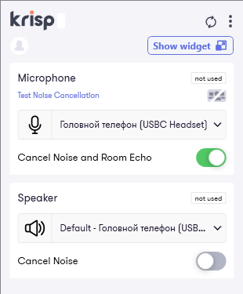
<figcaption>
Рисунок
</figcaption>
</figure>

**Microphone (важная часть)**

1\.  **Input device (вход Krisp):**\
    выбери **микрофон USB-гарнитуры** (в данном примере – это USBC
    Headset / «Головной телефон (Samsung AKG)», артикул: Samsung
    EO-IC100BWEGRU).\
    Это тот источник, который Krisp будет чистить. Настройка
    запоминается – и как только произойдёт повторное физическое
    подключение гарнитуры в ноутбук Krisp обнаруживает её и подхватывает
    в качестве Input device.

2\.  **Cancel Noise and Room Echo:** **ON**\
    Режим — **Auto** (не Aggressive).

3\.  **Lock microphone volume at optimal level:** **ON**\
    Фактически это означает, что Krisp сам выставляет и удерживает
    уровень физического микрофона на “оптимальном” значении (часто около
    90%, см. рис. 13), блокируя ручную регулировку ползунка в Windows
    (mmsys.cpl). Конкретный процент может зависеть от микрофона и версии
    Krisp.

4\.  **Voice Cancellation (обучение голоса):**

    - **НЕ настраивай**, если тебе надо убрать только клавиатуру.
    - Включай/обучай **только если рядом бывают чужие голоса/ТВ**, и
      Krisp их пропускает.

**Speaker (необязательно)**

В наушниках нам не нужно чистить входящий звук поэтому —\
**Speaker = not used**, шумодав на Speaker оставляем OFF.

<figure>

<figcaption>
Рисунок
</figcaption>
</figure>

### 3.3. Настройка Windows (mmsys.cpl)

#### Запись (Recording)

**Krisp Microphone** (это виртуальный микрофон)

- **Krisp Microphone** → ПКМ→\
  **Использовать по умолчанию** и\
  **Использовать устройство связи по умолчанию**.
- В Properties:
  - Уровни 100%
  - 48 kHz
- Exclusive Mode OFF («Разрешить приложениям использовать устройство в
  монопольном режиме» — ВЫКЛ )

#### Воспроизведение (Playback)

- Дефолтный вывод — **динамики/наушники USB-гарнитуры** (USBC Headset).
- Properties → Advanced:
- **48 kHz**
- **Обе галки Exclusive Mode = OFF** .

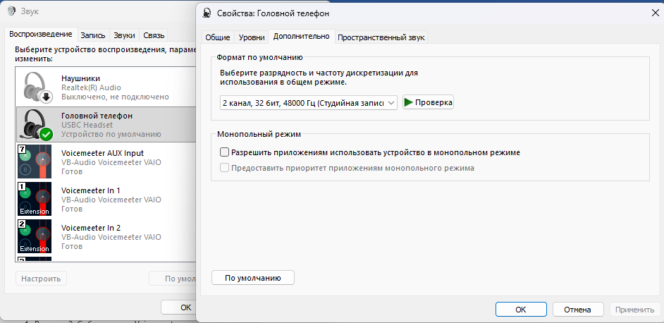

#### Связь (Communications)

- **Do nothing / Ничего не предпринимать**\
  Иначе Windows будет сама приглушать звук при звонках.

## Проблемы, с которыми столкнулся

### Падение громкости

На тракте **гарнитура+ПК → телефон** может упасть громкость из-за
служб/программ или встроенной звуковой карты Realtek на ПК. У меня так
случилось на Windows 11. При это уровень микрофонов в mmsys.cpl стоит
100%. Проблема следующая - звук в телефоне собеседника(т.е. на другом
конце GSM-канала) сильно ниже по громкости, чем при обычном телефонном
звонке. Моя проблема лежит сразу в двух местах: 1) сам микрофон
проводной гарнитуры Samsung EO-IC100BWEGRU очень тихий; 2) встроенная
звуковая карта в виде чипа Realtek не позволяет усиливать звук. При
использовании нормального микрофона (гарнитура Storm Pro) тоже
становится тихим – из-за чего не знаю, я не смог найти причину – ни в
настройках, ни в службах, может дело в чипе Realtek ? Установил утилиту
Voicemeeter (https://vb-audio.com/Voicemeeter/ - условно бесплатная) и
поднял уровень громкости на 2.2-3.1 дБ для микрофона Storm Pro и на 14.5
дБ для Samsung EO-IC100BWEGRU, см. инструкцию «**[Восстановление уровня громкости и шумодав](восстановление-громкости.md)**». Приложение Voicemeeter
(voicemeeter_x64.exe) должно быть запущено, пока используется гарнитура.
**Но самый верный путь - купить аудио интерфейс + кардиоидный
XLR-микрофон или хотя бы кардиоидный USB-микрофон (55-100\$ за
конденсаторный и 55-200\$ за динамический)**. Подробнее см. раздел
“[1.2. Способ Приложение MS “Связь с Windows” + BT-гарнитура в
ПК\Микрофон](#микрофон)”.

### Гарнитура. Микрофон молчит

**Проблема** – звук с микрофона USB-гарнитуры не идет на ПК.

**Решение** - нужно проверить:

Win+R → mmsys.cpl → Свойства: Микрофон → Уровни \\ кнопка динамика
должна быть отжата (это mute микрофона) и уровень 100%

### Гарнитура. Динамики молчат

**Проблема** – нет звука в динамиках проводной гарнитуры, подключенной к
ПК.

Однажды увидел такое (mmsys.cpl):

**Решение** - нужно проверить:

Win+R → mmsys.cpl → Свойства: Гарнитура → Уровни \\ кнопка динамика
должна быть отжата (это mute микрофона) и уровень 100%.

### “Сползание громкости” микрофона

**Проблема** –ползунок громкости микрофона сам сползает со 100%.

Чтобы Windows/Phone Link не трогали уровень:

1\.  mmsys.cpl → вкладка **Связь**

2\.  Выбери **“Действие не требуется / Ничего не делать”**

3\.  ОК

<figure>

<figcaption>
Рисунок
</figcaption>
</figure>

По умолчанию стояло 80%.

Но это не помогает, если например в Teams включена автоматическая
корректировка чувствительности микрофона:

Такая же настройка есть в Discord.

Однажды во время созвона по Телемосту меня стали плохо слышать, я
обнаружил, что уровень Krisp Microphone стоял на уровне 0%, а микрофона
Voicemeeter Out B1 (выставлен дефолтным устройством записи в Windows у
меня) на уровне 6%. Вероятно, это могло произойти по причине того, что
перед этим созвоном я экспериментировал с уровнями громкости в
компрессоре Voicemeeter Potato на тракте микрофона (Stereo Input 1) –
вплоть до треска динамиков гарнитуры, в результате чего одно из
приложений могло среагировать на это и убавить уровень звука дефолтного
микрофона (Voicemeeter Out B1), и таким приложением было либо Teams либо
Discord, одно из которых было запущено в этот момент. Поэтому я написал
ps1-скрипт, который детектирует приложение, изменившее уровень
громкости, и возвращает этот уровень на 100%:

`bats for calls/Детектор источника изменения громкости микрофонов и динамиков/`

 - в этой папке помимо скрипта для микрофона есть ещё скрипт для
динамиков, который устраняет проблему описанную в параграфе выше
([Гарнитура. Динамики молчат](#гарнитура-динамики-молчат)).

Ниже пример работы ChangeMicVolumeDetector.ps1:

- такое количество событий в реальности не происходит, это я сделал
специально для показа возможностей скрипта. В реальности за день работы
можно увидеть только как Krisp меняет уровень физического микрофона с
диапазоне 90-98% при условии установленной галочки "Lock microphone
volume at optimal level". Все остальные события редки, и у меня
случались 1-2 раза в месяц. В идеале данный скрипт нужно запускать перед
началом работы (созвоны, собеседования), но также его можно запустить,
когда вы обнаружили проблему со звуком уже во время созвона – скрипт всё
поправит. Нужно только скрипт доработать под ваши устройства Записи и
Воспроизведения, которые вы используете с своей работе. Используйте
универсальный скрипт из папки «Детектор источника изменения громкости
микрофонов и динамиков».

### “Связь с телефоном” не подхватывает звонок

**Проблема** –разговариваешь **по телефону**, а кнопка справа
**«Передача на компьютер»** неактивна. Это значит, что Phone Link видит
звонок, но **не может подхватить аудио-канал** в этот момент.

<figure>
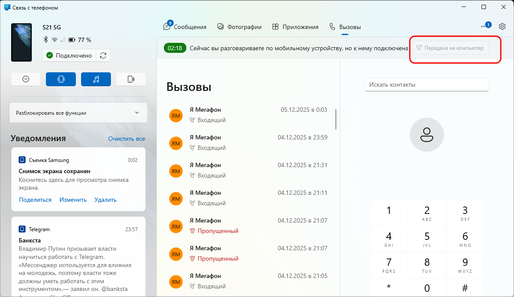
<figcaption>
Рисунок
</figcaption>
</figure>

**Решение**: вариант 1 - на телефоне на экране звонка переключил
BT-связь с ПК на BT-наушники и обратно на ПК. У меня давно были
BT-наушники привязаны к телефону; Вариант 2 - просто отключите BT на
телефоне, затем нажмите кнопку Подключить в приложении Phone Link и
снова включите BT на телефоне.

### Не у всякой TWS гарнитуры работает микрофон под Windows

**Проблема** – у некоторых TWS-гарнитур может не работать микрофон при
подключении к Windows 11, например, у Mpow M30:

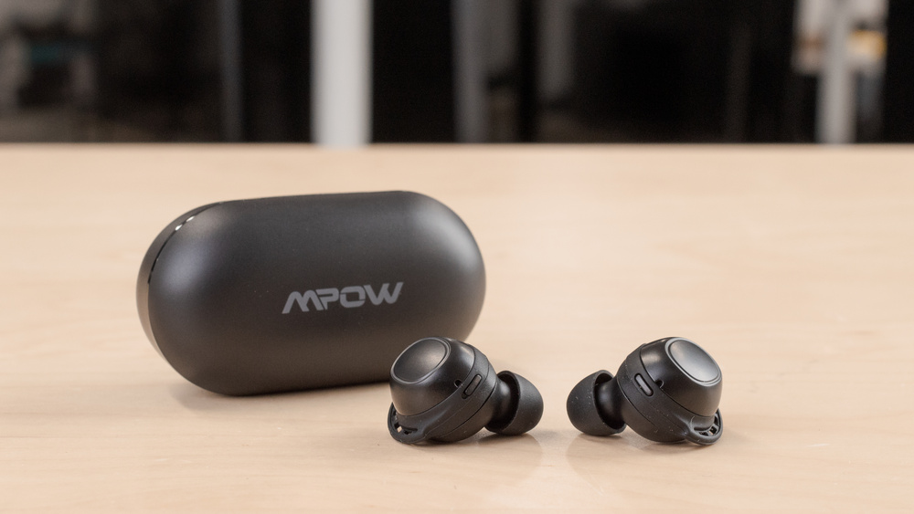

Тут выход только один – менять TWS-гарнитуру.

А вот, например, у Samsung Galaxy Buds+ микрофон работает при
подключении к Windows 11.

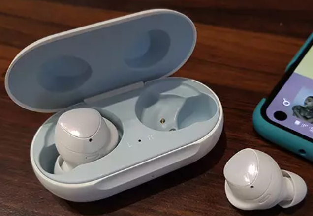
