# Незаметный человек-помощник в TWS-наушнике и нейронки на собеседовании

(здесь есть описание нескольких самых изощрённых схем с применением двух
пар TWS-наушников – зачем две пары, не спрашивайте. На самом деле
достаточно одной пары, см. раздел 3.1B и 4.1B, а ещё проще – одна
проводная USB-гарнитура, см. в другой инструкции «[Схемы аудио потоков с одной USB-headset](аудио-потоки-usb-headset.md)», раздел "Для системы №2".)

## 1. Задача: 

Подключить незаметно к собеседованию человека-помощника, который бы
всё видел и слышал и подсказывал в беспроводной наушник. Для
подключения человека-помощника используется DISCORD. Помимо этого
предполагается использование невидимых ассистентов-нейронок таких, как
Shadowhint и Sobes Copilot. Для этой задачи нужно использовать одну
или две пары одинаковых TWS-наушников – в первом случае в TWS-наушники
попадает звук с Phone Link/Teams, DISCORD, а во втором - одна пара TWS
привязана к Phone Link/Teams/Яндекс-Телемост, вторая – к DISCORD, по
которому идет связь с человеком-помощником.

Встроенный в TWS микрофон использовать нельзя (для обоих TWS) по двум
причинам:

   - 1.1) TWS нужно подключать через USB-BT-адаптер и/или [TRS(AUX) 3,5 мм
– BT]-адаптер, и если брать полноценный TX+RX-адаптер, то можем
получить следующие проблемы:\
❌ адаптеры путают профили\
❌ имеют плохой BT стек\
❌ в Windows могут быть распознаны программой Phone Link как
устройство захвата/передачи (подробнее см. раздел «[Ограничения\Phone
Link](#phone-link)» п. 1.3 и 1.4 )

   - 1.2) Звук должен надежно распознаваться нейронкой (невидимым
ассистентом), т.е. он должен быть качественным.

Поэтому нужно использовать отдельный микрофон, а TWS подключать через TX
(Transmit only)-адаптеры, или TX+RX-адаптеры, у которых можно отключить
RX и сделать только A2DP-режим.

Человек-помощник может не только на ухо диктовать ответы, но и
присылать их вам на Телеграм, который вы можете просматривать либо на
отдельном ПК+монитор/планшете, либо на том же мониторе, что шарите для
собеседования – в последнем случае надо шарить интервьюеру не весь
экран, а только браузер, в котором вы кодите/создаёте. Но вернёмся к
теме помощи через наушник.

На практике Phone Link используется отдельно от
Teams/Яндекс-Телемост/Zoom, поэтому и рассматривать эти задачи будем
отдельно, т.к. конфигурация систем и способы решения отличаются. Это
ключевой момент и причина кроется в том, что Phone Link не позволяет
управлять аудиоустройствами от слова совсем (подробнее см. раздел
«[Ограничения\Phone Link](#phone-link)» ), а
Teams/Яндекс-Телемост/Zoom имеют возможность выбрать устройства для
микрофона и устройство для динамика, как в самом приложении, так и в
микшере Windows. Поэтому для построения аудио графа для
Teams/Яндекс-Телемост/Zoom в данной инструкции я заложил условие
необходимости ручной настройки устройств ввода и вывода, чтобы забрать
звук собеседника из приложения, усилить его и отправить далее в
наушники, DISCORD, ассистенты-нейронки (об этом см. ниже
«Дополнительные условия»). Эта логика и определила структуру данного
документа:

«[3. Для системы №1](#3-для-системы-1)» - этот раздел содержит описание
способов, в которых используется Phone Link без
Teams/Яндекс-Телемост/Zoom

Состав системы №1:

Phone Link, Discord, ShadowHint, Sobes Copilot, OBS

(Teams/Яндекс-Телемост/Zoom не используются)

«[4. Для системы №2](#4-Состав-системы)» - этот раздел содержит
описание способов, в которых используется Teams/Яндекс-Телемост/Zoom
без Phone Link

Состав системы №2:

Teams/Яндекс-Телемост/Zoom, Discord, ShadowHint, Sobes Copilot, OBS

(Phone Link не используются)

Если вам не нужно в Teams/Яндекс-Телемост/Zoom настройка устройств
ввода и вывода, т.е. вам не нужно усиливать звук от собеседника ( =
вам достаточно того, что приложения сами выбирают дефолтные
устройства), то инструкция по настройке будет такая же, как для Phone
Link – просто замените в инструкции везде Phone Link на
Teams/Яндекс-Телемост/Zoom. Обязательно убедитесь, что
Teams/Яндекс-Телемост/Zoom подхватил именно дефолтные устройства –
зайдите в настройки приложения. Но правильным решением будет
использовать инструкцию для системы №2 и в настройках Voicemeeter
коэффициент усиления выставить в 0dB. Преимущество конфигураций для
Системы 2 в том, что в приложения ShadowHint и Sobes Copilot не
попадают звуки системы и других приложений.

### Дополнительные условия

Во время собеседования используются невидимые ассистенты-нейронки
такие, как Shadowhint и Sobes Copilot. Отличия этих двух ассистентов в
том, что Shadowhint не имеет возможности выбора устройства для звука
системы/голоса собеседника (только микрофон), а Sobes Copilot имеет.
Поэтому если нужно подать на Shadowhint усиленный звук, например, от
собеседника (чтобы лучше распознавался голос), то придётся усиливать
весь звук системы, других вариантов нет.

DISCORD используется для подключения человека-помощника, потому что
DISCORD имеет возможность выбрать в качестве микрофона любое
устройство записи(Recording(Capture) devices только), а в качестве
устройства вывода выбрать любое устройства воспроизведения (Playback
devices только), плюс к этому, у него есть мощные настройки фильтрации
звука с микрофона, в т.ч. при помощи шумодава Krisp, см. скриншот
ниже:

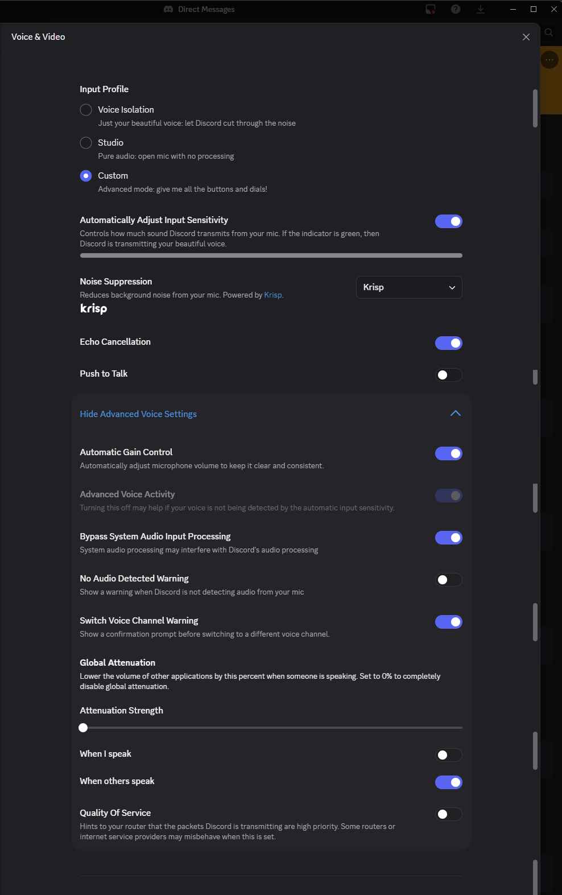

### Ограничения

Техническая информация, которая очень важна при настройке ПО и
построении аудио графа, т.е. схемы звуковых потоков на базе
Voicemeeter. При первом прочтении (человеком! Не нейронкой!) документа
этот раздел можно пропустить.

#### USB-BT-адаптер и [AUX 3,5 мм – BT]-адаптер

1\) Использование TX+RX-адаптера и TWS-гарнитуры может привести к
проблемам (было уже сказано в разделе «Задача»):

- адаптеры путают профили\
- имеют плохой BT стек\
- в Windows могут быть распознаны программой Phone Link как устройство
захвата/передачи (подробнее см. раздел «[Ограничения\Phone
Link](#phone-link)» п. 1.3 и 1.4 )

#### Windows

Есть реальные проблемы использования двух BT-гарнитур в Windows. Для
получения подробной информации отправь промт в нейронку: «поищи в
интернете реальные случаи проблем одновременного использования двух
BT-гарнитур в Windows 10/11. В первую очередь интересуют случаи когда
каждая BT гарнитура работает со своим приложением - например одна
выбрана в DISCORD, вторая в Teams/Яндекс-Телемост/Zoom»

#### Шумодав на ПК/ноутбуке

Для шумоподавления звука с микрофона можно использовать либо ПО Krisp,
которое использует только CPU, либо ПО NVIDIA Broadcast, которое
использует GPU, а именно видео карту NVIDIA GeForce RTX 2060 **/**
Quadro RTX 3000 **/** TITAN RTX или выше. У меня на ноутбуке нет видео
карты NVIDIA GeForce, поэтому я использую Krisp.

Krisp построен на нейросетях, это один из лучших шумодавов. Приложение
убирает клацание клавиш, клики мыши и прочие фоновые звуки, оставляя
только ваш голос. У Krisp есть режимы, которые NVIDIA Broadcast не
имеет:

- Voice Detection / Voice AI

- Возможность обучения на твоём голосе

Логика вида: «Оставлять этот голос, остальные — подавлять».

<https://krisp.ai/>

Ломаная версия есть на rutracker.org.

#### Phone Link

1\) Приложение MS "Связь с телефоном" (Phone Link) имеет ограничения
по маршрутизации звука:

   - 1.1) В самом Phone Link нет управления аудиоустройствами

   - 1.2) Phone Link игнорирует системные механизмы “per-app output”.

Я столкнулся с тем, что **Phone Link не отображается в микшере
приложений Windows**, а значит:

- нельзя штатно назначить ему отдельное output-устройство,

- невозможно разделить “собеседник” и “system/video” по разным
  виртуальным входам Voicemeeter.

Это типичное поведение для некоторых системных/UWP компонентов (часть
аудиопотоков не экспонируется как отдельное “приложение” в микшере).

   - 1.3) Default Communications Device не работает для Phone Link

Если в mmsys.cpl (см. рис. ниже) выбрать отдельное устройство для
связи по умолчанию и отдельное для воспроизведения/вывода, то Phone
Link “прилипает” к **дефолтному устройству вывода,** т.е. игнорит
устройство для связи по умолчанию.

Пункты 1.1, 1.2, 1.3 приводят к тому, что невозможно выделить голос
собеседника в Phone Link без своего голоса из микрофона и направить
его в любое третье приложение, например, ассистент-нейронку. Это
требуется, когда возникает необходимость отдельно его усилить, в
случае, когда HR-сотрудник звонит тебе с ПК-гарнитуры, подключенной к
встроенной звуковой карте (Realtek-чип), что приводит к тихому звуку.

   - 1.4) Phone Link отказывается принимать звук с телефона, если видит
подключенные BT-наушники/гарнитуру к ПК:

Проблему 1.4 можно обойти только использованием внешнего USB-BT
адаптера.

#### ShadowHint

(невидимый ИИ-ассистент)

1\) В самом ShadowHint нет возможности выбора устройства для звука
системы/голоса собеседника, можно только для микрофона. Поэтому если
нужно подать на него усиленный звук, например, от собеседника (чтобы
лучше распознавался голос), то это будет сделать сложно и криво, а в
некоторых случаях невозможно. ShadowHint забирает звук
системы(динамики) при помощи WASAPI loopback с default output
endpoint, т.е. использует дефолтное устройство Воспроизведения,
которое установлено в Винде (mmsys.cpl), а звук микрофона берёт при
запуске приложения из дефолтного устройства записи, но потом можно
выбрать любое устройство, нажав на кнопку с микрофоном (появляется
после старта сессии).

2\) Для ShadowHint важен уровень громкости “master volume” в Винде
(это общий ползунок; вызов по иконке динамика в трее). ShadowHint
«слышит как пользователь», т.е. если будет уровень 5 из 100, то он
ничего не услышит. Поэтому если нужно, чтобы ShadowHint «слышал» и
звук с ноута не шёл, то подключай проводную гарнитуру, у которой есть
собственный/локальный регулятор громкости. После физического
подключения/отключения гарнитуры **нужно перезапускать ассистента
ShadowHint кнопкой Старт/Стоп сессии, чтобы он подхватил новый
источник.**

#### Sobes Copilot

(невидимый ИИ-ассистент)

Sobes Copilot имеет возможность выбрать устройство Записи (микрофон)
для получения вашего голоса, а также выбрать устройство для системных
звуков, которое содержит голос собеседника, но только через устройства
воспроизведения, т.к. Sobes Copilot не поддерживает Capture (Recording
devices) и работает ТОЛЬКО через WASAPI loopback (Playback).

## 2. Состав документа

В разделе [Задача](#1-задача) были уже описаны основные ветви структуры
документа и её логика, продублирую основные ветви тут:

«[3. Для системы №1](#3-для-системы-1)» - этот раздел содержит описание
способов, в которых используется Phone Link без
Teams/Яндекс-Телемост/Zoom

Состав системы №1:

Phone Link, Discord, ShadowHint, Sobes Copilot, OBS

(Teams/Яндекс-Телемост/Zoom не используются)

«[4. Для системы №2](#4-Состав-системы)» - этот раздел содержит
описание способов, в которых используется Teams/Яндекс-Телемост/Zoom
без Phone Link

Состав системы №2:

Teams/Яндекс-Телемост/Zoom, Discord, ShadowHint, Sobes Copilot, OBS

(Phone Link не используются)

### Схемы

В документе приводятся схемы (Hardware wirings, Audio graphs), созданные
при помощи PlaintUML-кода, их все можно найти в папке репозитория `Audio graphs, HW wirings/Незаметный человек-помощник, TWS-наушники/`.

### Конфигурации

В данном документе рассмотрены следующие конфигурации (привожу их коды в
порядке следования в документе):

Система №1:

3.1. (Phone Link + Discord; HW: no audio interface,
2x BT-W5)

3.1B. (Phone Link + Discord; HW: no audio interface,
1x BT-W5)

3.2. (Phone Link + Discord; HW: audio interface, 1Mii
BT, BT-W5)

3.3. (Phone Link + Discord; HW: audio interface, 2x
BT-W5)

Система №2:

4.1. (Teams + Discord, no Phone Link; HW: no audio interface, 2x BT-W5)

*- В этом разделе кратко рассмотрена её разновидность:*

(Teams + Discord, no Phone Link, Default Playback =
VM AUX Input; HW: no audio interface, 2x BT-W5)

4.1A. (Teams + Discord, no Phone Link; HW: no audio interface, 2x TWS,
no BT-W5)

4.1B. (Teams + Discord, no Phone Link; HW: no audio interface, 1x BT-W5)

*- В этом разделе кратко рассмотрена её разновидность:*

(Teams + Discord, no Phone Link, Default Playback =
VM AUX Input; HW: no audio interface, 1x BT-W5)

4.2. (Teams + Discord; HW: audio interface, 1Mii BT, BT-W5)

*- В этом разделе кратко рассмотрена её разновидность:*

(Teams + Discord, no Phone Link, Default Playback =
VM AUX Input; HW: audio interface, 1Mii BT, BT-W5)

4.3. (Teams + Discord; HW: audio interface, 2x BT-W5)

*- В этом разделе кратко рассмотрена её разновидность:*

(Teams + Discord, no Phone Link, Default Playback =
VM AUX Input; HW: audio interface, 2x BT-W5)

Коды конфигураций нужны для того, чтобы можно было анализировать данный
документ при помощи нейронки.

Конфигурации одного цвета отличаются между собой только одной настройкой
Windows Default Playback = “Voicemeeter AUX Input” или = “Voicemeeter
Input” – это ни на что не влияет (просто разные названия виртуальных
устройств), т.е. схемы абсолютно одинаковые.

## 3. Для системы №1

Состав системы №1:

Phone Link, Discord, ShadowHint, Sobes Copilot, OBS, Krisp только для
микрофона.

(Teams/Яндекс-Телемост/Zoom не используются; Krisp только для
микрофона!)

### 3.1. Способ: без аудио карты, два USB-BT-адаптера.

Код конфигурации: (Phone Link + Discord; HW: no audio interface, 2x
BT-W5)

**Способ не проверял.**

Минусы этого способа (нашёл только два):

1\) нужно 3 USB-порта для микрофона и двух Creative BT-W5. Что может
быть критично для ноутбуков

2\) отсутствие аудиоинтерфейса ограничивает возможности выбора хорошего
микрофона, а также возможности усиления, шумоподавления.

Требуемое ПО: [Voicemeeter
Potato](https://shop.vb-audio.com/en/win-apps/21-voicemeeter8.html) (10
евро разовый платёж, или через месяц начнет надоедать всплывающим окном
с просьбой задонатить, во время которого перестают работать виртуальные
кабели)

#### Оборудование

Список устройств: BT-W5 2шт, TWS 2 шт, USB-микрофон

##### Схема подключения устройств (Hardware wiring):

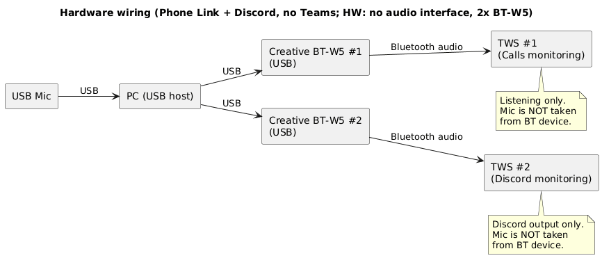

#### Конфигурирование

Что нужно настраивать: Voicemeeter Potato, Windows, Krisp и конечные
приложения (Discord, Sobes Copilot, OBS).

Основные настройки производятся в Voicemeeter Potato.

##### Схема аудио (Audio graph):

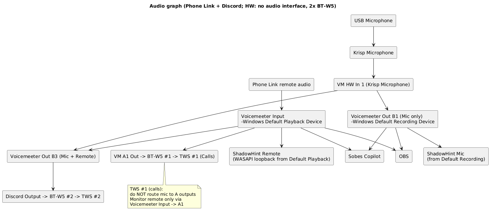

В этой конфигурации главное – Shadowhint, Sobes Copilot, DISCORD и OBS
получают усиленный звук системы+собеседника из Phone Link. Но нужно
иметь в виду, что в дефолтное устройство воспроизведения(Playback =
Voicemeeter Input) попадают все звуки системы, а не только звуки
собеседника из Phone Link. Поэтому нужно позаботиться о том, чтобы не
запускать приложения, которые издают лишние звуки, а в самой Винде
отключить все системные звуки.

##### Микрофон

См. общие требования к микрофонам в разделе «[3.2. Способ: 1Mii BT,
BT-W5, аудио карта с возможностью отключения Direct Monitoring, и без
Loopback\Общие требования](#общие-требования)»

Примеры USB-микрофонов см. в разделе «[3.1B. Способ: без аудио карты,
один USB-BT-адаптер\Примеры USB-микрофонов](#примеры-usb-микрофонов)».

##### Настройки:

###### Цель

- Используются **Phone Link** и **Discord**.

- Нужно:

  - усилить **микрофон** (через Krisp → Voicemeeter);

  - усилить **звук собеседника из Phone Link**;

  - раздать:

    - **mic-only → Sobes Copilot, OBS, ShadowHint (микрофон)**;

    - **remote/system-only → Sobes Copilot, OBS, ShadowHint (remote)**;

    - **mic + remote → Discord**;

  - в **TWS \#1 (через BT-W5 \#1)** слышать **только собеседника**;

  - в **TWS \#2 (через BT-W5 \#2)** — микс Discord.

- Частота: **48 кГц**

###### WINDOWS

Воспроизведение

- Default device: **Voicemeeter Input**

- Default communication device: **Voicemeeter Input**

Запись

- Default device: **Voicemeeter Out B1**

- Default communication device: **Voicemeeter Out B1**

Формат устройств: 48 000 Hz / 24-bit (где доступно).

###### Krisp

- **Microphone** **Input**: USB Headset

- **Cancel Noise and Room Echo** = ON

- **Speaker Cancel Noise = OFF**

**Microphone** **Output (нельзя изменить)**: **Krisp Microphone** (это
устройство отображается в mmsys.cpl\Запись)

Krisp используется **только как обработчик микрофона**.

**Krisp Microphone используется только внутри Voicemeeter** как источник
Stereo Input 1.\
Ни одно приложение напрямую его не использует.

###### Voicemeeter Potato

- Stereo Input 1 = Krisp Microphone

  - B1 ON (mic-only)

  - B3 ON (mic для DISCORD)

  - A1/A2/A3 OFF

- Voicemeeter Input (Phone Link remote)

  - A1 ON (мониторинг TWS \#1)

  - B3 ON (микс для Discord)

  - **Усиление звука из Phone Link делать зелёным fader’ом** Voicemeeter
    Input

Наушники

- A1 -> BT-W5 \#1 -> TWS \#1 (Teams)

- Discord output -> BT-W5 \#2 -> TWS \#2

ШИНЫ

- **B1** — Mic only\
  (и это Windows Default Recording Device)

- **B3** — Mic + Remote (для Discord)

###### Phone Link

- Input: **Windows Default Recording Device (Voicemeeter Out B1)**

- Output: **Windows Default Playback Device (Voicemeeter Input)**

###### Discord

- Input device: **Voicemeeter Out B3**

- Output device: **BT-W5 \#2**

###### Sobes Copilot

- Mic = **Voicemeeter Out B1**

- Remote = **Voicemeeter Input** (получает усиленный голос собеседника
  Teams, см. рис. ниже)

Либо Remote = “**По умолчанию”** (с тем же результатом):

###### OBS

Добавить два источника *Audio Input Capture*:

- Mic track: **Voicemeeter Out B1**

- Remote track: **Default Playback (Voicemeeter Input)**

###### ShadowHint

- **Mic**: берёт из **Default Recording** → Voicemeeter Out B1.

- **Remote/System**: автоматически через WASAPI loopback **Default
  Playback**\
  (а default playback у нас **Voicemeeter Input**, значит ShadowHint
  получает усиленный remote+system)

### 3.1B. Способ: без аудио карты, один USB-BT-адаптер.

Код конфигурации: (Phone Link + Discord; HW: no audio interface, 1x
BT-W5)

Способ частично описан в разделе «**1.2. Способ Приложение MS “Связь с
Windows” + BT-гарнитура в ПК**» инструкции «**[Звонки с телефона через ПК](звонки-через-пк.md)**» для системы «Phone Link + OBS» , но **без DISCORD,
ShadowHint, Sobes Copilot** – это конфигурация (Phone Link, no
Discord;no AI; HW no audio interface, 1x BT-W5), поэтому здесь я приведу
полное описание конфигурации с учётом этих приложений.

**Способ не проверял.**

Минус этого способа:

- отсутствие аудиоинтерфейса ограничивает возможности выбора хорошего
микрофона, а также возможности усиления, шумоподавления.

Требуемое ПО: [Voicemeeter
Potato](https://shop.vb-audio.com/en/win-apps/21-voicemeeter8.html) (10
евро разовый платёж, или через месяц начнет надоедать всплывающим окном
с просьбой задонатить, во время которого перестают работать виртуальные
кабели)

#### Оборудование

Список устройств: BT-W5 1шт, TWS 1 шт, USB-микрофон

##### Схема подключения устройств (Hardware wiring):

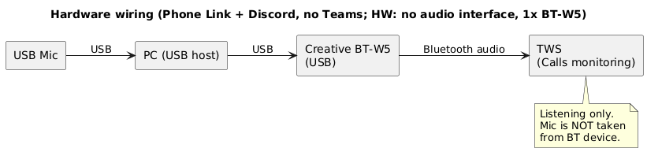

##### Микрофон

См. общие требования к микрофонам в разделе «[3.2. Способ: 1Mii BT,
BT-W5, аудио карта с возможностью отключения Direct Monitoring, и без
Loopback\Общие требования](#общие-требования)»

###### Примеры USB-микрофонов

Ниже представлены несколько микрофонов, которые я подобрал для нашей
задачей исходя из характеристик и отзывов пользователей. Но сразу скажу,
я не проверял ни одного из них, и в этом деле я дилетант.

####### Конденсаторные USB (или XLR+USB)

| **Модель** | **Диапазон цен (РФ)** | **Диаграмма направленности** | **Чувствительность** | **Комментарии** |
|----|---:|----|----|----|
| **HyperX SoloCast** | ~3 000–7 000 ₽ | Кардиоида | **-6 dBFS (1 V/Pa @1 kHz)** ([manualslib.com](https://www.manualslib.com/manual/2242371/Hyperx-Solocast.html?utm_source=chatgpt.com)) | Крепление к пантографу 3/8" и 5/8". |
| **HyperX QuadCast / QuadCast S** *(в режиме cardioid)* | ~7 000–15 000 ₽ | Кардиоида (есть и другие режимы) | **-36 dB (1 V/Pa @1 kHz)** ([Manuals+](https://manuals.plus/m/3cbb6b69f2afdb81e9a2e8b1bf64290feb3833195f14c287bbc32b453ab29696_optim.pdf?utm_source=chatgpt.com)) | Крепление к пантографу 3/8" и 5/8". |
| **Shure MOTIV MV5** | ~7 000–13 000 ₽ | Кардиоида | **-40 dBFS/Pa @1 kHz** | Есть DSP-пресеты (Voice/Instrument/Flat). На штатной подставке резьба **1/4"-20**; на пантограф 3/8"/5/8" ставится через адаптеры **3/8F→1/4M** или **5/8F→1/4M**. |
| **Audio-Technica AT2020USB+** | ~8 000–15 000 ₽ | Кардиоида | **-37 dB** *(как указывает продавец; единицы не уточнены)* ([DNS Shop](https://www.dns-shop.ru/product/driver/895203d05fd63120/mikrofon-audio-technica-at2020usb-cernyj/?utm_source=chatgpt.com)) | Крепление к пантографу **5/8"-27**, в комплекте есть **адаптер 5/8→3/8.** |
| **Esterra/ESPADA ME6S** | ~1 500–4 000 ₽ | Кардиоида | **-40 dB** *(как указано в характеристиках; формат/опорная величина не раскрыты)* ([DNS Shop](https://www.dns-shop.ru/product/characteristics/53e9643a19295717/mikrofon-esterra-me6s-belyj/?utm_source=chatgpt.com)) | Настольная стойка, резьба 5/8 |

####### Динамические USB (или XLR+USB)

<table style="width:100%;">
<colgroup>
<col style="width: 14%" />
<col style="width: 12%" />
<col style="width: 18%" />
<col style="width: 22%" />
<col style="width: 32%" />
</colgroup>
<thead>
<tr>
<th style="text-align: center;"><strong>Модель</strong></th>
<th style="text-align: right;"><strong>Диапазон цен (РФ)</strong></th>
<th style="text-align: center;"><strong>Диаграмма
направленности</strong></th>
<th style="text-align: center;"><strong>Чувствительность</strong></th>
<th style="text-align: center;"><strong>Комментарии</strong></th>
</tr>
</thead>
<tbody>
<tr>
<td>
<strong>Fifine AM8</strong>

<em>(USB+XLR)</em>
</td>
<td style="text-align: right;">~4 000–8 000 ₽</td>
<td>Кардиоида</td>
<td><strong>-50 дБ</strong></td>
<td>Бюджетный для стриминга, озвучки. Крепление к пантографу 3/8" и
5/8".</td>
</tr>
<tr>
<td><strong>Audio-Technica ATR2100x-USB (USB+XLR)</strong></td>
<td style="text-align: right;">~6 000–11 000 ₽</td>
<td>Кардиоида</td>
<td><strong>-54 dBV/Pa</strong> (<a
href="https://samsontech.com/products/microphones/usb-microphones/q2u/">samsontech.com</a>)</td>
<td>В комплекте обычно есть стойка/кабели. Имеет внутреннюю резьбу
крепления стандарта <strong>5/8"-27</strong> и поставляется в комплекте
с адаптером для установки на стойки с резьбой
<strong>3/8"-16</strong>.</td>
</tr>
<tr>
<td><strong>Samson Q2U (USB+XLR)</strong></td>
<td style="text-align: right;">~8 000–13 000 ₽</td>
<td>Кардиоида</td>
<td><strong>-57 dB</strong> <em>(из карточки продавца)</em> (<a
href="https://www.dns-shop.ru/product/driver/c19cac4abf8b2eb1/mikrofon-audio-technica-atr2100x-usb-cernyj/?utm_source=chatgpt.com">DNS
Shop</a>)</td>
<td>Крепление к пантографу 3/8" и 5/8".</td>
</tr>
<tr>
<td><strong>Shure MV7 (USB+XLR)</strong></td>
<td style="text-align: right;">~22 000–35 000 ₽ (оригинал)</td>
<td>Кардиоида</td>
<td><strong>XLR: -55 dBV/Pa; USB: -47 dBFS/Pa</strong> (<a
href="https://www.fullcompass.com/common/files/85555-MV7KBNDLSpecSheet.pdf">Full
Compass Systems</a>)</td>
<td>Крепление к пантографу <strong>5/8"-27</strong>, в комплекте адаптер
на <strong>3/8"-16.</strong></td>
</tr>
<tr>
<td><strong>Audio-Technica AT2005USB (USB+XLR)</strong></td>
<td style="text-align: right;">~6 000–11 000 ₽</td>
<td>Кардиоида</td>
<td><em>(в официальном мануале чувствительность не указана)</em></td>
<td>В официальной инструкции по комплекту/установке прямо упомянут
<strong>адаптер 5/8"-27</strong> для крепления зажимом на boom arm →
значит на 5/8 есть</td>
</tr>
<tr>
<td><strong>Audio-Technica AT2040USB (USB)</strong></td>
<td style="text-align: right;">~12 000–20 000 ₽</td>
<td><strong>Гиперкардиоида</strong></td>
<td><strong>2.2 mV/Pa</strong> <em>(по агрегатору характеристик)</em>
(<a
href="https://micpedia.com/microphone/audio-technica-at2040usb/?utm_source=chatgpt.com">Micpedia</a>)</td>
<td>В офиц. даташите/мануале Audio-Technica строку sensitivity я не
нашёл; зато есть вес/габариты и др. (<a
href="https://docs.audio-technica.com/all/AT2040USB_UM_142420720_EN_V1_web.pdf">docs.audio-technica.com</a>)</td>
</tr>
</tbody>
</table>

Цены указаны на момент 09.01.2026.

#### Конфигурирование

Что нужно настраивать: Voicemeeter Potato, Windows, Krisp и конечные
приложения (Discord, Sobes Copilot, OBS).

Основные настройки производятся в Voicemeeter Potato.

##### Схема аудио (Audio graph):

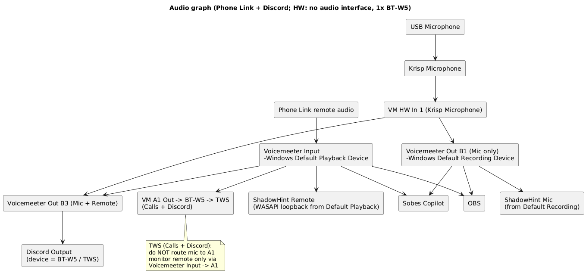

Схема отличается от 3.1 (Phone Link + Discord; HW: no audio interface,
2x BT-W5) только одним адаптером BT-W5 вместо двух.

В этой конфигурации главное:

1\) DISCORD отправляет звук в те же TWS-наушники, в которые попадает
звук из Phone Link

2\) Shadowhint, Sobes Copilot, DISCORD и OBS получают усиленный звук
системы+собеседника из Phone Link. Но нужно иметь в виду, что в
дефолтное устройство воспроизведения(Playback = Voicemeeter Input)
попадают все звуки системы, а не только звуки собеседника из Phone Link.
Поэтому нужно позаботиться о том, чтобы не запускать приложения, которые
издают лишние звуки, а в самой Винде отключить все системные звуки.

##### Настройки:

Настройки ПО почти такие же, как в конфигурации (Phone Link + Discord;
HW: no audio interface, 2x BT-W5) из раздела 3.1, исключение – настройки
Discord: Output Device =TWS, те же, что и для Phone Link.

###### Цель

- Используются **Phone Link** и **Discord**.

- Нужно:

  - усилить **микрофон** (через Krisp → Voicemeeter);

  - усилить **звук собеседника из Phone Link**;

  - раздать:

    - **mic-only → Sobes Copilot, OBS, ShadowHint (микрофон)**;

    - **remote/system-only → Sobes Copilot, OBS, ShadowHint (remote)**;

    - **mic + remote → Discord**;

  - в **TWS (через BT-W5 )** слышать собеседника из Phone Link и
    Discord;

- Частота: **48 кГц**

###### WINDOWS

Воспроизведение

- Default device: **Voicemeeter Input**

- Default communication device: **Voicemeeter Input**

Запись

- Default device: **Voicemeeter Out B1**

- Default communication device: **Voicemeeter Out B1**

Формат устройств: 48 000 Hz / 24-bit (где доступно).

###### Krisp

- **Microphone** **Input**: USB Microphone

- **Cancel Noise and Room Echo** = ON

- **Speaker Cancel Noise = OFF**

**Microphone** **Output (нельзя изменить)**: **Krisp Microphone** (это
устройство отображается в mmsys.cpl\Запись)

Krisp используется **только как обработчик микрофона**.

**Krisp Microphone используется только внутри Voicemeeter** как источник
Stereo Input 1.\
Ни одно приложение напрямую его не использует.

###### Voicemeeter Potato

- Stereo Input 1 = Krisp Microphone

  - B1 ON (mic-only)

  - B3 ON (mic для DISCORD)

  - A1/A2/A3 OFF

- Voicemeeter Input (Phone Link remote)

  - A1 ON (мониторинг TWS )

  - B3 ON (микс для Discord)

  - **Усиление звука из Phone Link делать зелёным fader’ом** Voicemeeter
    Input

Наушники

- A1 -> BT-W5 -> TWS (Teams)

- Discord output -> BT-W5 -> TWS

ШИНЫ

- **B1** — Mic only\
  (и это Windows Default Recording Device)

- **B3** — Mic + Remote (для Discord)

###### Phone Link

- Input: **Windows Default Recording Device (Voicemeeter Out B1)**

- Output: **Windows Default Playback Device (Voicemeeter Input)**

###### Discord

- Input device: **Voicemeeter Out B3**

- Output device: **BT-W5**

###### Sobes Copilot

- Mic = **Voicemeeter Out B1**

- Remote = **Voicemeeter Input** (получает усиленный голос собеседника
  Teams, см. рис. ниже)

Либо Remote = “**По умолчанию”** (с тем же результатом):

###### OBS

Добавить два источника *Audio Input Capture*:

- Mic track: **Voicemeeter Out B1**

- Remote track: **Default Playback (Voicemeeter Input)**

###### ShadowHint

- **Mic**: берёт из **Default Recording** → Voicemeeter Out B1.

- **Remote/System**: автоматически через WASAPI loopback **Default
  Playback**\
  (а default playback у нас **Voicemeeter Input**, значит ShadowHint
  получает усиленный remote+system)

### 3.2. Способ: 1Mii BT, BT-W5, аудио карта с возможностью отключения Direct Monitoring, и без Loopback.

Код конфигурации: (Phone Link + Discord; HW: audio interface, 1Mii BT,
BT-W5)

**Способ не проверял.**

Аудиоинтерфейс в нашей задаче выполняет функцию усиления микрофона и для
подключения в разъём 6.35 TRS TWS-наушников через переходник 6.35
TRS->3.5 TRS и адаптер 3.5 TRS to BT (1Mii BT).

Требование возможности отключения Direct Monitoring нужно чтобы
отключать свой голос в TWS-наушниках, подключенных через адаптер 1Mii BT
в разъем 6,35 мм TRS аудиоинтерфейса. Вообще, все аудиоинтерфейсы имеют
эту возможность, но я специально уточняю, чтобы под аудиоинтерфейсом
никто не понимал подкаст-станцию/“смарт-интерфейс”.

Приписка о том, что нам не нужен Loopback – это для того, чтобы сузить
поиск и не переплачивать.

Требуемое ПО: [Voicemeeter
Potato](https://shop.vb-audio.com/en/win-apps/21-voicemeeter8.html) (10
евро разовый платёж, или через месяц начнет надоедать всплывающим окном
с просьбой задонатить, во время которого перестают работать виртуальные
кабели)

#### Оборудование

Список устройств: аудиоинтерфейс, 1Mii BT, BT-W5, TWS 2 шт, XLR-микрофон

##### Схема подключения устройств (Hardware wiring):

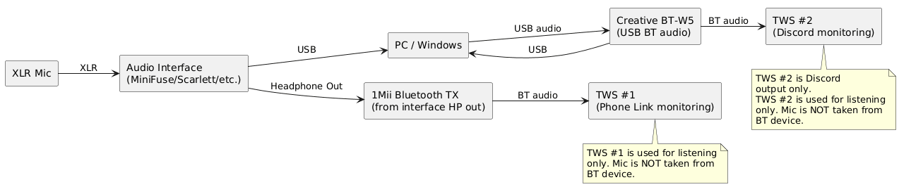

##### Аудиоинтерфейс

Аудиоинтерфейс Arturia MiniFuse 1 (120\$) - это один из самых дешевых
девайсов с необходимым минимальным функционалом для данной задачи. Если
средства позволяют, то можете подобрать любой аудиоинтерфейс,
отталкиваясь от характеристик Arturia MiniFuse 1, вот основные для нашей
задачи:

- качество усиления микрофона

- низкий собственный шум

- один XLR-вход для микрофона

- возможность отключения Direct Monitoring.

- стабильные драйверы

Не требуется:

- loopback ( но конкретно в выбранном нами Arturia MiniFuse 1 эта
  функция есть)

- DSP-микшер

- stream-функции

- виртуальные каналы

Если в устройстве есть функции из списка «Не требуется», то ничего
страшного, этот список нужен, чтобы сузить поиск и не переплачивать.

Список подходящих аудиоинтерфейсов в порядке возрастания цены сверху
вниз:

| **Модель** | **Цена, ₽** | **Mic Gain Trim Range** | **EIN (A-Weighted)** |
|----|---:|---:|---:|
| **Behringer UMC22** | ~5 000–7000 | до ~60 dB (максимум) ([B&H Photo Video](https://www.bhphotovideo.com/c/compare/Focusrite_Solo_vs_Elgato_Wave_XLR_vs_RODE_Ai1_vs_Audient_ID4_MKII/BHitems/1479273-REG_1709830-REG_1378115-REG_1641633-REG?utm_source=chatgpt.com)) | **не опубликовано** |
| **M-Audio M-Track Solo** | ~6 000–9000 | ~54 dB (обзорные измерения) ([B&H Photo Video](https://www.bhphotovideo.com/c/compare/Focusrite_Solo_vs_Elgato_Wave_XLR_vs_RODE_Ai1_vs_Audient_ID4_MKII/BHitems/1479273-REG_1709830-REG_1378115-REG_1641633-REG?utm_source=chatgpt.com)) | \*\* ~-130 dB (обзор)\*\* |
| **Behringer UMC202HD** | ~9 000–13 000 | ~51 dB (обзор) ([B&H Photo Video](https://www.bhphotovideo.com/c/compare/Focusrite_Solo_vs_Elgato_Wave_XLR_vs_RODE_Ai1_vs_Audient_ID4_MKII/BHitems/1479273-REG_1709830-REG_1378115-REG_1641633-REG?utm_source=chatgpt.com)) | ~-129 dB (обзор) ([B&H Photo Video](https://www.bhphotovideo.com/c/compare/Focusrite_Solo_vs_Elgato_Wave_XLR_vs_RODE_Ai1_vs_Audient_ID4_MKII/BHitems/1479273-REG_1709830-REG_1378115-REG_1641633-REG?utm_source=chatgpt.com)) |
| **Arturia MiniFuse 1** | ~9 000–15 000 | ~56 dB (spec/обзор) ([B&H Photo Video](https://www.bhphotovideo.com/c/compare/Focusrite_Solo_vs_Elgato_Wave_XLR_vs_RODE_Ai1_vs_Audient_ID4_MKII/BHitems/1479273-REG_1709830-REG_1378115-REG_1641633-REG?utm_source=chatgpt.com)) | ~-129 dBu (обзорные замеры) ([B&H Photo Video](https://www.bhphotovideo.com/c/compare/Focusrite_Solo_vs_Elgato_Wave_XLR_vs_RODE_Ai1_vs_Audient_ID4_MKII/BHitems/1479273-REG_1709830-REG_1378115-REG_1641633-REG?utm_source=chatgpt.com)) |
| **Nearity NearStream AMIX40U** | ~10 500–13 500 | ручной gain 0–100 (нет официальных dB) | не опубликовано |
| **PreSonus Studio 24c** | ~13 000–20 000 | ~50 dB (обзор) | ~-126 dBu (обзор) |
| **Rode AI-1** | ~14 000–19 000 | ~58 dB (обзор) ([B&H Photo Video](https://www.bhphotovideo.com/c/compare/Focusrite_Solo_vs_Elgato_Wave_XLR_vs_RODE_Ai1_vs_Audient_ID4_MKII/BHitems/1479273-REG_1709830-REG_1378115-REG_1641633-REG?utm_source=chatgpt.com)) | ~-128 dB (обзор) ([B&H Photo Video](https://www.bhphotovideo.com/c/compare/Focusrite_Solo_vs_Elgato_Wave_XLR_vs_RODE_Ai1_vs_Audient_ID4_MKII/BHitems/1479273-REG_1709830-REG_1378115-REG_1641633-REG?utm_source=chatgpt.com)) |
| **Focusrite Scarlett Solo (3rd Gen)** | ~15 000–22 000 | ~56 dB trim range ([B&H Photo Video](https://www.bhphotovideo.com/c/compare/Focusrite_Solo_vs_Elgato_Wave_XLR_vs_RODE_Ai1_vs_Audient_ID4_MKII/BHitems/1479273-REG_1709830-REG_1378115-REG_1641633-REG?utm_source=chatgpt.com)) | ~-128 dBu (A-w) ([B&H Photo Video](https://www.bhphotovideo.com/c/compare/Focusrite_Solo_vs_Elgato_Wave_XLR_vs_RODE_Ai1_vs_Audient_ID4_MKII/BHitems/1479273-REG_1709830-REG_1378115-REG_1641633-REG?utm_source=chatgpt.com)) |
| **Focusrite Scarlett Solo (4th Gen)** | ~18 000–25 000 | ~57 dB trim range ([B&H Photo Video](https://www.bhphotovideo.com/c/compare/Focusrite_One_vs_Audient_ID4_MKII_vs_Elgato_Wave_XLR_vs_Focusrite_Solo/BHitems/1702482-REG_1641633-REG_1709830-REG_1479273-REG?utm_source=chatgpt.com)) | ~-127 dBu (A-w) ([B&H Photo Video](https://www.bhphotovideo.com/c/compare/Focusrite_One_vs_Audient_ID4_MKII_vs_Elgato_Wave_XLR_vs_Focusrite_Solo/BHitems/1702482-REG_1641633-REG_1709830-REG_1479273-REG?utm_source=chatgpt.com)) |
| **Audient iD4 MKII** | ~20 000–28 000 | ~58 dB trim range ([B&H Photo Video](https://www.bhphotovideo.com/c/compare/Focusrite_One_vs_Audient_ID4_MKII_vs_Elgato_Wave_XLR_vs_Focusrite_Solo/BHitems/1702482-REG_1641633-REG_1709830-REG_1479273-REG?utm_source=chatgpt.com)) | ~-129 dB (A-w) ([B&H Photo Video](https://www.bhphotovideo.com/c/compare/Focusrite_One_vs_Audient_ID4_MKII_vs_Elgato_Wave_XLR_vs_Focusrite_Solo/BHitems/1702482-REG_1641633-REG_1709830-REG_1479273-REG?utm_source=chatgpt.com)) |
| **Steinberg UR12** | ~15 000–20 000 | ~44–54 dB (разные измерения) ([B&H Photo Video](https://www.bhphotovideo.com/c/compare/Focusrite_2i2_vs_Focusrite_Solo_vs_Elgato_Wave%2BXLR_vs_Audient_EVO4/BHitems/1778213-REG_1778216-REG_1709830-REG_1548377-REG?utm_source=chatgpt.com)) | **не опубликовано в spec** |
| **Steinberg UR22C** | ~18 000–25 000 | ~6–60 dB (manual spec) ([B&H Photo Video](https://www.bhphotovideo.com/c/compare/Focusrite_2i2_vs_Focusrite_Solo_vs_Elgato_Wave%2BXLR_vs_Audient_EVO4/BHitems/1778213-REG_1778216-REG_1709830-REG_1548377-REG?utm_source=chatgpt.com)) | **не опубликовано** |
| **Universal Audio Volt 1** | ~18 000–25 000 | ~55 dB (обзорные спецификации) ([B&H Photo Video](https://www.bhphotovideo.com/c/compare/Focusrite_Solo_vs_Elgato_Wave_XLR_vs_RODE_Ai1_vs_Audient_ID4_MKII/BHitems/1479273-REG_1709830-REG_1378115-REG_1641633-REG?utm_source=chatgpt.com)) | ~-127 dBu (обзор) ([B&H Photo Video](https://www.bhphotovideo.com/c/compare/Focusrite_Solo_vs_Elgato_Wave_XLR_vs_RODE_Ai1_vs_Audient_ID4_MKII/BHitems/1479273-REG_1709830-REG_1378115-REG_1641633-REG?utm_source=chatgpt.com)) |
| **MOTU M2** | ~25 000–35 000 | ~60 dB gain range ([B&H Photo Video](https://www.bhphotovideo.com/c/compare/Focusrite_2i2_vs_Focusrite_Solo_vs_Elgato_Wave%2BXLR_vs_Audient_EVO4/BHitems/1778213-REG_1778216-REG_1709830-REG_1548377-REG?utm_source=chatgpt.com)) | ~-129 dBu (A-w) ([B&H Photo Video](https://www.bhphotovideo.com/c/compare/Focusrite_2i2_vs_Focusrite_Solo_vs_Elgato_Wave%2BXLR_vs_Audient_EVO4/BHitems/1778213-REG_1778216-REG_1709830-REG_1548377-REG?utm_source=chatgpt.com)) |

Цены указаны на момент 09.01.2026.

**Mic Gain Trim Range**\
— показывает, насколько **усилитель может усиливать сигнал микрофона**
(больший диапазон полезен, если микрофон тихий или плохо
чувствительный).

**EIN (Equivalent Input Noise)**\
— измерение шумов микрофонного предусилителя. Чем **ниже значение (в
отрицательных dB)**, тем тише собственный шум усилителя, что важно при
чувствительных микрофонах или большом усилении. Например, –130 dBu
-лучше, чем –127 dBu, но для звонков / Teams / Phone Link / Discord /
ShadowHint оба эти значения неразличимы.

Из всех этих аудиоинтерфейсов я остановил свой теоретический выбор на
**Arturia MiniFuse 1** потому, что у него самый лучший(подтвержденный)
**mic gain 56 dB** среди первых четырёх позиций в таблице.

##### Микрофон

###### Общие требования:

Микрофон должен быть **направленным**, чтобы ловить меньше голосов
домочадцев, соседей, шум с улицы за окном.

**Конденсаторный или динамический** – тут выбирать в зависимости от
условий, условия всегда разные могут быть, универсального решения не
существует. В этом выборе следует учесть важное условие – микрофон не
должен попасть в видео кадр, иначе у интервьюера возникнут лишние
подозрения – зачем нужен микрофон, если в ушах TWS-затычки? На крайний
случай можно объяснить так: “микрофон у BT-затычек плохой, поэтому
использую USB-микрофон”. Как можно спрятать микрофон ? Убрать подальше –
на то же расстояние от головы, что и видео камера, т.е. это 40 см
минимум, а 80 см в идеале. **Это условие автоматически подталкивает к
выбору конденсаторного микрофона** , т.к. он ловит качественно звук и в
1-2 метрах без необходимости его усиливать. Но его проблема в том, что
он ловит голоса в соседних комнатах и квартирах , поэтому использовать
его можно только в полной тишине. **Если полной тишины достичь
невозможно, то нужно выбирать динамический**, но у него очень низкая
чувствительность по сравнению с конденсаторным – 15-30 см это
критическое расстояние для большинства динамических, на котором
значительно падает громкость. Поэтому для них динамических микрофонов
очень важен аппаратный усилитель (аудиоинтерфес).

####### Важные замечания:

- Даже гиперкардиоида не “заглушит” голоса за стеной, если они слышны в
  комнате (через дверь/проёмы/отражения). Она *сильнее режет* бок/тыл,
  но магии нет.

- Для максимального отсечения домашнего фона обычно дают лучший эффект:
  динамический + близкая дистанция (10–15 см) + грамотная ориентация
  (нулём диаграммы в сторону двери или откуда идут ненужные голоса) +
  компрессор/expander/gate (в Voicemeeter).\
  При 40 см почти всегда придётся усиливать — и фон тоже поднимется.

В данной инструкции не будем предъявлять требований к наличию шумодава у
микрофона и аудиоинтерфейса, т.к. шум от клавиатуры предполагается
гасить программным шумодавом Krisp, либо при помощи ПО NVIDIA Broadcast
(для тех, у кого есть видео карта NVIDIA GeForce RTX 2060 **/** Quadro
RTX 3000 **/** TITAN RTX или выше). Но вы вольны выбрать любой вариант в
зависимости от финансов.

Я, как дилетант, сделал вывод, что **подойдёт любой XLR-микрофон от 40\$
(без учёта пантографа) и любой USB (или XLR+USB) от 55\$(без учёта
пантографа), главные условия**:

- Кардиодный/гиперардиодный

- Возможность крепления к пантографу, т.е. чтобы микрофон был не на
  настольной подставке, которая принимает на себя вибрации стола. Это
  важно, не столько по причине шумов (шумодав Krisp это всё 100%
  отфильтрует), скорее это важно для того, чтобы можно использовать
  вместе с ноутбуком – чтобы микрофон не мешался под руками, не
  пересекался с проводами, которые выходят из ноутбука, и чтобы можно
  было микрофон вывести за сектор обзора видеокамеры.

####### Чувствительность

Есть ещё один важный параметр - чувствительность – чем она ниже, тем
ближе нужно подносить микрофон ко рту, чтобы сохранить требуемый уровень
громкости, например -70 дБ будет звучать на ПК тише, чем-37 дБ при одном
и том же расстоянии, одном и том же звуковом давлении тише, без усиления
и при сравнении микрофонов одного типа подключения (XLR с XLR, USB с
USB). При сравнение паспортной чувствительности надо понимать, что
конденсаторный XLR-микрофон с чувствительностью -35 дБ, подключенный к
аудиоинтерфесу, на котором усиление не включено, и USB-микрофон с -6 дБ
(эта цифра всегда приводится в описании для всей системы “капсюль+АЦП”),
подключенный к тому же ПК, могут давать одинаковый уровень громкости.

При хорошем аудиоинтерфейсе низкую чувствительность XLR-микрофона можно
поднять до нужного нам уровня. Но я уверен, опять же повторюсь, как
дилетант, что **для наших задач, подойдёт микрофон с любой
чувствительностью**. Конечно, если взять XLR-микрофон с -70дБ, то к нему
нужен аудиоинтерфейс с микрофонным коэф-том усиления 55-60 дБ, или
вообще [подкаст-станция](сма#_Аудиоинтерфейс/подкаст-станция/), у
которых усиление Mic-входа обычно составляет 70 дБ.

###### Примеры

Ниже представлены несколько микрофонов, которые я подобрал для нашей
задачей исходя из характеристик и отзывов пользователей. Но сразу скажу,
я не проверял ни одного из них, и в этом деле я дилетант.

####### Конденсаторные (XLR)

| **Модель** | **Диапазон цен (РФ)** | **Диаграмма направленности** | **Чувстви-тельность** | **Комментарии** |
|----|---:|----|----|----|
| **Behringer C-1** | ~**5 100–9 500 ₽** | кардиоида | ≈ -37 dBV/Pa (≈ 14.1 mV/Pa) | Часто встречается в наборах/вариациях (есть C-1U USB — это другой микрофон). |
| **Audio-Technica AT2020** | ~**4 500–13 700 ₽** | кардиоида | -37 dBV/Pa (≈ 14.1 mV/Pa) | Базовый «классический» студийный конденсатор. |
| **AKG P120** | ~**6 900–14 300 ₽** | кардиоида | -33 dB | Часто выбирают как недорогой LDC |
| **Audio-Technica AT2035** | ~**3 400–16 600 ₽** | кардиоида | -33 dB re 1V/Pa (≈ 22.4 mV/Pa) | Есть **HPF 80 Гц** и **-10 dB pad** (полезно против гула/перегруза). |
| **SHURE MXL 770** | ~**13 090 ₽** | кардиоида | ≈ 15 mV/Pa (≈ -36.5 dBV/Pa ориентировочно) | Часто продаётся комплектом |
| **Takstar TAK35** | **~3500-7000** **₽** | кардиоида | - 36 dB | Takstar - **к**итайский бренд. |
| **Takstar TAK55** | **~6000-9000** **₽** | cardioid, figure-8, omni | ≈ -39 dB ±3 dBV (0 dB = 1 V/Pa) (~ 11 mV/Pa) | Takstar - **к**итайский бренд. Поддерживает три полярных паттерна, переключаемые тумблером |
| **Behringer B-1** | ~**9 700–12 000 ₽** | кардиоида | - 34 dB | Часто идёт с кейсом/подвесом в комплекте (зависит от продавца). |

Цены указаны на момент 09.01.2026.

Если минимальная и максимальная цена отличается в 2-2.5 раза, и эта
торговая марка Европы, США, Японии, то значит минимальная цена – это
цена для китайской реплики. Вполне вероятно, что для наших задач
подойдут и китайские реплики, не знаю. Я только знаю, что у реплик
собственный шум выше оригиналов, но этот шум всё так же незначителен для
задач проведения созвонов и распознавания текста нейронками, на уровне
нуля я бы сказал. А вот что с диаграммой направленности и
чувствительностью у китайских подделок не известно.

####### Динамические (XLR)

<table>
<colgroup>
<col style="width: 21%" />
<col style="width: 17%" />
<col style="width: 16%" />
<col style="width: 11%" />
<col style="width: 32%" />
</colgroup>
<thead>
<tr>
<th style="text-align: center;"><strong>Модель</strong></th>
<th style="text-align: right;"><strong>Диапазон цен (РФ)</strong></th>
<th style="text-align: center;"><strong>Диаграмма
направленности</strong></th>
<th style="text-align: center;"><strong>Чувстви-тельность</strong></th>
<th style="text-align: center;"><strong>Комментарии</strong></th>
</tr>
</thead>
<tbody>
<tr>
<td><strong>Behringer XM8500</strong></td>
<td style="text-align: right;">~<strong>2 160–5 240 ₽</strong></td>
<td>кардиоида</td>
<td>- 70 дБ</td>
<td>Очень бюджетный «вокальный» динамический.</td>
</tr>
<tr>
<td><strong>Audio-Technica ATR2100x-USB</strong> <em>(USB+XLR)</em></td>
<td style="text-align: right;">~<strong>6 000–11 200 ₽</strong></td>
<td>кардиоида</td>
<td>- 57 дБ</td>
<td>Универсальный: можно и по XLR в интерфейс, и по USB.</td>
</tr>
<tr>
<td><strong>Audio-Technica AT2040</strong></td>
<td style="text-align: right;">~<strong>11 600–15 200 ₽</strong></td>
<td>гиперкардиоида</td>
<td>- 53 дБ</td>
<td>Более «узкий» рисунок, лучше отсекает комнату/боковые голоса, чем
кардиоида при равных условиях.</td>
</tr>
<tr>
<td><strong>Samson Q2U</strong> <em>(USB+XLR)</em></td>
<td style="text-align: right;">~<strong>10 732 ₽</strong></td>
<td>кардиоида</td>
<td>- 54 дБВ/Па</td>
<td>Ещё один популярный «двухинтерфейсный» динамический.</td>
</tr>
<tr>
<td>
<strong>Fifine AM8</strong>

<em>(USB+XLR)</em>
</td>
<td style="text-align: right;">4500 <strong>₽</strong></td>
<td>кардиоида</td>
<td>- 50 дБ</td>
<td>Бюджетный для стриминга, озвучки</td>
</tr>
</tbody>
</table>

Цены указаны на момент 09.01.2026.

Если не понятно совсем с чего начинать, то я бы сначала купил
конденсаторный Takstar TAK35 или динамический Fifine AM8, а потом уже
действовал по обстоятельствам , т.е. подбирал другой микрофон при
необходимости. Но моих советов слушать не надо, ибо я далек от этой
темы.

#### Конфигурирование

Что нужно настраивать: Voicemeeter Potato, Windows, Krisp и конечные
приложения (Discord, Sobes Copilot, OBS).

Основные настройки производятся в Voicemeeter Potato.

##### Схема аудио (Audio graph):

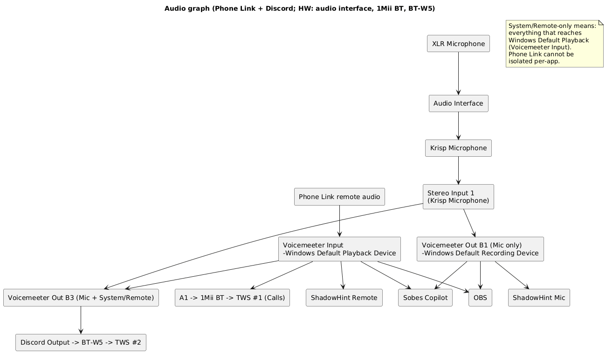

Схема отличается от 3.1 (Phone Link + Discord; HW: no audio interface,
2x BT-W5) только адаптером 1Mii BT вместо BT-W5 на позиции TWS \#1.

В этой конфигурации главное – Shadowhint, Sobes Copilot, DISCORD и OBS
получают усиленный звук системы+собеседника из Phone Link. Но нужно
иметь в виду, что в дефолтное устройство воспроизведения(Playback =
Voicemeeter Input) попадают все звуки системы, а не только звуки
собеседника из Phone Link. Поэтому нужно позаботиться о том, чтобы не
запускать приложения, которые издают лишние звуки, а в самой Винде
отключить все системные звуки.

##### Настройки:

**Настройки ПО такие же, как в конфигурации** (Phone Link + Discord; HW:
no audio interface, 2x BT-W5) из предыдущего раздела 3.1.

###### Цель

- Используются **Phone Link** и **Discord**.

- Нужно:

  - усилить **микрофон** (XLR → интерфейс → Krisp → Voicemeeter);

  - усилить **звук собеседника из Phone Link**;

  - раздать:

    - **mic-only → Sobes Copilot, OBS, ShadowHint (микрофон)**;

    - **remote/system-only → Sobes Copilot, OBS, ShadowHint (remote)**;

    - **mic + remote → Discord**;

  - в **TWS \#1 (через 1Mii BT)** слышать **только собеседника**;

  - в **TWS \#2 (через BT-W5 \#2)** — микс Discord.

- Частота: **48 кГц**

###### WINDOWS

Воспроизведение

- Default device: **Voicemeeter Input**

- Default communication device: **Voicemeeter Input**

Запись

- Default device: **Voicemeeter Out B1**

- Default communication device: **Voicemeeter Out B1**

Формат устройств: 48 000 Hz / 24-bit (где доступно).

###### Krisp

- **Microphone** **Input**: Audio Interface microphone

- **Cancel Noise and Room Echo** = ON

- **Speaker Cancel Noise = OFF**

**Microphone** **Output (нельзя изменить)**: **Krisp Microphone** (это
устройство отображается в mmsys.cpl\Запись)

Krisp используется **только как обработчик микрофона**.

**Krisp Microphone используется только внутри Voicemeeter** как источник
Stereo Input 1.\
Ни одно приложение напрямую его не использует.

###### Voicemeeter Potato

- Stereo Input 1 = Krisp Microphone

  - B1 ON (mic-only)

  - B3 ON (mic для DISCORD)

  - A1/A2/A3 OFF

- Voicemeeter Input (Phone Link remote)

  - A1 ON (мониторинг TWS \#1)

  - B3 ON (микс для Discord)

  - **усиление звука из Phone Link делать зелёным fader’ом** Voicemeeter
    Input

Наушники

- A1 -> BT-W5 \#1 -> TWS \#1 (Phone Link)

- Discord output -> BT-W5 \#2 -> TWS \#2

ШИНЫ

- **B1** — Mic only\
  (и это Windows Default Recording Device)

- **B3** — Mic + Remote (для Discord)

###### Phone Link

- Input: **Windows Default Recording Device (Voicemeeter Out B1)**

- Output: **Windows Default Playback Device (Voicemeeter Input)**

###### Discord

- Input device: **Voicemeeter Out B3**

- Output device: **BT-W5 \#2**

###### Sobes Copilot

- Mic = **Voicemeeter Out B1**

- Remote = **Voicemeeter Input** (получает усиленный голос собеседника
  Phone Link, см. рис. ниже)

Либо Remote = “**По умолчанию”** (с тем же результатом):

###### OBS

Добавить два источника *Audio Input Capture*:

- Mic track: **Voicemeeter Out B1**

- Remote track: **Default Playback (Voicemeeter Input)**

###### ShadowHint

- **Mic**: берёт из **Default Recording** → Voicemeeter Out B1.

- **Remote/System**: автоматически через WASAPI loopback **Default
  Playback**\
  (а default playback у нас **Voicemeeter Input**, значит ShadowHint
  получает усиленный remote+system)

### 3.3. Способ: BT-W5 2 шт, аудио карта без Loopback.

Код конфигурации: (Phone Link + Discord; HW: audio interface, 2x BT-W5)

**Способ не проверял.**

Аудиоинтерфейс в нашей задаче выполняет только функцию усиления
микрофона.

Требуемое ПО: [Voicemeeter
Potato](https://shop.vb-audio.com/en/win-apps/21-voicemeeter8.html) (10
евро разовый платёж, или через месяц начнет надоедать всплывающим окном
с просьбой задонатить, во время которого перестают работать виртуальные
кабели)

#### Оборудование

Список устройств: аудиоинтерфейс, BT-W5 2 шт, TWS 2 шт, XLR-микрофон

##### Схема подключения устройств (Hardware wiring):

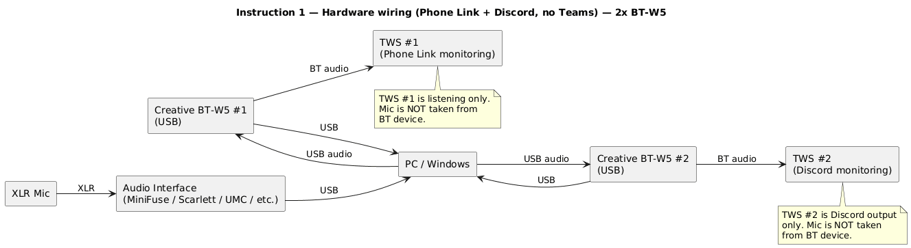

##### Аудиоинтерфейс/подкаст-станция/“смарт-интерфейс”

Для данного способа подходят такие же аудиоинтерфейсы, как в разделе
«3.2. Способ: 1Mii BT, BT-W5, аудио карта с возможностью отключения
Direct Monitoring, и без Loopback», но плюс к этому, появляется
возможность использовать вместо них подкаст-станции /
“смарт-интерфейсы”, которые не позволяют отключать Direct monitor, в
большинстве случаев, в отличии от аудиоинтефейсов. В данном способе мы
не подключаем никакие наушники к аудиоустройству, и используем его
исключительно для усиления микрофона. Мне, как дилетанту, кажется, что с
такой функцией подкаст-станция/“смарт-интерфейс” справится и не выдаст
сюрпризов по автоматическому изменению уровня громкости или
нестандартному поведению в Винде с точки зрения аудиоинтерфейса
(например, Винда будет неверно определять устройство для получения звука
микрофона).

Почему я говорю про подкаст-станции / “смарт-интерфейсы”? У них, в
отличии от аудиоинтерфейсов, очень высокий Mic gain (~70dB). Их нужно
иметь в виду.

###### Подкаст-станции / “смарт-интерфейсы”

| **Модель** | **Цена (₽)** | **Mic gain (dB)** | **EIN (dB)** |
|----|---:|---:|---:|
| **PreSonus Revelator io44** | **≈ 10 168 – 24 715** (Ozon, по выдаче) ([ОЗОН](https://www.ozon.ru/category/presonus-revelator-io44/?utm_source=chatgpt.com)) | **60** ([PreSonus](https://uk.presonus.com/products/Revelator-io44/tech-specs)) | **-128 dBu** ([PreSonus](https://uk.presonus.com/products/Revelator-io44/tech-specs)) |
| **Zoom PodTrak P4** | **≈ 18 108 – 30 822** (Ozon, по выдаче) | **70** ([Zoom Europe](https://www.zoom-europe.com/en/podcast-recorders/zoom-p4-podtrak?utm_source=chatgpt.com)) | N/A |
| **Zoom PodTrak P4next** | **≈ 15 000 – 23 000** (по рынку РФ/предзаказы) | **70** (ожидаемо тот же класс предусилителей) | N/A |
| **Zoom PodTrak P8** | **≈ 38 429 – 46 987** (Ozon, по выдаче) | **70** ([Zoom Corporation](https://zoomcorp.com/en/us/podtrak-recorders/podcast-recorders/podtrak-p8/?utm_source=chatgpt.com)) | N/A |
| **Focusrite Vocaster One** | **≈ 10000 – 34000** ([ОЗОН](https://www.ozon.ru/product/vocaster-one-vocaster-one-audio-interfeys-usb-portativnyy-focusrite-1549898577/?utm_source=chatgpt.com)) | **70+** ([Musikhaus Thomann](https://www.thomannmusic.com/focusrite_vocaster_one.htm?utm_source=chatgpt.com)) | N/A *(не нашёл официально опубликованного EIN)* |
| **Elgato Wave XLR** | **≈ 25 340 – 72 603** (Я.Маркет, по выдаче) ([Аудиомания - Хороший звук от А до Я](https://www.audiomania.ru/home_record_mic_sets/focusrite/focusrite_vocaster_one_studio_podcast_set.html?utm_source=chatgpt.com)) | **75** ([Elgato](https://help.elgato.com/hc/en-us/articles/4404226644493-Elgato-Wave-XLR-Technical-Specifications?utm_source=chatgpt.com)) | **-130 dBV** ([Elgato](https://help.elgato.com/hc/en-us/articles/4404226644493-Elgato-Wave-XLR-Technical-Specifications?utm_source=chatgpt.com)) |
| **MAONO AME2 GEN2 или E2 Gen2** *(китайский бренд)* | **≈ 6 740 – 18 126** (Ozon, по карточке/предложениям) ([ОЗОН](https://www.ozon.ru/product/miksher-maono-ame2-gen2-chernyy-3191895751/?utm_source=chatgpt.com)) | до ~60 дБ | N/A |
| **TASCAM Mixcast 4** | **≈ 67 072 – 101 412** (Я.Маркет, по выдаче) ([ОЗОН](https://www.ozon.ru/product/vocaster-one-audio-interfeys-usb-portativnyy-focusrite-2158037924/?utm_source=chatgpt.com)) | **66.5** ([cf.tascam.com](https://cf.tascam.com/wp-content/uploads/downloads/products/tascam/mixcast_4/mixcast_4-e-spec_om_vc.pdf?utm_source=chatgpt.com)) | **-125 dBu** ([cf.tascam.com](https://cf.tascam.com/wp-content/uploads/downloads/products/tascam/mixcast_4/mixcast_4-e-spec_om_vc.pdf?utm_source=chatgpt.com)) |
| **RØDE RØDECaster Duo** | **≈ 59 288 – 66 940** (POP-MUSIC / Audiomania) | N/A | N/A |
| **RØDE RØDECaster Pro II** | **≈ 83 750 – 89 000** (MuStore / ProVideo) ([ОЗОН](https://www.ozon.ru/product/miksher-rode-rodecaster-pro-2-2608908738/?utm_source=chatgpt.com)) | **76** ([edge.rode.com](https://edge.rode.com/pdf/products/1177/RODECaster%20PRO%20II_DataSheet_04_FINAL%20ARTWORK-WEB.pdf?utm_source=chatgpt.com)) | **-131.5 dBV** ([edge.rode.com](https://edge.rode.com/pdf/products/1177/RODECaster%20PRO%20II_DataSheet_04_FINAL%20ARTWORK-WEB.pdf?utm_source=chatgpt.com)) |
| **Mackie DLZ Creator XS** | **≈ 58 900 – 77 990** (Audiomania / Mackie) ([AliExpress](https://aliexpress.ru/item/1005005467477341.html?utm_source=chatgpt.com)) | **80** ([muztorg.ru](https://www.muztorg.ru/product/A195131?utm_source=chatgpt.com)) | N/A |
| **Mackie DLZ Creator** | **≈ 94 590 – 111 890** (Mackie / Audiomania) ([mackie.ru](https://www.mackie.ru/catalog/3-mikshery/3-4-mikshery-dlya-strima-i-podkasta/mackie-dlz-creator-miksher-dlya-vedeniya-podkastov/?utm_source=chatgpt.com)) | N/A *(не вижу в источниках явное число)* | N/A |

Zoom PodTrak P4 и P8 записывают максимум в 44.1 кГц / 16-бит. Новая
модель **PodTrak P4next** с поддержкой 48 кГц. Поэтому Zoom PodTrak P4 и
P8 лучше исключить, чтобы не заниматься ресемплингом.

Из всего этого списка, меня как дилетанта, привлекает Focusrite Vocaster
One.

##### Микрофон

См. раздел «3.2. Способ: 1Mii BT, BT-W5, аудио карта с возможностью
отключения Direct Monitoring, и без Loopback»

#### Конфигурирование

Что нужно настраивать: Voicemeeter Potato, Windows, Krisp и конечные
приложения (Discord, Sobes Copilot, OBS).

Основные настройки производятся в Voicemeeter Potato.

##### Схема аудио (Audio graph):

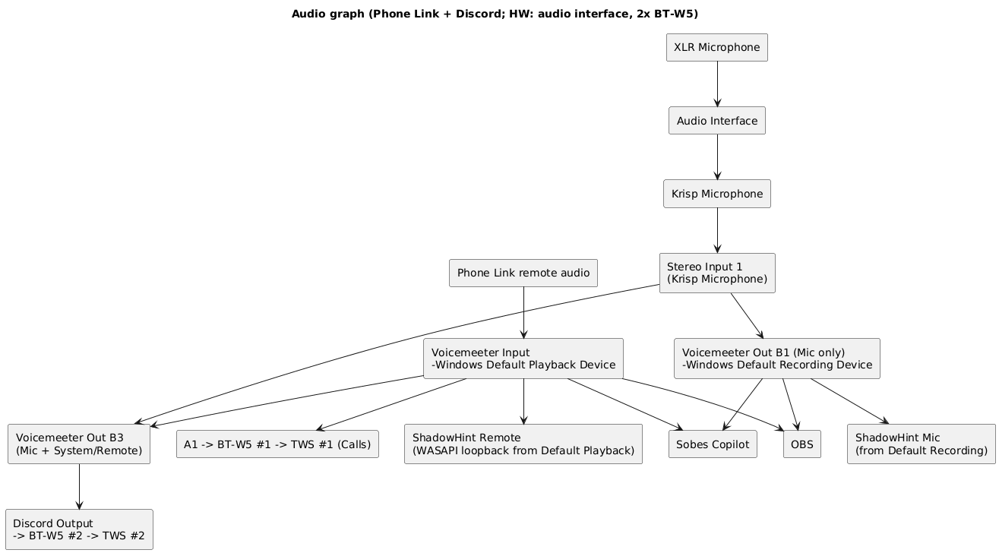

Схема отличается от 3.1 (Phone Link + Discord; HW: no audio interface,
2x BT-W5) только XLR-микрофоном вместо USB-микрофона.

##### Настройки:

**Настройки ПО такие же, как в конфигурации** (Phone Link + Discord; HW:
audio interface, 1Mii BT, BT-W5) из предыдущего раздела 3.2.

###### Цель

- Используются **Phone Link** и **Discord**.

- Нужно:

  - усилить **микрофон** (XLR → интерфейс → Krisp → Voicemeeter);

  - усилить **звук собеседника из Phone Link**;

  - раздать:

    - **mic-only → Sobes Copilot, OBS, ShadowHint (микрофон)**;

    - **remote/system-only → Sobes Copilot, OBS, ShadowHint (remote)**;

    - **mic + remote → Discord**;

  - в **TWS \#1 (через BT-W5 \#1)** слышать **только собеседника**;

  - в **TWS \#2 (через BT-W5 \#2)** — микс Discord.

- Частота: **48 кГц**

###### WINDOWS

Воспроизведение

- Default device: **Voicemeeter Input**

- Default communication device: **Voicemeeter Input**

Запись

- Default device: **Voicemeeter Out B1**

- Default communication device: **Voicemeeter Out B1**

Формат устройств: 48 000 Hz / 24-bit (где доступно).

###### Krisp

- **Microphone** **Input**: Audio Interface microphone

- **Cancel Noise and Room Echo** = ON

- **Speaker Cancel Noise = OFF**

**Microphone** **Output (нельзя изменить)**: **Krisp Microphone** (это
устройство отображается в mmsys.cpl\Запись)

Krisp используется **только как обработчик микрофона**.

**Krisp Microphone используется только внутри Voicemeeter** как источник
Stereo Input 1.\
Ни одно приложение напрямую его не использует.

###### Voicemeeter Potato

- Stereo Input 1 = Krisp Microphone

  - B1 ON (mic-only)

  - B3 ON (mic для DISCORD)

  - A1/A2/A3 OFF

- Voicemeeter Input (Phone Link remote)

  - A1 ON (мониторинг TWS \#1)

  - B3 ON (микс для Discord)

  - **усиление звука из Phone Link делать зелёным fader’ом** Voicemeeter
    Input

Наушники

- A1 -> BT-W5 \#1 -> TWS \#1 (Phone Link)

- Discord output -> BT-W5 \#2 -> TWS \#2

ШИНЫ

- **B1** — Mic only\
  (и это Windows Default Recording Device)

- **B3** — Mic + Remote (для Discord)

###### Phone Link

- Input: **Windows Default Recording Device (Voicemeeter Out B1)**

- Output: **Windows Default Playback Device (Voicemeeter Input)**

###### Discord

- Input device: **Voicemeeter Out B3**

- Output device: **BT-W5 \#2**

###### Sobes Copilot

- Mic = **Voicemeeter Out B1**

- Remote = **Voicemeeter Input** (получает усиленный голос собеседника
  Phone Link, см. рис. ниже)

Либо Remote = “**По умолчанию”** (с тем же результатом):

###### OBS

Добавить два источника *Audio Input Capture*:

- Mic track: **Voicemeeter Out B1**

- Remote track: **Default Playback (Voicemeeter Input)**

###### ShadowHint

- **Mic**: берёт из **Default Recording** → Voicemeeter Out B1.

- **Remote/System**: автоматически через WASAPI loopback **Default
  Playback**\
  (а default playback у нас **Voicemeeter Input**, значит ShadowHint
  получает усиленный remote+system)

## 4. Для системы №2

Состав системы №2:

Teams/Яндекс-Телемост/Zoom, Discord, Sobes Copilot, ShadowHint, OBS,
Krisp только для микрофона

(Phone Link не используются; Krisp только для микрофона!)

### 4.1. Способ: без аудио карты, два USB-BT-адаптера.

Код конфигурации: (Teams + Discord, no Phone Link; HW: no audio
interface, 2x BT-W5)

Особенность: усиленный изолированный звук собеседника из Teams
передаётся для Sobes Copilot, при этом Shadowhint и Phone Link не
используются (им невозможно передать изолированный звук собеседника без
звуков системы). Возможность передачи звука системы+собеседника из Teams
в Shadowhint и Phone Link в этом разделе тоже рассмотрена, как отдельная
конфигурация, которая реализуется в пару кликов мыши.

**Способ не проверял.**

Минусы этого способа те же, что и у «[3.1. Способ: без аудио карты, два
USB-BT-адаптера.](#31-способ-без-аудио-карты-два-usb-bt-адаптера)»:

1\) нужно 3 USB-порта для микрофона и двух Creative BT-W5. Что может
быть критично для ноутбуков

2\) отсутствие аудиоинтерфейса ограничивает возможности выбора хорошего
микрофона, а также возможности усиления, шумоподавления.

Требуемое ПО: [Voicemeeter
Potato](https://shop.vb-audio.com/en/win-apps/21-voicemeeter8.html) (10
евро разовый платёж, или через месяц начнет надоедать всплывающим окном
с просьбой задонатить, во время которого перестают работать виртуальные
кабели)

#### Оборудование

Список устройств: BT-W5 2шт, TWS 2 шт, USB-микрофон

##### Схема подключения устройств (Hardware wiring):

- схема такая же, как в разделе «3.1. Способ: без аудио карты, два
USB-BT-адаптера», отличие только в подписи под TWS \#1 и BT-W5 \#1 –
“Teams” вместо “Calls”/“Phone Link”.

##### Микрофон

См. общие требования к микрофонам в разделе «[3.2. Способ: 1Mii BT,
BT-W5, аудио карта с возможностью отключения Direct Monitoring, и без
Loopback\Общие требования](#общие-требования)»

Примеры USB-микрофонов см. в разделе «[3.1B. Способ: без аудио карты,
один USB-BT-адаптер\Примеры USB-микрофонов](#примеры-usb-микрофонов)».

#### Конфигурирование

Что нужно настраивать: Voicemeeter Potato, Windows, Krisp и конечные
приложения (Discord, Sobes Copilot, OBS).

Основные настройки производятся в Voicemeeter Potato.

##### Схема аудио (Audio graph):

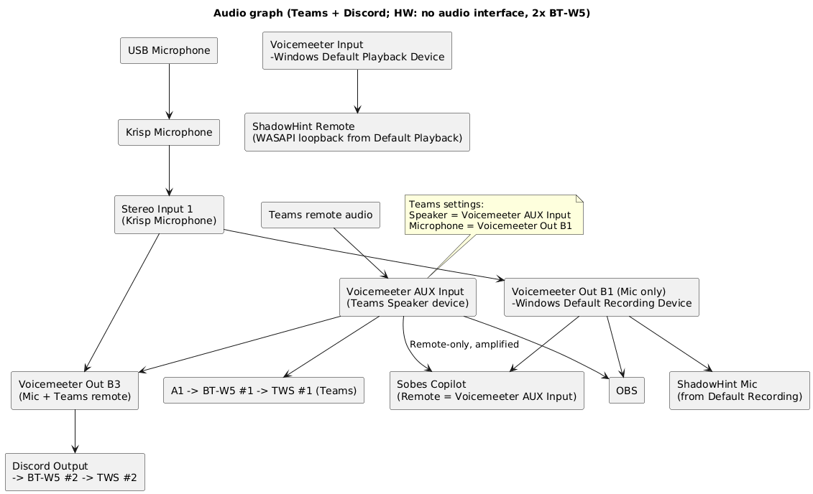

В этой конфигурации главное – Sobes Copilot, DISCORD и OBS получают
усиленный голос/звук собеседника из Teams (изолированный звук от
системных звуков!), а Shadowhint не сможет его получить, т.к. у него в
настройках нет возможности выбрать устройство для голоса собеседника (в
данной схеме изолированный канал звука из Teams (**Voicemeeter AUX
Input) не является дефолтным)**. Shadowhint присутствует на аудио графе
только, чтобы показать, что при его запуске он будет брать звук из
Voicemeeter Input, на который ничего полезного не приходит.

Отправку звука в Shadowhint можно решить легко – в mmsys.cpl выставить
дефолтным устройством Воспроизведения **Voicemeeter AUX Input** вместо
**Voicemeeter Input**, но нужно иметь в виду, что теперь в дефолтное
устройство (Voicemeeter AUX Input) попадают все звуки системы, а не
только звуки собеседника из Teams. Поэтому нужно позаботиться о том,
чтобы не запускать приложения, которые издают лишние звуки, а в самой
Винде отключить все системные звуки. Отдельно в этой документации я не
буду рисовать для этого схемы и приводить настройки в силу малых
отличий. Но на всякий случай приведу отдельный **код новой конфигурации:
(Teams + Discord, no Phone Link, Default Playback = VM AUX Input; HW: no
audio interface, 2x BT-W5)** – данная конфигурация становится похожей на
конфигурацию из раздела 3.1 (Phone Link + Discord; HW: no audio
interface, 2x BT-W5), где Shadowhint, Sobes Copilot, DISCORD и OBS
получают усиленный звук системы+собеседника из Teams, с единственным
отличием, что в последней конфигурации дефолтным Playback является
Voicemeeter Input, а не Voicemeeter AUX Input.

##### Настройки:

(Teams ONLY + Discord; HW: no audio interface, 2x BT-W5)

###### Цель

Используется **Teams + Discord**

Нужно:

- усилить **микрофон**

- усилить **голос собеседника Teams**

Раздать:

- **mic + remote → Discord**

- **mic → Sobes Copilot**

- **remote (isolated) → Sobes Copilot**

- **mic + remote → OBS**

Мониторинг:

- **TWS \#1 (через BT-W5 \#1)** — слышит **ТОЛЬКО Teams remote**

- **TWS \#2 (через BT-W5 \#2)** — слышит **Discord**

###### Windows (mmsys.cpl)

- Playback default = Voicemeeter Input

- Recording default = Voicemeeter Out B1

###### Krisp

- **Microphone** **Input**: USB microphone

- **Cancel Noise and Room Echo** = ON

- **Speaker Cancel Noise = OFF**

**Microphone** **Output (нельзя изменить)**: **Krisp Microphone** (это
устройство отображается в mmsys.cpl\Запись)

Krisp используется **только как обработчик микрофона**.

**Krisp Microphone используется только внутри Voicemeeter** как источник
Stereo Input 1.\
Ни одно приложение напрямую его не использует.

###### Teams (явно в настройках Teams)

- Speaker = Voicemeeter AUX Input

- Microphone = Voicemeeter Out B1

###### Voicemeeter Potato

- Stereo Input 1 = Krisp Microphone

  - B1 ON (mic-only)

  - B3 ON (mic для DISCORD)

  - A1/A2/A3 OFF

- Voicemeeter AUX Input (Teams remote)

  - A1 ON (мониторинг TWS \#1)

  - B3 ON (микс для Discord)

  - A2/A3 OFF

  - **усиление звука из Teams делать зелёным fader’ом AUX**

Наушники

- A1 -> BT-W5 \#1 -> TWS \#1 (Teams)

  - подаётся **ТОЛЬКО Voicemeeter AUX Input**

- Discord output -> BT-W5 \#2 -> TWS \#2

###### Sobes Copilot

- Mic = **Voicemeeter Out B1**

- Remote = **Voicemeeter AUX Input** (получает усиленный голос
  собеседника Teams, см. рис. ниже)

###### OBS

- Mic track = Voicemeeter Out B1

- Remote track = **Voicemeeter AUX Input**

###### Discord

- Input = Voicemeeter Out B3

- Output = BT-W5 \#2

### 4.1A. Способ: без аудио карты, TWS 2шт без USB-BT-адаптеров.

Код конфигурации: (Teams + Discord, no Phone Link; HW: no audio
interface, 2x TWS, no BT-W5)

Особенность:

1\) Отличие от конфигурации (Teams + Discord, no Phone Link; HW: no
audio interface, 2x BT-W5) из раздела 4.1 в том, что TWS \#1 И TWS \#2
подключены напрямую к ПК без BT-W5 \#1 и BT-W5 \#2.

2\) усиленный изолированный звук собеседника из Teams передаётся для
Sobes Copilot, при этом Shadowhint не поддерживается (ему невозможно
передать изолированный звук собеседника без звуков системы). Возможность
передачи звука системы+собеседника из Teams в Shadowhint в этом разделе
тоже рассмотрена, как отдельная конфигурация, которая реализуется в пару
кликов мыши.

3\) Phone Link не используется, потому что к системе подключены
TWS-наушники (напрямую без USB-BT-адаптеров).

**Способ не проверял.**

Минусы этого способа:

1\) риск того, что две пары TWS-наушников не будут работать в Windows
как надо

2\) отсутствие аудиоинтерфейса ограничивает возможности выбора хорошего
микрофона, а также возможности усиления, шумоподавления.

Требуемое ПО: [Voicemeeter
Potato](https://shop.vb-audio.com/en/win-apps/21-voicemeeter8.html) (10
евро разовый платёж, или через месяц начнет надоедать всплывающим окном
с просьбой задонатить, во время которого перестают работать виртуальные
кабели)

#### Оборудование

Список устройств: TWS 2 шт, USB-микрофон

##### Схема подключения устройств (Hardware wiring):

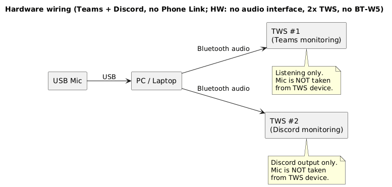

##### Микрофон

См. общие требования к микрофонам в разделе «[3.2. Способ: 1Mii BT,
BT-W5, аудио карта с возможностью отключения Direct Monitoring, и без
Loopback\Общие требования](#общие-требования)»

Примеры USB-микрофонов см. в разделе «[3.1B. Способ: без аудио карты,
один USB-BT-адаптер\Примеры USB-микрофонов](#примеры-usb-микрофонов)».

#### Конфигурирование

Что нужно настраивать: Voicemeeter Potato, Windows, Krisp и конечные
приложения (Discord, Sobes Copilot, OBS).

Основные настройки производятся в Voicemeeter Potato.

##### Схема аудио (Audio graph):

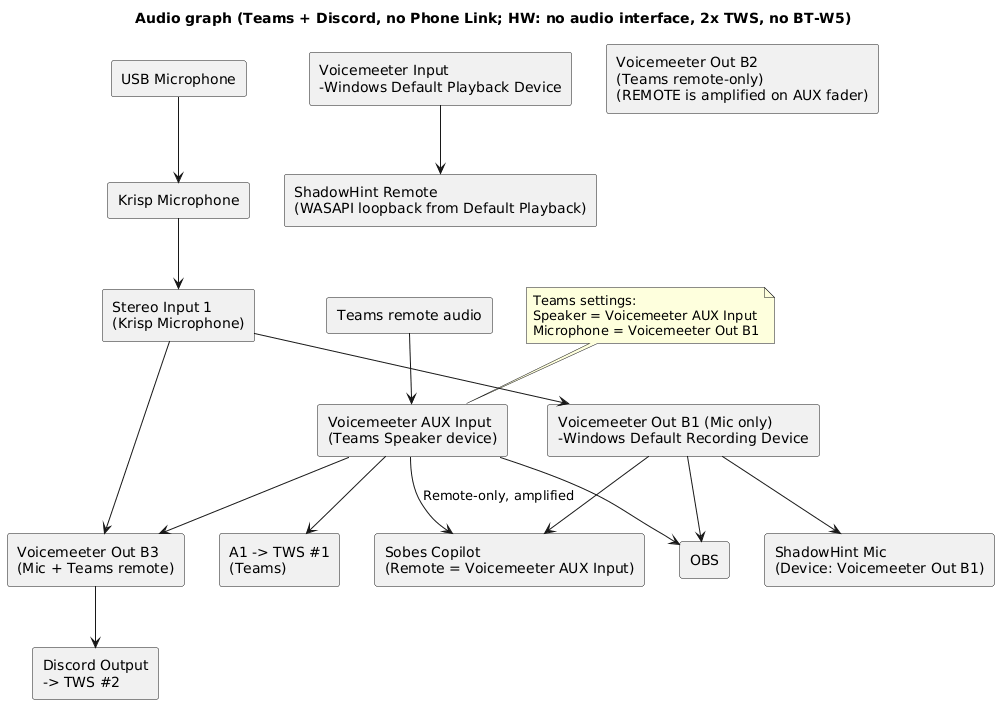

В этой конфигурации главное – Sobes Copilot, DISCORD и OBS получают
усиленный голос/звук собеседника из Teams (изолированный звук от
системных звуков!), а Shadowhint не сможет его получить, т.к. у него в
настройках нет возможности выбрать устройство для голоса собеседника (в
данной схеме изолированный канал звука из Teams (**Voicemeeter AUX
Input) не является дефолтным)**. Shadowhint присутствует на аудио графе
только, чтобы показать, что при его запуске он будет брать звук из
Voicemeeter Input, на который ничего полезного не приходит.

Отправку звука в Shadowhint можно решить легко – в mmsys.cpl выставить
дефолтным устройством Воспроизведения **Voicemeeter AUX Input** вместо
**Voicemeeter Input**, но нужно иметь в виду, что теперь в дефолтное
устройство (Voicemeeter AUX Input) попадают все звуки системы, а не
только звуки собеседника из Teams. Поэтому нужно позаботиться о том,
чтобы не запускать приложения, которые издают лишние звуки, а в самой
Винде отключить все системные звуки. Отдельно в этой документации я не
буду рисовать для этого схемы и приводить настройки в силу малых
отличий. Но на всякий случай приведу отдельный **код новой конфигурации:
(Teams + Discord, no Phone Link, Default Playback = VM AUX Input; HW: no
audio interface, 2x TWS, no BT-W5)** .

##### Настройки:

Настройки ПО почти такие же, как в конфигурации (Teams + Discord, no
Phone Link; HW: no audio interface, 2x BT-W5) из раздела 4.1, только
вместо устройств BT-W5 \#1 и BT-W5 \#2 выбираем TWS \#1 И TWS \#2.

###### Цель

Teams + Discord работают параллельно

Нужно:

- усилить **микрофон** (через Krisp + Voicemeeter)

- усилить **голос собеседника Teams**, изолированный от системных звуков

Раздать:

- **mic + Teams remote → Discord**

- **mic → Sobes Copilot и OBS**

- **Teams remote (isolated) → Sobes Copilot и OBS**

Мониторинг:

- **TWS \#1 слышит только Teams remote**

- **TWS \#2 слышит только Discord output**

###### Windows (mmsys.cpl)

Playback

- Default device: **Voicemeeter Input**

- Default communication device: **Voicemeeter Input**

Recording

- Default device: **Voicemeeter Out B1**

- Default communication device: **Voicemeeter Out B1**

###### Krisp

- **Microphone** **Input**: USB microphone

- **Cancel Noise and Room Echo** = ON

- **Speaker Cancel Noise = OFF**

**Microphone** **Output (нельзя изменить)**: **Krisp Microphone** (это
устройство отображается в mmsys.cpl\Запись)

Krisp используется **только как обработчик микрофона**.

**Krisp Microphone используется только внутри Voicemeeter** как источник
Stereo Input 1.\
Ни одно приложение напрямую его не использует.

###### Voicemeeter Potato

Stereo Input 1

- Device: **Krisp Microphone**

- Routing:

  - **B1 ON** (mic-only)

  - **B3 ON** (mic пойдёт в Discord-микс)

- A1 / A2 / A3: **OFF**

Усиление микрофона — здесь (fader Stereo Input 1)

(микрофон не мониторится в наушники)

Voicemeeter AUX Input

- A1 ON (чтобы слушать Teams в TWS \#1)

- B3 ON (чтобы Teams remote подмешался в Discord-микс)

- **Усиление звука из Teams делаем зелёным fader на AUX**

A1 (Hardware Out)

- **A1 = TWS \#1**\
  (именно первая пара TWS)

**В A1 будет слышно только Teams remote**, потому что:

- mic strip (Stereo Input 1) не направлен в A1

Назначение шин

- **B1** — mic-only

- **B2** — **Teams remote-only (усиленный)**

- **B3** — mic + Teams remote (remote усиленный)

###### Teams (обязательно вручную)

- **Speaker (Output)** = **Voicemeeter AUX Input**

- **Microphone (Input)** = **Voicemeeter Out B1**

###### Discord

- **Input** = **Voicemeeter Out B3**

- **Output** = **TWS \#2 (Bluetooth)**

###### Наушники

- **TWS \#1 (Teams)**

  - Output device в Windows/Teams = **TWS \#1**

  - Получает **ТОЛЬКО Teams remote** (через AUX → B2 → мониторинг)

- **TWS \#2 (Discord)**

  - Output device в Discord = **TWS \#2**

  - Слышит **только Discord**

###### Sobes Copilot

- Mic = **Voicemeeter Out B1**

- Remote = **Voicemeeter AUX Input** (получает усиленный голос
  собеседника Teams, см. рис. ниже)

###### OBS

- Mic track = **Voicemeeter Out B1**

- Remote track = **Voicemeeter AUX Input**

### 4.1B. Способ: без аудио карты, TWS 1шт без USB-BT-адаптера.

Код конфигурации: (Teams + Discord, no Phone Link; HW: no audio
interface, 1x TWS, no BT-W5)

Особенность: усиленный изолированный звук собеседника из Teams
передаётся для Sobes Copilot, при этом Shadowhint и Phone Link не
используются (им невозможно передать изолированный звук собеседника без
звуков системы). Возможность передачи звука системы+собеседника из Teams
в Shadowhint и Phone Link в этом разделе тоже рассмотрена, как отдельная
конфигурация, которая реализуется в пару кликов мыши.

**Способ не проверял.**

Минусы этого способа те же, что и у «[3.1B. Способ: без аудио карты,
один USB-BT-адаптер](#31b-способ-без-аудио-карты-один-usb-bt-адаптер)»:

- отсутствие аудиоинтерфейса ограничивает возможности выбора хорошего
микрофона, а также возможности усиления, шумоподавления.

Требуемое ПО: [Voicemeeter
Potato](https://shop.vb-audio.com/en/win-apps/21-voicemeeter8.html) (10
евро разовый платёж, или через месяц начнет надоедать всплывающим окном
с просьбой задонатить, во время которого перестают работать виртуальные
кабели)

#### Оборудование

Список устройств: TWS 1 шт, USB-микрофон

##### Схема подключения устройств (Hardware wiring):

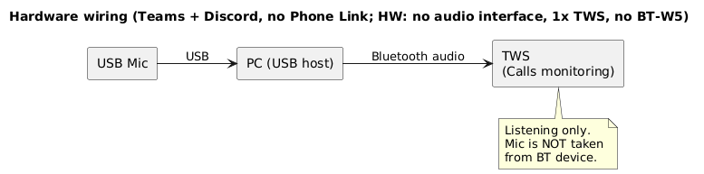

##### Микрофон

См. общие требования к микрофонам в разделе «[3.2. Способ: 1Mii BT,
BT-W5, аудио карта с возможностью отключения Direct Monitoring, и без
Loopback\Общие требования](#общие-требования)»

Примеры USB-микрофонов см. в разделе «[3.1B. Способ: без аудио карты,
один USB-BT-адаптер\Примеры USB-микрофонов](#примеры-usb-микрофонов)».

#### Конфигурирование

Что нужно настраивать: Voicemeeter Potato, Windows, Krisp и конечные
приложения (Teams, Discord, Sobes Copilot, OBS).

Основные настройки производятся в Voicemeeter Potato.

##### Схема аудио (Audio graph):

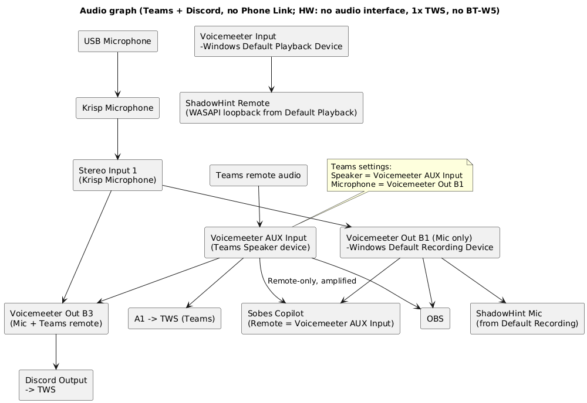

В этой конфигурации главное:

1\) DISCORD отправляет звук в те же TWS-наушники, в которые попадает
звук из Teams.

2\) Sobes Copilot, DISCORD и OBS получают усиленный голос/звук
собеседника из Teams (изолированный звук от системных звуков!), а
Shadowhint не сможет его получить, т.к. у него в настройках нет
возможности выбрать устройство для голоса собеседника (в данной схеме
изолированный канал звука из Teams (**Voicemeeter AUX Input) не является
дефолтным)**. Shadowhint присутствует на аудио графе только, чтобы
показать, что при его запуске он будет брать звук из Voicemeeter Input,
на который ничего полезного не приходит.

Отправку звука в Shadowhint можно решить легко – в mmsys.cpl выставить
дефолтным устройством Воспроизведения **Voicemeeter AUX Input** вместо
**Voicemeeter Input**, но нужно иметь в виду, что теперь в дефолтное
устройство (Voicemeeter AUX Input) попадают все звуки системы, а не
только звуки собеседника из Teams. Поэтому нужно позаботиться о том,
чтобы не запускать приложения, которые издают лишние звуки, а в самой
Винде отключить все системные звуки. Отдельно в этой документации я не
буду рисовать для этого схемы и приводить настройки в силу малых
отличий. Но на всякий случай приведу отдельный **код новой конфигурации:
(Teams + Discord, no Phone Link, Default Playback = VM AUX Input; HW: no
audio interface, 1x BT-W5)** – данная конфигурация становится похожей на
конфигурацию из раздела 4.1 (Phone Link + Discord; HW: no audio
interface, 1x BT-W5), где Shadowhint, Sobes Copilot, DISCORD и OBS
получают усиленный звук системы+собеседника из Teams, с единственным
отличием, что в последней конфигурации дефолтным Playback является
Voicemeeter Input, а не Voicemeeter AUX Input.

##### Настройки:

Настройки ПО почти такие же, как в конфигурации (Teams + Discord, no
Phone Link; HW: no audio interface, 2x BT-W5) из раздела 4.1 и (Teams +
Discord, no Phone Link; HW: no audio interface, 1x TWS, no BT-W5) из
раздела 4.1B, исключение – настройки Discord: Output Device =TWS, те же,
что и для Phone Link.

###### Цель

Используется **Teams + Discord**

Нужно:

- усилить **микрофон**

- усилить **голос собеседника Teams**

Раздать:

- **mic + remote → Discord**

- **mic → Sobes Copilot**

- **remote (isolated) → Sobes Copilot**

- **mic + remote → OBS**

Мониторинг:

- в **TWS** слышать собеседника из Teams и Discord;

Частота: **48 кГц**

###### Windows (mmsys.cpl)

- Playback default = Voicemeeter Input

- Recording default = Voicemeeter Out B1

###### Krisp

- **Microphone** **Input**: USB microphone

- **Cancel Noise and Room Echo** = ON

- **Speaker Cancel Noise = OFF**

**Microphone** **Output (нельзя изменить)**: **Krisp Microphone** (это
устройство отображается в mmsys.cpl\Запись)

Krisp используется **только как обработчик микрофона**.

**Krisp Microphone используется только внутри Voicemeeter** как источник
Stereo Input 1.\
Ни одно приложение напрямую его не использует.

###### Teams (явно в настройках Teams)

- Speaker = Voicemeeter AUX Input

- Microphone = Voicemeeter Out B1

###### Voicemeeter Potato

- Stereo Input 1 = Krisp Microphone

  - B1 ON (mic-only)

  - B3 ON (mic для DISCORD)

  - A1/A2/A3 OFF

- Voicemeeter AUX Input (Teams remote)

  - A1 ON (мониторинг TWS)

  - B3 ON (микс для Discord)

  - A2/A3 OFF

  - **Усиление звука из Teams делать зелёным fader’ом AUX**

Наушники

- A1 -> TWS (Teams)

- Discord output -> TWS

###### Sobes Copilot

- Mic = **Voicemeeter Out B1**

- Remote = **Voicemeeter AUX Input** (получает усиленный голос
  собеседника Teams, см. рис. ниже)

###### OBS

- Mic track = Voicemeeter Out B1

- Remote track = **Voicemeeter AUX Input**

###### Discord

- Input = Voicemeeter Out B3

- Output = TWS

### 4.2. Способ: 1Mii BT, BT-W5, аудио карта с возможностью отключения Direct Monitoring, и без Loopback.

Код конфигурации: (Teams + Discord; HW: audio interface, 1Mii BT, BT-W5)

Особенность: усиленный изолированный звук собеседника из Teams
передаётся для Sobes Copilot, при этом Shadowhint и Phone Link не
используются (им невозможно передать изолированный звук собеседника без
звуков системы). Возможность передачи звука системы+собеседника из Teams
в Shadowhint и Phone Link в этом разделе тоже рассмотрена, как отдельная
конфигурация, которая реализуется в пару кликов мыши.

**Способ не проверял.**

Аудиоинтерфейс в нашей задаче выполняет функцию усиления микрофона и для
подключения в разъём 6.35 TRS TWS-наушников через переходник 6.35
TRS->3.5 TRS и адаптер 3.5 TRS to BT (1Mii BT).

Требование возможности отключения Direct Monitoring нужно чтобы
отключать свой голос в TWS-наушниках, подключенных через адаптер 1Mii BT
в разъем 6,35 мм TRS аудиоинтерфейса. Вообще, все аудиоинтерфейсы имеют
эту возможность, но я специально уточняю, чтобы под аудиоинтерфейсом
никто не понимал подкаст-станцию/“смарт-интерфейс”.

Приписка о том, что нам не нужен Loopback – это для того, чтобы сузить
поиск и не переплачивать.

Требуемое ПО: [Voicemeeter
Potato](https://shop.vb-audio.com/en/win-apps/21-voicemeeter8.html) (10
евро разовый платёж, или через месяц начнет надоедать всплывающим окном
с просьбой задонатить, во время которого перестают работать виртуальные
кабели)

#### Оборудование

Список устройств: аудиоинтерфейс, 1Mii BT, BT-W5, TWS 2 шт, XLR-микрофон

##### Схема подключения устройств (Hardware wiring):

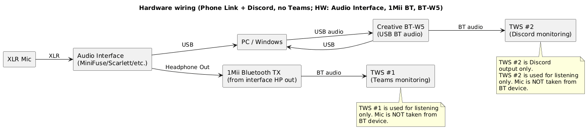

- схема такая же, как в разделе «3.2. Способ: 1Mii BT, BT-W5, аудио
карта с возможностью отключения Direct Monitoring, и без Loopback»,
отличие только в подписи под TWS \#1 – “Teams monitoring” вместо “Phone
Link monitoring”.

##### Аудиоинтерфейс

См. раздел «3.2. Способ: 1Mii BT, BT-W5, аудио карта с возможностью
отключения Direct Monitoring, и без Loopback»

##### Микрофон

См. раздел «3.2. Способ: 1Mii BT, BT-W5, аудио карта с возможностью
отключения Direct Monitoring, и без Loopback»

#### Конфигурирование

Что нужно настраивать: Voicemeeter Potato, Windows, Krisp и конечные
приложения (Discord, Sobes Copilot, OBS).

Основные настройки производятся в Voicemeeter Potato.

##### Схема аудио (Audio graph):

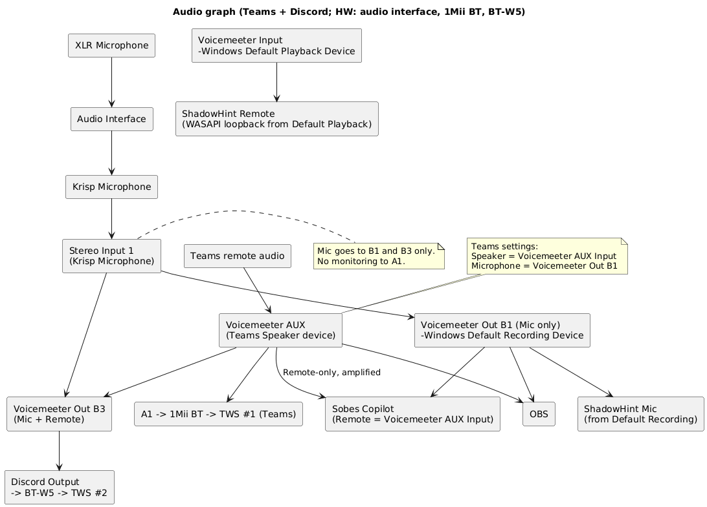

В этой конфигурации главное – Sobes Copilot, DISCORD и OBS получают
усиленный голос/звук собеседника из Teams (изолированный звук от
системных звуков!), а Shadowhint не сможет его получить, т.к. у него в
настройках нет возможности выбрать устройство для голоса собеседника (в
данной схеме изолированный канал звука из Teams (**Voicemeeter AUX
Input) не является дефолтным)**. Shadowhint присутствует на аудио графе
только, чтобы показать, что при его запуске он будет брать звук из
Voicemeeter Input, на который ничего полезного не приходит.

Отправку звука в Shadowhint можно решить легко – в mmsys.cpl выставить
дефолтным устройством Воспроизведения **Voicemeeter AUX Input** вместо
**Voicemeeter Input**, но нужно иметь в виду, что теперь в дефолтное
устройство (Voicemeeter AUX Input) попадают все звуки системы, а не
только звуки собеседника из Teams. Поэтому нужно позаботиться о том,
чтобы не запускать приложения, которые издают лишние звуки, а в самой
Винде отключить все системные звуки. Отдельно в этой документации я не
буду рисовать для этого схемы и приводить настройки в силу малых
отличий. Но на всякий случай приведу отдельный **код новой конфигурации:
(Teams + Discord, no Phone Link, Default Playback = VM AUX Input; HW:
audio interface, 1Mii BT, BT-W5)** – данная конфигурация становится
похожей на конфигурацию из раздела 3.2 (Phone Link + Discord; HW: audio
interface, 1Mii BT, BT-W5), где Shadowhint, Sobes Copilot, DISCORD и OBS
получают усиленный звук системы+собеседника из Teams, с единственным
отличием, что в последней конфигурации дефолтным Playback является
Voicemeeter Input, а не Voicemeeter AUX Input.

##### Настройки:

###### Цель

Используется **Teams**.\
**Discord** работает параллельно.

Нужно:

- усилить **ТОЛЬКО голос собеседника Teams**

- усилить **микрофон**

раздать:

- **mic → Teams**

- **mic + Teams remote → Discord**

- **mic → Sobes Copilot**

- **Teams remote (isolated) → Sobes Copilot**

- **mic → OBS**

- **Teams remote (isolated) → OBS**

мониторинг:

- **TWS \#1 (через 1Mii BT)** — слышит **ТОЛЬКО Teams remote**

- **TWS \#2 (через BT-W5)** — слышит **ТОЛЬКО Discord**

###### Аппаратная часть (HW)

- XLR-микрофон → Audio Interface

- Audio Interface → ПК

- Наушники для звонков (TWS \#1) → **1Mii Bluetooth TX** → A1

- Наушники для Discord (TWS \#2) → **BT-W5**

- Аудиоинтерфейс используется **только как источник микрофона**

###### Windows (mmsys.cpl)

Воспроизведение

- Default device: **Voicemeeter Input**

- Default communication device: **Voicemeeter Input**

Запись

- Default device: **Voicemeeter Out B1**

- Default communication device: **Voicemeeter Out B1**

###### Krisp

- **Microphone** **Input**: Audio Interface microphone

- **Cancel Noise and Room Echo** = ON

- **Speaker Cancel Noise = OFF**

**Microphone** **Output (нельзя изменить)**: **Krisp Microphone** (это
устройство отображается в mmsys.cpl\Запись)

Krisp используется **только как обработчик микрофона**.

**Krisp Microphone используется только внутри Voicemeeter** как источник
Stereo Input 1.\
Ни одно приложение напрямую его не использует.

###### Voicemeeter Potato

Stereo Input 1

- Device: **Krisp Microphone**

- Routing:

  - **B1 ON** (mic-only)

  - **B3 ON** (mic пойдёт в Discord-микс)

- A1 / A2 / A3: **OFF**

Усиление микрофона — здесь (fader Stereo Input 1)

(микрофон не мониторится в наушники)

Voicemeeter AUX Input

- A1 ON (чтобы слушать Teams в TWS \#1)

- B3 ON (чтобы Teams remote подмешался в Discord-микс)

- **Усиление звука из Teams делаем зелёным fader на AUX**

A1 (Hardware Out)

- **A1 = TWS \#1**\
  (именно первая пара TWS)

**В A1 будет слышно только Teams remote**, потому что:

- mic strip (Stereo Input 1) не направлен в A1

Назначение шин

- **B1** — mic-only\
  (Windows Default Recording Device)

- **B3** — mic + Teams remote\
  (для Discord)

Мониторинг (наушники)

- **A1 → 1Mii BT → TWS \#1 (Teams)**

  - подаётся **ТОЛЬКО B2**

  - микрофон туда не попадает

- **Discord Output → BT-W5 → TWS \#2**

  - Discord слышен **только во второй паре**

###### Teams (обязательно вручную)

- Speaker (Output): **Voicemeeter AUX Input**

- Microphone (Input): **Voicemeeter Out B1**

Это ключевой момент для изоляции и усиления **ТОЛЬКО голоса
собеседника**.

###### Discord

- Input: **Voicemeeter Out B3**

- Output: **BT-W5 → TWS \#2**

###### Sobes Copilot

- Mic = **Voicemeeter Out B1**

- Remote = **Voicemeeter AUX Input** (получает усиленный голос
  собеседника Teams, см. рис. ниже)

###### OBS

- Mic source: **Voicemeeter Out B1**

- Remote source: **Voicemeeter AUX Input**

### 4.3. Способ: BT-W5 2 шт, аудио карта без Loopback.

Код конфигурации: (Teams + Discord; HW: audio interface, 2x BT-W5)

Отличие от предыдущей конфигурации в разделе «4.2. Способ: 1Mii BT,
BT-W5, аудио карта с возможностью отключения Direct Monitoring, и без
Loopback» только в том, что в мониторинге Teams: вместо 1Mii
используется **BT-W5 \#1. Поэтому настройки всего ПО одинаковые.**

Особенность: усиленный изолированный звук собеседника из Teams
передаётся для Sobes Copilot, при этом Shadowhint и Phone Link не
используются (им невозможно передать изолированный звук собеседника без
звуков системы). Возможность передачи звука системы+собеседника из Teams
в Shadowhint и Phone Link в этом разделе тоже рассмотрена, как отдельная
конфигурация, которая реализуется в пару кликов мыши.

**Способ не проверял.**

Аудиоинтерфейс в нашей задаче выполняет только функцию усиления
микрофона.

Требуемое ПО: [Voicemeeter
Potato](https://shop.vb-audio.com/en/win-apps/21-voicemeeter8.html) (10
евро разовый платёж, или через месяц начнет надоедать всплывающим окном
с просьбой задонатить, во время которого перестают работать виртуальные
кабели)

#### Оборудование

Список устройств: аудиоинтерфейс, BT-W5 2 шт, TWS 2 шт, XLR-микрофон

##### Схема подключения устройств (Hardware wiring):

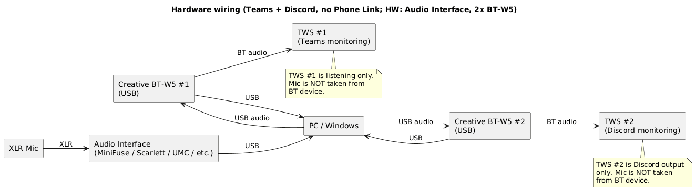

- схема такая же, как в разделе «3.3. Способ: аудио карта с
возможностью отключения Direct Monitoring, и без Loopback», отличие
только в подписи под TWS \#1 – “Teams monitoring” вместо “Phone Link
monitoring”.

##### Аудиоинтерфейс/подкаст-станция/“смарт-интерфейс”

См. раздел «3.3. Способ: BT-W5 2 шт, аудио карта без Loopback»

##### Микрофон

См. раздел «3.2. Способ: 1Mii BT, BT-W5, аудио карта с возможностью
отключения Direct Monitoring, и без Loopback»

#### Конфигурирование

Что нужно настраивать: Voicemeeter Potato, Windows, Krisp и конечные
приложения (Discord, Sobes Copilot, OBS).

Основные настройки производятся в Voicemeeter Potato.

##### Схема аудио (Audio graph):

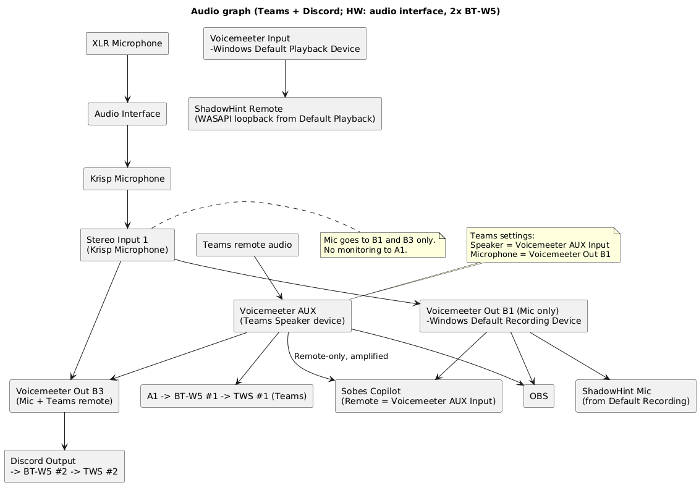

В этой конфигурации главное – Sobes Copilot, DISCORD и OBS получают
усиленный голос/звук собеседника из Teams (изолированный звук от
системных звуков!), а Shadowhint не сможет его получить, т.к. у него в
настройках нет возможности выбрать устройство для голоса собеседника (в
данной схеме изолированный канал звука из Teams (**Voicemeeter AUX
Input) не является дефолтным)**. Shadowhint присутствует на аудио графе
только, чтобы показать, что при его запуске он будет брать звук из
Voicemeeter Input, на который ничего полезного не приходит.

Отправку звука в Shadowhint можно решить легко – в mmsys.cpl выставить
дефолтным устройством Воспроизведения **Voicemeeter AUX Input** вместо
**Voicemeeter Input**, но нужно иметь в виду, что теперь в дефолтное
устройство (Voicemeeter AUX Input) попадают все звуки системы, а не
только звуки собеседника из Teams. Поэтому нужно позаботиться о том,
чтобы не запускать приложения, которые издают лишние звуки, а в самой
Винде отключить все системные звуки. Отдельно в этой документации я не
буду рисовать для этого схемы и приводить настройки в силу малых
отличий. Но на всякий случай приведу отдельный **код новой конфигурации:
(Teams + Discord, no Phone Link, Default Playback = VM AUX Input; HW:
audio interface, 2x BT-W5)** – данная конфигурация становится похожей на
конфигурацию из раздела 3.3 (Phone Link + Discord; HW: audio interface,
2x BT-W5), где Shadowhint, Sobes Copilot, DISCORD и OBS получают
усиленный звук системы+собеседника из Teams, с единственным отличием,
что в последней конфигурации дефолтным Playback является Voicemeeter
Input, а не Voicemeeter AUX Input.

##### Настройки:

###### Цель

Используется **Teams**.\
**Discord** работает параллельно.

Нужно:

- усилить **ТОЛЬКО голос собеседника Teams**

- усилить **микрофон**

раздать:

- **mic → Teams**

- **mic + Teams remote → Discord**

- **mic → Sobes Copilot**

- **Teams remote (isolated) → Sobes Copilot**

- **mic → OBS**

- **Teams remote (isolated) → OBS**

мониторинг:

- **TWS \#1 (через BT-W5)** — слышит **ТОЛЬКО Teams remote**

- **TWS \#2 (через BT-W5)** — слышит **ТОЛЬКО Discord**

###### Аппаратная часть (HW)

- XLR-микрофон → Audio Interface

- Audio Interface → ПК

- Наушники для звонков (TWS \#1) → **BT-W5**→ A1

- Наушники для Discord (TWS \#2) → **BT-W5**

- Аудиоинтерфейс используется **только как источник микрофона**

###### Windows (mmsys.cpl)

Воспроизведение

- Default device: **Voicemeeter Input**

- Default communication device: **Voicemeeter Input**

Запись

- Default device: **Voicemeeter Out B1**

- Default communication device: **Voicemeeter Out B1**

###### Krisp

- **Microphone** **Input**: Audio Interface microphone

- **Cancel Noise and Room Echo** = ON

- **Speaker Cancel Noise = OFF**

**Microphone** **Output (нельзя изменить)**: **Krisp Microphone** (это
устройство отображается в mmsys.cpl\Запись)

Krisp используется **только как обработчик микрофона**.

**Krisp Microphone используется только внутри Voicemeeter** как источник
Stereo Input 1.\
Ни одно приложение напрямую его не использует.

###### Voicemeeter Potato

Stereo Input 1

- Device: **Krisp Microphone**

- Routing:

  - **B1 ON** (mic-only)

  - **B3 ON** (mic пойдёт в Discord-микс)

- A1 / A2 / A3: **OFF**

Усиление микрофона — здесь (fader Stereo Input 1)

(микрофон не мониторится в наушники)

Voicemeeter AUX Input

- A1 ON (чтобы слушать Teams в TWS \#1)

- B3 ON (чтобы Teams remote подмешался в Discord-микс)

- **Усиление звука из Teams делаем зелёным fader на AUX**

A1 (Hardware Out)

- **A1 = TWS \#1**\
  (именно первая пара TWS)

**В A1 будет слышно только Teams remote**, потому что:

- mic strip (Stereo Input 1) не направлен в A1

Назначение шин

- **B1** — mic-only\
  (Windows Default Recording Device)

- **B3** — mic + Teams remote\
  (для Discord)

Мониторинг (наушники)

- **A1 → 1Mii BT → TWS \#1 (Teams)**

  - подаётся **ТОЛЬКО Voicemeeter AUX Input**

  - микрофон туда не попадает

- **Discord Output → BT-W5 → TWS \#2**

  - Discord слышен **только во второй паре**

###### Teams (обязательно вручную)

- Speaker (Output): **Voicemeeter AUX Input**

- Microphone (Input): **Voicemeeter Out B1**

Это ключевой момент для изоляции и усиления **ТОЛЬКО голоса
собеседника**.

###### Discord

- Input: **Voicemeeter Out B3**

- Output: **BT-W5 → TWS \#2**

###### Sobes Copilot

- Mic = **Voicemeeter Out B1**

- Remote = **Voicemeeter AUX Input** (получает усиленный голос
  собеседника Teams, см. рис. ниже)

###### OBS

- Mic source: **Voicemeeter Out B1**

- Remote source: **Voicemeeter AUX Input**
